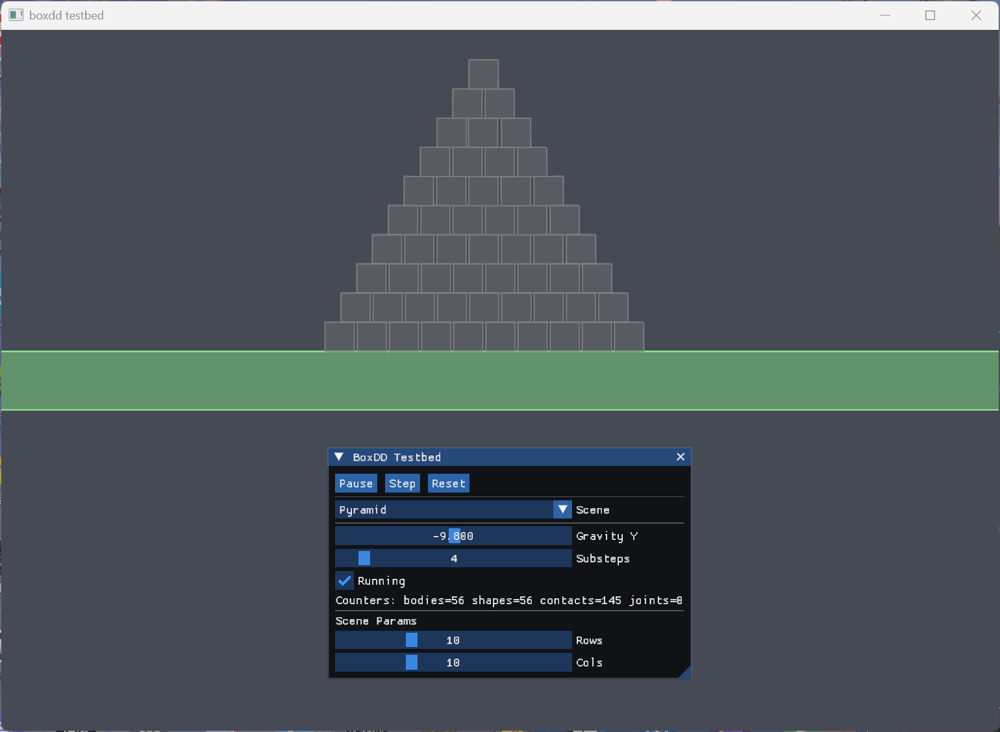

<div align="center">

# boxdd · Rust bindings for Box2D v3 (C API)

[](https://crates.io/crates/boxdd)
[](https://docs.rs/boxdd)
[](#license)



</div>

Crates
- `boxdd-sys`: low‑level FFI for the official Box2D v3 C API (vendored)
- `boxdd`: safe layer (world, bodies, shapes, joints, queries, events, debug draw)

Getting Started

```bash
git submodule update --init --recursive
cargo build

# run some examples
cargo r --example world_basics
cargo r --example joints
cargo r --example queries
cargo r --example sensors
cargo r --example testbed_imgui_glow --features imgui-glow-testbed
```

Examples
- The `examples/` folder covers worlds/bodies/shapes, joints, queries/casts, events/sensors, CCD, and debug draw.

Notes
- Vendored C sources + bindgen (requires a C toolchain and libclang)
- Optional: link a prebuilt static library via `BOX2D_LIB_DIR=/path/to/lib`
- On docs.rs, the native build is skipped

Docs
- Local: `cargo doc --open`
- Online: https://docs.rs/boxdd

License
- `boxdd`: MIT OR Apache-2.0
- `boxdd-sys`: MIT OR Apache-2.0

