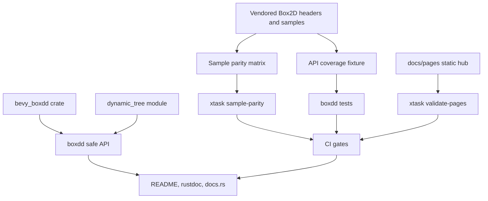

# Boxdd Binding Productization Refactor - Plan

## Goal Capsule

| Field | Decision |
|---|---|
| Objective | Rework `boxdd` from a strong safe wrapper into an auditably maintained Box2D Rust binding suite with workspace governance, upstream coverage checks, sample parity, ABI checks, a real API gap filled by `dynamic_tree`, an independent `bevy_boxdd` MVP, a static Pages hub, and CI gates that keep those assets from drifting. |
| Authority | User request and repository instructions override this plan; existing `boxdd` safety behavior overrides `boxddd` imitation; `boxddd` patterns guide engineering governance; official Box2D headers and vendored docs are the source of truth for API semantics. |
| Execution profile | Fearless refactor is allowed, including breaking workspace layout changes and deletion of obsolete scaffolding, but do not remove `boxdd-sys` system-link/prebuilt-binary support without a replacement decision. |
| Stop conditions | Stop and surface a blocker if implementing a unit requires changing established handle lifetime semantics, dropping a published feature without replacement documentation, or choosing a Bevy major version that cannot be validated locally. |
| Tail ownership | The current Codex goal owns implementation, verification, simplification/review, and commits; progress must not be written into this plan file. |

---

## Product Contract

### Summary

`boxdd` already has substantial safe Box2D v3 coverage, examples, and tests. The missing layer is the one `boxddd` demonstrates well: public API coverage is machine-auditable, official samples are traceable to Rust examples or deferred rows, CI validates release assets, documentation maps back to official Box2D concepts, and ecosystem users have a Bevy-native entry point.

This plan keeps the existing owned/scoped/id wrapper model and improves the project around it. The first implementation pass builds the governance rails, fills the isolated `dynamic_tree` gap, adds an independent Bevy MVP, and publishes a static example hub without promising a browser physics runtime before the lower-level boundary is stable.

### Problem Frame

Without API coverage and sample parity, upstream Box2D drift is hard to distinguish from deliberate omission. Without a Bevy crate, many Rust game users have to build their own ECS bridge even though the core binding is already suitable. Without Pages and CI validation, examples remain discoverable only to people already browsing the source tree.

The right refactor is not a wholesale rewrite of safe APIs. It is a productization pass that makes future breaking work safer because omissions, upstream changes, and user-facing docs are checked in code.

### Requirements

**Binding governance**

- R1. Centralize workspace metadata and shared dependencies so adding `bevy_boxdd` and `xtask` does not duplicate package identity across crates.
- R2. Add a machine-verifiable API coverage matrix that classifies every vendored `B2_API` function as `safe`, `raw`, `omitted`, or `deferred`.
- R3. Add `boxdd-sys` ABI/layout smoke tests for representative public structs, id types, and linked symbols.
- R4. Add an official Box2D sample parity matrix that validates every upstream `RegisterSample` or `RegisterReplay` entry has a Rust example, testbed scene, test-only row, upstream-reference row, or explicit deferred rationale.
- R5. Introduce `xtask` commands for repository-owned validation tasks instead of scattering custom parsing logic through CI scripts.
- R6. Preserve existing system library, pkg-config, bindgen, pregenerated binding, and prebuilt-binary workflows unless a later plan replaces them.

**User-facing documentation and discovery**

- R7. Document the rustdoc alignment policy: vendored headers supply API comments; vendored official docs supply concepts; upstream web docs are references but may lag the vendored source.
- R8. Update README, examples documentation, and changelog so users can find coverage status, sample parity, Bevy integration, Pages, and verification commands.
- R9. Add a static GitHub Pages hub that links to examples, sample parity, API coverage, docs.rs, and Bevy guidance without claiming a live WASM demo.
- R10. Keep crate-level rustdoc as a navigation page and move long-form operational details into stable docs where practical.

**Rust API surface**

- R11. Add a safe `boxdd::dynamic_tree` module for Box2D's public dynamic tree API, with RAII ownership, typed proxy ids, callback-safe query/ray-cast entry points, tests, and an example.
- R12. Clarify the raw/unchecked boundary in docs and exports: `unchecked` is for hot paths that skip validation; raw access is for FFI boundary work that remains unsafe or process-global.

**Bevy integration**

- R13. Add an independent `bevy_boxdd` workspace crate that depends on `boxdd` but keeps Bevy out of the core crates.
- R14. Provide a Bevy MVP with `BoxddPhysicsPlugin`, `BoxddPhysicsContext`, ECS components for bodies/colliders/materials/velocity/sensors, FixedUpdate stepping, entity-to-handle sync, and transform synchronization.
- R15. Keep Bevy dependencies split where reasonable and use the umbrella `bevy` crate only for examples/dev-dependencies.
- R16. Include at least one Bevy example and no-render tests that prove component insertion creates Box2D objects and stepping updates transforms/events.

**CI and release readiness**

- R17. Modernize CI around `cargo nextest`, formatting, clippy/check feature matrices, docs, API coverage, sample parity, Pages validation, package audit, and existing sys/prebuilt checks.
- R18. Keep the first Pages release static; defer WASM provider/runtime work until callback, thread, and dynamic tree boundaries are audited.

### Actors

- A1. Core binding maintainer who needs upstream drift and release readiness to be visible before publishing.
- A2. Rust library user who wants a safe Box2D v3 API with documented omissions.
- A3. Bevy game developer who wants ECS-native physics integration without depending on the testbed.
- A4. Contributor who needs a reliable command set for local checks.

### Acceptance Examples

- AE1. When a new `B2_API` symbol appears in vendored headers, `cargo nextest run -p boxdd --test api_coverage` fails until the symbol is classified in the fixture and reflected in `docs/api-coverage.md`.
- AE2. When an official Box2D sample is registered upstream, `cargo run -p xtask -- sample-parity --check` fails until the sample matrix maps it to a Rust artifact or a deferred rationale.
- AE3. Given a minimal Bevy app with `BoxddPhysicsPlugin`, a dynamic body, and a circle collider, fixed update creates Box2D handles and a step changes the entity transform under gravity.
- AE4. When a Pages link points at a missing document or example, `cargo run -p xtask -- validate-pages` fails before the Pages workflow publishes it.
- AE5. When `boxdd-sys` links to vendored Box2D, layout tests prove the representative raw types have the expected size/alignment and smoke-callable public symbols.

### Scope Boundaries

- In scope: breaking workspace metadata cleanup, new crates, new validation docs/tests, `dynamic_tree`, Bevy MVP, static Pages, CI workflow modernization, README/changelog updates.
- Deferred: full WASM provider, live browser physics demo, complete Bevy joint/editor/debug asset model, mandatory workspace-wide `missing_docs`, full raw module redesign, and removal of prebuilt binary support.
- Out of scope: replacing the existing `World`/`OwnedBody`/`Body`/`OwnedShape`/`Shape`/`OwnedJoint`/`Joint` safety model with a pure id API.

---

## Planning Contract

### Key Technical Decisions

- KTD1. Governance comes before broad API churn. The current safe layer already covers much of Box2D v3, so the first refactor should make coverage and omissions measurable before large wrapper redesigns.
- KTD2. `xtask` owns repository validation logic. API/sample/pages checks should be runnable locally and in CI with the same commands, following the `boxddd` pattern.
- KTD3. Coverage classification may be conservative. A raw or omitted classification is acceptable when documented; an unclassified upstream symbol is not acceptable.
- KTD4. `dynamic_tree` is the first safe API gap to close. It is public Box2D API, independent from world lifetimes, and gives the coverage matrix a real implementation target.
- KTD5. `bevy_boxdd` is a separate crate. Bevy integration should feel ECS-native while keeping `boxdd` engine-agnostic and avoiding Bevy transitive dependencies for non-Bevy users.
- KTD6. Bevy transform mapping is 2D native. Use Bevy `Transform` XY translation and Z-axis rotation for Box2D position/angle, and avoid importing 3D `boxddd` shape concepts.
- KTD7. Pages starts as a static catalog. A static hub improves discoverability now and avoids overpromising WASM runtime support before the FFI/callback boundary is audited.
- KTD8. CI modernizes without deleting unique `boxdd` release capabilities. `prebuilt-binaries.yml`, pkg-config, forced bindgen, and system-link coverage remain part of the repository contract.
- KTD9. Rustdoc alignment follows vendored source first. The online Box2D manual is useful context, but vendored headers and docs must be treated as the exact version target.

### High-Level Technical Design

The implementation should keep validation assets close to the code they protect: API coverage fixtures live under `boxdd/tests/fixtures`, sys layout tests live under `boxdd-sys/tests`, sample parity and Pages checks live under `xtask`, and user-facing governance docs live under `docs/`.

### Implementation Constraints

- Use `apply_patch` for manual edits and avoid PowerShell-heavy text rewrites.
- Use `cargo nextest` for Rust test execution where available; fall back to scoped `cargo test` only if `nextest` is unavailable and record that limitation.
- Do not use `git restore`, `git checkout --`, `git reset`, `git stash`, or deletion to discard changes that may belong to the user.
- Do not make workspace-wide `missing_docs` a hard gate in this pass; document the path to that gate instead.
- Keep generated or validation fixtures deterministic and reviewable.

### Risks & Dependencies

| Risk | Mitigation |
|---|---|
| Bevy version churn can make the MVP costly or unstable. | Start with split crates and no-render tests, mirror the version strategy from `boxddd`, and document the compatibility table in `bevy_boxdd/README.md`. |
| API coverage can become noisy if every symbol must be safely wrapped immediately. | Allow `raw`, `omitted`, and `deferred` categories with rationale; fail only on unclassified drift or inconsistent docs counts. |
| Dynamic tree callbacks cross an unsafe FFI boundary. | Keep callback state scoped to the call, avoid storing borrowed references, and test early termination and payload recovery. |
| CI can become too slow after adding Bevy and matrix gates. | Separate required fast checks from scheduled/package audits and keep Bevy examples as `cargo check` where runtime rendering is unnecessary. |
| Existing license metadata may not match checked-in license files. | Add or verify license files during workspace metadata cleanup before package validation. |
| Pages may be mistaken for a live demo. | Use copy and validation that label it as an example/documentation hub until WASM work is explicitly implemented. |

### Sources

- Local `boxddd` reference: `../boxddd/Cargo.toml`, `../boxddd/boxddd/tests/api_coverage.rs`, `../boxddd/docs/api-coverage.md`, `../boxddd/docs/upstream-parity/box3d-sample-matrix.md`, `../boxddd/xtask/src/main.rs`, `../boxddd/bevy_boxddd`, `../boxddd/docs/pages/index.html`.
- Local Box2D source: `boxdd-sys/third-party/box2d/include/box2d/*.h`, `boxdd-sys/third-party/box2d/docs/*.md`, `boxdd-sys/third-party/box2d/samples/sample_*.cpp`.
- Official Box2D documentation: https://box2d.org/documentation/
- Box2D upstream repository and releases: https://github.com/erincatto/box2d
- Bevy physics prior art: https://docs.rs/bevy_rapier2d, https://rapier.rs/docs/user_guides/bevy_plugin/getting_started_bevy/, https://docs.rs/avian2d
- Cargo/docs tooling references: https://doc.rust-lang.org/cargo/reference/manifest.html, https://docs.rs/about/metadata, https://nexte.st/

---

## Implementation Units

### U1. Workspace and Publishing Baseline

- **Goal:** Convert the workspace to a multi-crate publishing baseline that can host `xtask` and `bevy_boxdd` without duplicated metadata.
- **Requirements:** R1, R6, R17.
- **Files:** `Cargo.toml`, `boxdd/Cargo.toml`, `boxdd-sys/Cargo.toml`, `LICENSE-MIT`, `LICENSE-APACHE`, `README.md`, `CHANGELOG.md`.
- **Approach:** Introduce `[workspace.package]` and `[workspace.dependencies]`, move repeated metadata to inherited fields, keep crate-specific features and `links = "box2d"` untouched, add missing license files if absent, and preserve current package inclusion/exclusion intent.
- **Test scenarios:** `cargo metadata --no-deps` succeeds; `cargo check -p boxdd --no-default-features` still builds; `cargo check -p boxdd-sys --no-default-features` still preserves supported build modes.
- **Verification:** `cargo metadata --no-deps`; `cargo check -p boxdd --no-default-features`; `cargo check -p boxdd-sys --no-default-features`.

### U2. API Coverage and Sys ABI Gates

- **Goal:** Make upstream API drift and raw layout assumptions explicit.
- **Requirements:** R2, R3, R7, R17; covers AE1 and AE5.
- **Files:** `docs/api-coverage.md`, `docs/upstream-parity/box2d-api-matrix.md`, `boxdd/tests/api_coverage.rs`, `boxdd/tests/fixtures/api_coverage_symbols.txt`, `boxdd-sys/tests/layout.rs`.
- **Approach:** Port the `boxddd` coverage pattern to `B2_API`, scan vendored headers, parse fixture rows, validate documentation counts, and add representative layout/symbol tests for `b2Vec2`, `b2Rot`, `b2Transform`, id structs, world/body/shape defs, and smoke-callable FFI symbols.
- **Test scenarios:** Removing a fixture row fails the coverage test; adding an extra unknown fixture row fails; changing a documented count fails; representative raw type size/alignment assertions pass on the current target.
- **Verification:** `cargo nextest run -p boxdd --test api_coverage`; `cargo nextest run -p boxdd-sys --test layout`.

### U3. Xtask, Sample Parity, and Pages Validation

- **Goal:** Add repository-owned validation commands for official samples and static documentation links.
- **Requirements:** R4, R5, R9, R17, R18; covers AE2 and AE4.
- **Files:** `xtask/Cargo.toml`, `xtask/src/main.rs`, `docs/upstream-parity/box2d-sample-matrix.md`, `docs/pages/index.html`, `docs/pages/examples/index.html`, `.github/workflows/pages.yml`.
- **Approach:** Add an `xtask` crate with `sample-parity --check`, `validate-pages`, and a narrow `help` command. The sample parser scans vendored `sample_*.cpp` files for registered samples/replays and requires matching markdown rows. The Pages validator checks local links and required hub sections.
- **Test scenarios:** Deleting a sample row fails `sample-parity`; adding a broken local link fails `validate-pages`; valid static pages pass without building WASM.
- **Verification:** `cargo run -p xtask -- sample-parity --check`; `cargo run -p xtask -- validate-pages`.

### U4. Dynamic Tree Safe API

- **Goal:** Add a focused safe wrapper for Box2D's public dynamic tree API.
- **Requirements:** R11, R12.
- **Files:** `boxdd/src/dynamic_tree.rs`, `boxdd/src/lib.rs`, `boxdd/src/prelude.rs`, `boxdd/tests/dynamic_tree.rs`, `boxdd/examples/dynamic_tree.rs`, `boxdd/examples/README.md`, `docs/api-coverage.md`.
- **Approach:** Implement RAII tree ownership, typed proxy ids, proxy create/destroy/move/enlarge operations, category-bit accessors, query and cast callbacks with scoped user state, and clear docs on callback ordering and lifetime. Mark newly covered dynamic tree symbols as `safe` in the coverage fixture.
- **Test scenarios:** Creating and destroying proxies does not leak ownership; moving a proxy changes query results; callbacks can terminate traversal; invalid proxy operations return `Result` errors instead of panicking where the safe API can detect them.
- **Verification:** `cargo nextest run -p boxdd --test dynamic_tree`; `cargo run -p boxdd --example dynamic_tree` where the example is non-interactive.

### U5. Bevy Integration MVP

- **Goal:** Add a Bevy-native entry crate that proves `boxdd` can drive ECS physics without polluting the core binding.
- **Requirements:** R13, R14, R15, R16.
- **Files:** `bevy_boxdd/Cargo.toml`, `bevy_boxdd/README.md`, `bevy_boxdd/src/lib.rs`, `bevy_boxdd/src/components.rs`, `bevy_boxdd/src/plugin.rs`, `bevy_boxdd/src/resources.rs`, `bevy_boxdd/src/systems.rs`, `bevy_boxdd/src/messages.rs`, `bevy_boxdd/src/math.rs`, `bevy_boxdd/src/prelude.rs`, `bevy_boxdd/tests/plugin.rs`, `bevy_boxdd/examples/falling_box.rs`, `Cargo.toml`.
- **Approach:** Mirror the architectural shape of `bevy_boxddd` but translate it to 2D: `BoxddPhysicsPlugin`, `BoxddPhysicsContext` as `NonSend`, components for body/collider/material/velocity/sensor state, FixedUpdate stepping, transform synchronization, event/message extraction, and an example that can be checked without rendering dependencies.
- **Test scenarios:** A Bevy app with one dynamic body and collider creates handles after update; gravity changes transform after fixed stepping; removing an entity destroys handles; sensor/contact messages are observable when enabled.
- **Verification:** `cargo check -p bevy_boxdd --no-default-features`; `cargo nextest run -p bevy_boxdd`; `cargo check -p bevy_boxdd --example falling_box`.

### U6. Documentation, Rustdoc Alignment, and Example Index

- **Goal:** Make official Box2D semantics visible in the Rust user journey.
- **Requirements:** R7, R8, R10, R12, R18.
- **Files:** `README.md`, `CHANGELOG.md`, `boxdd/src/lib.rs`, `boxdd/examples/README.md`, `docs/development/ci.md`, `docs/development/rustdoc-alignment.md`, `docs/development/ffi-lifetime-audit.md`, `docs/platforms/wasm.md`, `docs/upstream-parity/box2d-sample-matrix.md`.
- **Approach:** Update docs to emphasize MKS units, fixed timestep/substeps, transient events, callback restrictions, filters/sensors, chain limitations, and collision APIs. Keep README as a concise map and move maintenance details to `docs/development`.
- **Test scenarios:** New docs link to existing examples or parity rows; rustdoc examples compile where feasible; README command table matches actual commands.
- **Verification:** `cargo test -p boxdd --doc`; PowerShell docs check with `$env:RUSTDOCFLAGS='-D warnings'; cargo doc --workspace --no-deps`.

### U7. CI and Release Gate Modernization

- **Goal:** Make the new governance assets required by CI while preserving existing release capabilities.
- **Requirements:** R6, R17, R18.
- **Files:** `.github/workflows/ci.yml`, `.github/workflows/pages.yml`, `.github/workflows/prebuilt-binaries.yml`, `docs/development/ci.md`.
- **Approach:** Add nextest-based tests, actionlint where practical, API coverage, sys layout, sample parity, Pages validation, docs, package audit, and feature checks. Keep prebuilt binary jobs and system-link checks, and remove or document stale environment variables only after confirming they are unused.
- **Test scenarios:** CI commands are reproducible locally; workflow YAML remains valid; docs explain which gates are required, scheduled, or release-only.
- **Verification:** `cargo fmt --all --check`; `cargo clippy --workspace --all-targets --all-features -- -D warnings`; `cargo nextest run --workspace`; `cargo run -p xtask -- sample-parity --check`; `cargo run -p xtask -- validate-pages`.

### U8. Final Validation, Simplification, Review, and Commit

- **Goal:** Finish the refactor with a clean diff and recorded verification.
- **Requirements:** R1-R18.
- **Files:** All changed files.
- **Approach:** Run the Verification Contract, inspect the diff for dead-end code, simplify non-mechanical changes, run code review, apply eligible findings, and commit in logical conventional commits when the tree is coherent.
- **Test scenarios:** Every non-deferred acceptance example has an observed command result; failed or skipped checks have a concrete reason; the final diff contains no abandoned experimental scaffolding.
- **Verification:** Full Verification Contract below, plus final `git status --short` and review of staged files before each commit.

---

## Verification Contract

| Command | Applies to | Done signal |
|---|---|---|
| `cargo metadata --no-deps` | U1 | Workspace graph resolves with `boxdd`, `boxdd-sys`, `xtask`, and `bevy_boxdd` as intended. |
| `cargo fmt --all --check` | U1-U8 | Formatting is stable. |
| `cargo check -p boxdd --no-default-features` | U1, U2, U4 | Core crate builds without optional features. |
| `cargo check -p boxdd-sys --no-default-features` | U1, U2 | Sys crate build modes remain valid. |
| `cargo nextest run -p boxdd --test api_coverage` | U2 | API coverage fixture and docs are synchronized with vendored headers. |
| `cargo nextest run -p boxdd-sys --test layout` | U2 | Representative raw layout and symbols validate. |
| `cargo run -p xtask -- sample-parity --check` | U3, U6, U7 | Official Box2D sample registrations are all represented. |
| `cargo run -p xtask -- validate-pages` | U3, U7 | Static Pages hub has no broken local links. |
| `cargo nextest run -p boxdd --test dynamic_tree` | U4 | Safe dynamic tree behavior is covered. |
| `cargo run -p boxdd --example dynamic_tree` | U4 | Non-interactive dynamic tree example runs. |
| `cargo check -p bevy_boxdd --no-default-features` | U5 | Bevy crate builds without optional presentation features. |
| `cargo nextest run -p bevy_boxdd` | U5 | Bevy plugin behavior tests pass. |
| `cargo check -p bevy_boxdd --example falling_box` | U5 | Bevy example type-checks. |
| `cargo test -p boxdd --doc` | U6 | Core crate rustdoc examples compile. |
| PowerShell: `$env:RUSTDOCFLAGS='-D warnings'; cargo doc --workspace --no-deps` | U6, U7 | Workspace docs build without warnings, unless a documented rustdoc debt is explicitly deferred. |
| `cargo clippy --workspace --all-targets --all-features -- -D warnings` | U7, U8 | Lints pass across touched crates, unless an existing unrelated lint is documented. |
| `cargo nextest run --workspace` | U7, U8 | Workspace test suite passes. |

---

## Definition of Done

| Unit | Done criteria |
|---|---|
| U1 | Workspace metadata is centralized, license metadata is backed by files, and existing sys build modes remain represented. |
| U2 | Every vendored `B2_API` symbol is classified, docs counts are checked, and sys layout tests are part of the suite. |
| U3 | `xtask` validates sample parity and static Pages links, and the Pages workflow publishes only validated static content. |
| U4 | `boxdd::dynamic_tree` is public, documented, tested, demonstrated, and reflected in API coverage. |
| U5 | `bevy_boxdd` is a workspace crate with plugin, components, context, systems, tests, example, and README compatibility notes. |
| U6 | README, examples README, changelog, rustdoc alignment docs, CI docs, FFI lifetime docs, and WASM notes reflect the new project shape. |
| U7 | CI invokes the new gates without deleting unique `boxdd` prebuilt/system-link release paths. |
| U8 | Required verification commands are run or explicitly documented as unavailable/not applicable; simplification/review has run or been skipped with a reason; no dead-end code remains; commits are conventional and stage only intended changes. |
