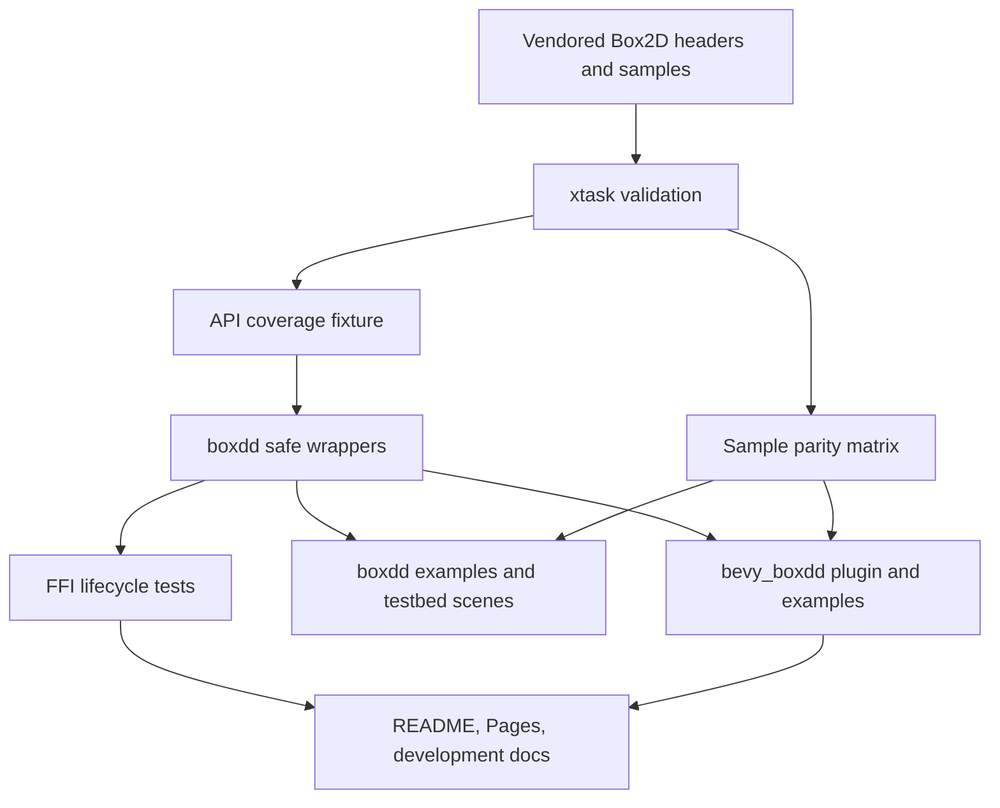

# API Lifecycle Examples Hardening - Plan

## Goal Capsule

| Field | Decision |
|---|---|
| Objective | Turn the existing Box2D binding suite from broad first-pass coverage into a stricter product surface: real sample parity, fewer raw APIs, executable FFI lifecycle contracts, and richer Bevy examples. |
| Authority | User request, vendored Box2D headers/samples, existing `boxdd` safe API patterns, and `boxddd` engineering-platform patterns. |
| Execution profile | Fearless refactor is allowed, including breaking safe APIs and deleting obsolete code, but only when it improves the public binding contract. |
| Stop conditions | Stop for user input only if implementation reveals a product-scope choice that changes which upstream capabilities should be supported or intentionally omitted. |
| Tail ownership | This plan is intended for goal-mode or `ce-work`; progress is tracked in tasks and commits, not by editing this plan. |

---

## Product Contract

### Summary

This plan hardens the parts of `boxdd` that users and maintainers use to trust the binding: every official sample must be mapped to a Rust artifact or a defended deferral, raw API rows must shrink or be explicitly justified, FFI lifecycle rules must be executable tests, and `bevy_boxdd` must demonstrate events and queries beyond a falling box.

### Problem Frame

The first productization pass created the workspace shell: `xtask`, API coverage, sample parity, Pages, a dynamic-tree wrapper, and a starter `bevy_boxdd` crate.
The remaining risk is that several artifacts are still accounting mechanisms rather than proof: `docs/upstream-parity/box2d-sample-matrix.md` indexes upstream samples but leaves nearly every row as `UpstreamReference`; `docs/api-coverage.md` reports 12 raw APIs; callback behavior has ignored tests and only partial panic/lock coverage; and Bevy integration has one example despite already exposing contact and sensor messages.

### Requirements

**Coverage and parity**

- R1. The sample parity matrix must map non-benchmark official Box2D samples to existing Rust examples, testbed scenes, tests, or a defended deferral instead of leaving them as unowned upstream references.
- R2. `xtask sample-parity --check` must reject accidental non-benchmark `UpstreamReference` rows and must validate that claimed Rust artifacts exist.
- R3. API coverage must shrink the raw set where the safe wrapper shape is already obvious, and every remaining raw or omitted row must carry a durable rationale.

**FFI lifecycle and safety**

- R4. Callback-sensitive behavior must be covered by default-running tests where it is deterministic enough for CI.
- R5. Panic containment for query, dynamic-tree, callback, and debug-draw crossings must be tested at the Rust boundary so panics do not unwind through C.
- R6. Borrowed event/raw view rules must stay closure-bound and documented, with tests or compile-time examples that prevent accidental long-lived borrows.

**Bevy integration and examples**

- R7. `bevy_boxdd` must show contact events, sensor events, ray/query usage, joints or kinematic platform behavior, and the fixed-step transform sync model through examples and tests.
- R8. Bevy-facing examples must use the existing plugin and message surface before adding new abstractions; new ECS APIs are allowed only when an example cannot be expressed cleanly with the current model.

**Documentation and maintainability**

- R9. README, Pages, and development docs must reflect the stricter coverage/parity/lifecycle contracts.
- R10. All new or changed behavior must be verified by focused nextest/check/clippy/doc/xtask gates, with release-level packaging checks kept available.

### Scope Boundaries

- This plan may break or rename public safe APIs when doing so removes raw leakage or fixes lifecycle ambiguity.
- This plan may delete obsolete examples, stale docs, and redundant helper code if a better artifact covers the same behavior.
- This plan does not require a browser/WASM live demo; Pages may remain static unless implementation makes a live demo cheap and stable.
- This plan does not require safe wrappers for global allocator, assert, and log hooks unless implementation reveals a sound scoped design.

#### Deferred to Follow-Up Work

- Full Bevy debug drawing and visual gizmos are deferred unless the existing plugin already has enough render-surface support.
- A full browser testbed and wasm provider strategy are deferred behind a separate platform plan.
- Semver-checks and PR automation can remain release-process follow-up if they distract from API/lifecycle hardening.

### Acceptance Examples

- AE1. When an upstream non-benchmark sample already has a matching `boxdd/examples` file or testbed scene, the sample matrix names that artifact and `xtask sample-parity --check` passes.
- AE2. When a new upstream non-benchmark sample appears and is not mapped, `xtask sample-parity --check` fails with a message identifying the unmapped sample.
- AE3. When a Rust callback panics during a query, dynamic-tree traversal, custom filter, pre-solve callback, or debug draw, the panic is caught at the FFI boundary and resumed after Box2D returns.
- AE4. When a Bevy app spawns physics entities with contact or sensor events enabled, the plugin emits entity-mapped messages that can be asserted in tests and demonstrated in examples.

---

## Planning Contract

### Key Technical Decisions

- KTD1. Vendored source is authoritative. Use `boxdd-sys/third-party/box2d/include/box2d` and `boxdd-sys/third-party/box2d/samples` as the exact release contract; online Box2D docs are orientation, not the symbol source.
- KTD2. Sample parity becomes strict by category. Benchmark rows may remain `UpstreamReference` when the Rust artifact would be performance data rather than user API coverage; non-benchmark rows must be `FaithfulPort`, `TeachingAdaptation`, `TestOnly`, or `Deferred` with rationale.
- KTD3. Raw API reduction prefers crate-owned values. Shape-specific casts should accept `Circle`, `Capsule`, `Polygon`, `Segment`, `Transform`, and translation values, returning existing `CastOutput` and using `try_*` validation before crossing FFI.
- KTD4. Remaining global raw hooks stay raw unless they can be scoped. Allocator, assert, and log callbacks mutate process-global Box2D state, so wrapping them without a guard object and reset semantics would be misleading.
- KTD5. FFI lifecycle tests should exercise real chains instead of mocks. Query callbacks, dynamic-tree callbacks, custom filter/pre-solve callbacks, event views, and owned-handle drops each need direct tests where the safe layer's guard or panic behavior is observable.
- KTD6. `bevy_boxdd` examples should prove current ECS-native surfaces first. Add tests/examples around messages, fixed-step sync, queries against `BoxddPhysicsContext`, and one simple joint/kinematic scene before introducing debug draw or larger ECS abstraction.

### High-Level Technical Design

The hardened contract has one direction: vendored upstream assets feed `xtask`, `xtask` validates docs/fixtures, and docs point back to real Rust artifacts.
Implementation should not let examples and matrices drift independently.

### Assumptions

- Existing examples and testbed scenes already cover many official samples; the main work is mapping and tightening validation rather than porting every scene from scratch.
- The current `bevy_boxdd` message surface is sufficient for first-class contact and sensor examples.
- Remaining raw global hooks are better documented as raw escape hatches than wrapped prematurely.

### Sources and Research

- `docs/api-coverage.md` reports `total=430`, `safe=416`, `raw=12`, `omitted=2`, `deferred=0`.
- `boxdd/tests/fixtures/api_coverage_symbols.txt` names the raw rows: global hooks, `b2IsValidRay`, four shape-specific shape casts, three joint world/local-frame functions, and internal assert.
- `docs/upstream-parity/box2d-sample-matrix.md` currently uses `UpstreamReference` broadly even though `boxdd/examples` and `boxdd/examples/testbed/scenes` already cover many categories.
- `docs/development/ffi-lifetime-audit.md` states the callback/event/query lifetime model but should be backed by more default-running tests.
- `bevy_boxdd/src/messages.rs` already exposes body, contact, hit, sensor, and error messages; `bevy_boxdd/tests/plugin.rs` currently covers body/shape creation, transform sync, handle destruction, and one-shot impulses.
- External orientation: Box2D official docs describe C handle-based world/body/shape/joint APIs and transient event arrays; Bevy physics ecosystem conventions from `bevy_rapier` and Avian favor plugin/prelude/message examples and ECS-native scenes.

---

## System-Wide Impact

- Public API: new safe wrappers may add exported functions/types and may rename or demote raw-only helpers if they conflict with the safe API style.
- CI and maintenance: stricter `xtask sample-parity --check` will make future upstream sample additions fail until categorized.
- Docs: Pages and README become part of the coverage contract because they link to real examples and matrices.
- Bevy: examples and tests increase confidence that message/event surfaces are not only compiled but usable through Bevy schedules.
- FFI safety: callback and event tests reduce the chance that a future wrapper accidentally permits reentrant world mutation or C-boundary unwinding.

---

## Implementation Units

### U1. Make Sample Parity Real

- **Goal:** Replace broad `UpstreamReference` rows with real Rust artifact mappings and make non-benchmark unmapped rows fail validation.
- **Requirements:** R1, R2, R9; covers AE1 and AE2.
- **Dependencies:** None.
- **Files:** `xtask/src/main.rs`, `docs/upstream-parity/box2d-sample-matrix.md`, `docs/pages/index.html`, `docs/pages/examples/index.html`, `boxdd/examples/README.md`.
- **Approach:** Build a category-aware mapping table from existing examples and testbed scenes before writing new examples. Keep benchmark rows as indexed references unless there is a meaningful Rust benchmark artifact. Add strict validation for non-benchmark rows so matrix drift is visible.
- **Execution note:** Start with a failing `sample-parity --check` expectation for at least one intentionally unmapped non-benchmark row, then update the matrix/tool until the full matrix passes.
- **Patterns to follow:** `xtask` table parsing and artifact existence checks; existing examples under `boxdd/examples`; testbed scene names under `boxdd/examples/testbed/scenes`.
- **Test scenarios:**
  - Happy path: a non-benchmark row with `TeachingAdaptation` and an existing artifact passes validation.
  - Error path: a non-benchmark row with `UpstreamReference` fails with the category/sample name.
  - Error path: a `FaithfulPort`, `TeachingAdaptation`, or `TestOnly` row pointing at a missing artifact fails.
  - Edge case: benchmark rows with `UpstreamReference` remain allowed.
- **Verification:** `cargo run -p xtask -- sample-parity --check` passes and the matrix visibly maps existing artifacts for major non-benchmark categories.

### U2. Close Obvious Raw API Gaps

- **Goal:** Add safe wrappers for raw APIs whose safe shape is straightforward and update API coverage.
- **Requirements:** R3, R10.
- **Dependencies:** None.
- **Files:** `boxdd/src/collision.rs`, `boxdd/src/shapes/geometry.rs`, `boxdd/src/joints/base.rs`, `boxdd/src/joints/base/runtime_handle.rs`, `boxdd/src/joints/base/owned.rs`, `boxdd/src/joints/base/scoped.rs`, `boxdd/src/joints/runtime.rs`, `boxdd/src/lib.rs`, `boxdd/src/prelude.rs`, `boxdd/tests/collision_validation.rs`, `boxdd/tests/joint_new_apis.rs`, `boxdd/tests/fixtures/api_coverage_symbols.txt`, `docs/api-coverage.md`.
- **Approach:** Wrap `b2IsValidRay`, `b2ShapeCastCircle`, `b2ShapeCastCapsule`, `b2ShapeCastSegment`, `b2ShapeCastPolygon`, `b2Joint_GetWorld`, `b2Joint_SetLocalFrameA`, and `b2Joint_SetLocalFrameB` if implementation confirms they do not require a broader design. Keep allocator/assert/log/internal assert raw with stronger notes if scoped safety is not solved.
- **Execution note:** Add focused tests before changing the coverage fixture so the fixture only moves symbols to `safe` after the wrapper behavior exists.
- **Patterns to follow:** `shape_cast` / `try_shape_cast` in `boxdd/src/collision.rs`; `make_ray_input` validation in `boxdd/src/shapes/geometry.rs`; existing joint getter/setter patterns in `boxdd/src/joints/base.rs` and `boxdd/src/joints/runtime.rs`.
- **Test scenarios:**
  - Happy path: valid shape-specific cast inputs return `CastOutput` without raw FFI.
  - Edge case: invalid ray or non-finite translation returns `ApiError::InvalidArgument` on `try_*` and panics on convenience APIs.
  - Happy path: a live joint can return its owning `WorldId` or equivalent safe world identity if exposed.
  - Happy path: local frame setters round-trip through existing local frame getters.
  - Error path: local frame setters reject invalid transforms and stale joint ids on `try_*`.
- **Verification:** API coverage reports fewer raw rows, focused tests pass, and docs explain any raw rows that intentionally remain.

### U3. Harden FFI Lifecycle Tests

- **Goal:** Turn lifecycle audit principles into default-running tests for callback locks, panic containment, event views, and deferred destruction.
- **Requirements:** R4, R5, R6, R10; covers AE3.
- **Dependencies:** U2 where new wrappers introduce callback or lifetime surfaces.
- **Files:** `boxdd/tests/world_callbacks.rs`, `boxdd/tests/panic_across_ffi_is_caught.rs`, `boxdd/tests/world_and_queries.rs`, `boxdd/tests/dynamic_tree.rs`, `boxdd/tests/events_and_sensors.rs`, `boxdd/tests/world_destroy_and_recycle.rs`, `docs/development/ffi-lifetime-audit.md`.
- **Approach:** Remove `#[ignore]` from deterministic callback tests or replace them with stable equivalents. Add query and dynamic-tree panic tests if missing. Add event-view tests that prove borrowed views are closure-bound and owned snapshots remain usable after the view closes.
- **Execution note:** Prefer characterization-first edits for ignored tests: run them focused, determine why they were ignored, then stabilize or replace them.
- **Patterns to follow:** `try_*` callback guard checks in `boxdd/src/core/callback_state.rs`; existing debug-draw panic tests; event view APIs documented in `boxdd/src/lib.rs`.
- **Test scenarios:**
  - Happy path: custom filter and pre-solve callbacks are invoked and can control contact behavior without ignored tests.
  - Error path: callback reentry into forbidden world APIs produces `ApiError::InCallback` on `try_*` paths.
  - Error path: query and dynamic-tree callback panics are caught and resumed after native traversal returns.
  - Edge case: event view closures can inspect events without allocation while owned snapshots remain copyable for storage.
  - Integration: dropping owned handles while event buffers are borrowed defers destruction safely or reports the documented error.
- **Verification:** Focused nextest suites pass without ignored lifecycle tests being required for the main safety contract.

### U4. Expand Bevy Examples and Tests

- **Goal:** Demonstrate and test `bevy_boxdd` contact events, sensor events, query access, and one joint or kinematic-platform scene.
- **Requirements:** R7, R8, R9, R10; covers AE4.
- **Dependencies:** U1 for sample mapping if examples are used as parity artifacts.
- **Files:** `bevy_boxdd/src/components.rs`, `bevy_boxdd/src/messages.rs`, `bevy_boxdd/src/resources.rs`, `bevy_boxdd/src/systems.rs`, `bevy_boxdd/src/prelude.rs`, `bevy_boxdd/tests/plugin.rs`, `bevy_boxdd/examples/falling_box_2d.rs`, new files under `bevy_boxdd/examples/`, `bevy_boxdd/README.md`.
- **Approach:** Use the existing plugin and messages first. Add examples such as `contact_events_2d`, `sensor_events_2d`, `ray_query_2d`, and `kinematic_platform_2d` or `joint_bridge_2d` depending on which surfaces are already clean. Add tests that assert messages are emitted and entity mappings are present.
- **Execution note:** Keep Bevy additions small and ECS-native; do not introduce a debug-rendering subsystem unless examples cannot be explained without it.
- **Patterns to follow:** `bevy_boxdd/examples/falling_box_2d.rs`, `bevy_boxdd/tests/plugin.rs`, `bevy_boxdd/src/systems.rs` message publication.
- **Test scenarios:**
  - Happy path: contact-enabled dynamic body colliding with ground emits begin/contact or hit messages with mapped entities.
  - Happy path: sensor-enabled shape emits sensor begin/end messages with mapped sensor and visitor entities.
  - Happy path: an example can query the native world through `BoxddPhysicsContext` without moving the world across threads.
  - Edge case: invalid collider/material input emits `BoxddErrorMessage` when configured to report recoverable errors.
- **Verification:** `cargo nextest run -p bevy_boxdd --test plugin`, `cargo check -p bevy_boxdd --examples`, and `cargo check -p bevy_boxdd --no-default-features` pass.

### U5. Align Docs, Pages, and Release Gates

- **Goal:** Make public docs match the stricter API/parity/lifecycle contract and verify the full workspace.
- **Requirements:** R9, R10.
- **Dependencies:** U1, U2, U3, U4.
- **Files:** `README.md`, `CHANGELOG.md`, `docs/development/ffi-lifetime-audit.md`, `docs/development/rustdoc-alignment.md`, `docs/development/ci.md`, `docs/pages/index.html`, `docs/pages/examples/index.html`, crate READMEs, CI workflow files if touched.
- **Approach:** Update status tables, examples lists, and development docs after code behavior settles. Remove stale claims that the old broad `UpstreamReference` matrix was sufficient. Keep CI additions scoped to checks that are now stable.
- **Execution note:** This is mostly documentation/config; prefer smoke validation and doc builds over adding more unit tests.
- **Patterns to follow:** Existing docs pages and README badge/table style from the first productization pass.
- **Test scenarios:**
  - Test expectation: none for prose-only edits; validation is link/doc/check based.
  - Integration: Pages validation still passes after all links are updated.
  - Integration: Rustdoc builds warning-clean with the new public APIs and examples.
- **Verification:** `cargo fmt --all -- --check`, focused nextest suites, all relevant `xtask` checks, clippy for touched crates, docs build, and package checks pass or have documented non-applicability.

---

## Verification Contract

| Gate | Applies To | Done Signal |
|---|---|---|
| `cargo fmt --all -- --check` | Whole workspace | Formatting is stable after all edits. |
| `cargo run -p xtask -- api-coverage --check` | U2, U5 | API fixture and docs match vendored headers. |
| `cargo run -p xtask -- sample-parity --check` | U1, U5 | Sample matrix maps every upstream row under the stricter policy. |
| `cargo run -p xtask -- validate-pages` | U1, U5 | Pages local links remain valid. |
| `cargo nextest run -p boxdd --test api_coverage --test collision_validation --test joint_new_apis --test world_callbacks --test panic_across_ffi_is_caught --test dynamic_tree --test events_and_sensors` | U2, U3 | Focused safe-wrapper and lifecycle tests pass. |
| `cargo nextest run -p bevy_boxdd --test plugin` | U4 | Bevy plugin behavior tests pass. |
| `cargo check -p bevy_boxdd --examples` | U4 | New Bevy examples compile. |
| `cargo clippy -p boxdd --all-targets --all-features -- -D warnings` | U2, U3, U5 | Safe API changes are lint-clean. |
| `cargo clippy -p bevy_boxdd --all-targets --no-default-features -- -D warnings` | U4, U5 | Bevy changes are lint-clean without default features. |
| `RUSTDOCFLAGS='-D warnings --cfg docsrs' cargo doc --workspace --no-deps` | U2, U4, U5 | Public docs build without warnings. |
| `cargo package -p boxdd --allow-dirty --no-verify`, `cargo package -p boxdd-sys --allow-dirty --no-verify`, `cargo package -p bevy_boxdd --allow-dirty --no-verify` | U5 | Packaging metadata remains valid. |

---

## Risks & Dependencies

- Shape-specific cast wrappers may overlap with existing generic `shape_cast`; mitigate by making them thin convenience wrappers over crate-owned geometry and preserving the generic path.
- Callback tests can be timing-sensitive; mitigate by preferring deterministic overlap/contact setups and replacing unstable ignored tests rather than simply unignoring them.
- Strict sample parity may make the matrix large; mitigate by using existing testbed scenes and `TestOnly` mappings rather than creating dozens of redundant top-level examples.
- Bevy 0.19 API changes can make examples verbose; mitigate by keeping examples compile-only where runtime assertions belong in `bevy_boxdd/tests/plugin.rs`.
- Global Box2D hooks are process-global and can poison tests; mitigate by keeping them raw unless a scoped guard with reset semantics is implemented.

---

## Definition of Done

- Every non-deferrable implementation unit is complete and has observed verification results.
- Non-benchmark sample matrix rows no longer rely on broad unowned `UpstreamReference` status.
- API coverage raw rows are reduced where safe wrappers are straightforward, and remaining raw/omitted rows have explicit rationale.
- FFI lifecycle tests cover callback locks and panic containment without relying on ignored tests for the main safety story.
- `bevy_boxdd` has tested event/message behavior and multiple compiling examples beyond `falling_box_2d`.
- README, Pages, and development docs match the shipped behavior.
- Dead-end code from attempted wrappers, examples, or tests is removed before final validation.
