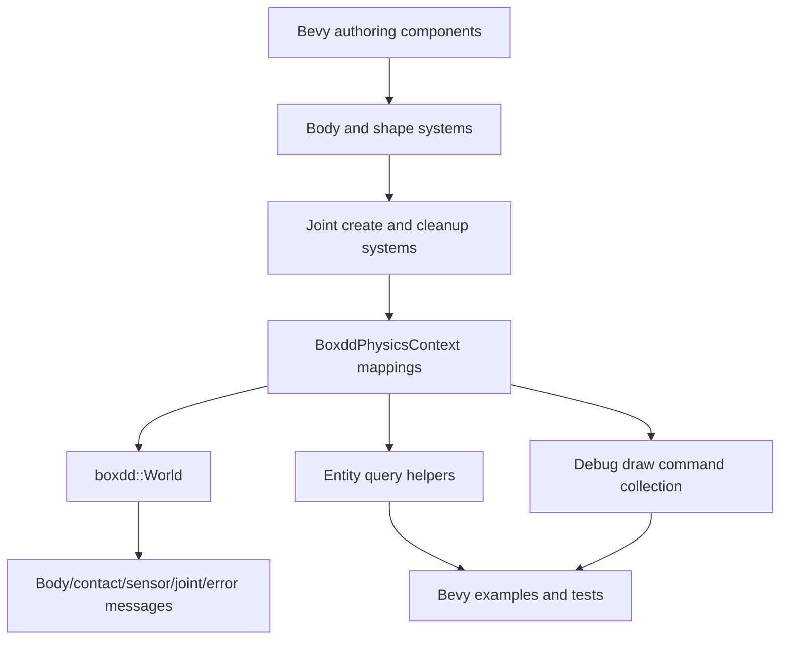

# Bevy Productization Round - Plan

## Goal Capsule

| Field | Decision |
|---|---|
| Objective | Turn `bevy_boxdd` from a body/shape smoke adapter into a usable Bevy physics surface with ECS-authored joints, entity-mapped queries, debug-draw command collection, and examples that exercise the public workflow. |
| Authority | User request for another productization round, the current `boxdd` safe ID-based API, existing `bevy_boxdd` plugin systems, previous productization plans, and local examples/tests. |
| Execution profile | Fearless refactor is allowed when it improves public crate shape, including breaking Bevy-facing APIs before release. |
| Stop conditions | Stop only if implementation reveals a soundness issue in native joint lifetime management or a Bevy scheduling constraint that would require a different public API. |
| Tail ownership | Execute directly in this session; track progress in tasks and commits, not by editing this plan. |

---

## Product Contract

### Summary

This round productizes the Bevy binding where users feel the current gaps first: connecting bodies, asking physics questions in entity terms, and inspecting the world without manually touching raw native handles.
The core `boxdd` crate already exposes broad safe APIs, so this plan keeps the center of gravity in `bevy_boxdd` and uses core APIs only as stable building blocks.

### Problem Frame

`bevy_boxdd` currently creates bodies and colliders, publishes body/contact/sensor messages, maps ray hits manually through `BoxddPhysicsContext`, and demonstrates events through examples.
It still forces users to drop down to the native `boxdd::World` for joints and debug draw, which breaks the ECS authoring model that makes a Bevy integration useful.
The next product step is not a renderer or editor; it is a thin, typed ECS layer over native IDs that owns lifetime, exposes clear errors, and remains small enough to verify.

### Requirements

**ECS joint authoring**

- R1. Bevy apps must be able to author native joints with components that refer to two Bevy body entities and receive a `BoxddJoint` component after creation.
- R2. Joint creation must use native `JointId` APIs and context-owned mappings, avoiding scoped or owned joint handle drop semantics inside ECS systems.
- R3. Removing a joint component/entity or changing its descriptor must destroy and recreate the native joint without leaking mappings.
- R4. Recoverable joint creation errors must be routed through `BoxddErrorMessage` with the joint entity attached.

**Entity-level physics access**

- R5. `BoxddPhysicsContext` must expose entity-mapped ray query helpers so examples and game systems do not repeat `world.cast_ray_*` plus `shape_entity` plumbing.
- R6. `BoxddPhysicsContext` must expose a reusable debug-draw command collection helper that keeps rendering optional and does not add Bevy render dependencies.
- R7. New helpers must preserve `boxdd::World` access for advanced users; the Bevy layer adds convenience, not a parallel physics engine.

**Examples, docs, and release trust**

- R8. `bevy_boxdd` examples must include a joint scene and a debug-draw collection scene or equivalent compile-checked artifact.
- R9. `bevy_boxdd` README, crate docs, Pages examples, and development CI docs must name the new product surface and its verification gates.
- R10. Focused tests must cover happy paths, descriptor changes, stale references, message/error behavior, and helper APIs before release-level checks pass.

### Scope Boundaries

- This plan implements a joint MVP, not every Box2D joint knob. Distance and revolute joints are enough to prove the pattern; prismatic, wheel, weld, motor, and filter may follow after the ECS model stabilizes.
- This plan does not add a Bevy renderer, gizmo plugin, editor UI, or asset format. Debug draw is collected as `boxdd::DebugDrawCmd` so applications decide how to render.
- This plan does not change the core safe API unless a small helper is necessary to avoid unsound Bevy lifetime usage.
- This plan does not require a browser or WASM demo; platform checks stay release-gate documentation unless implementation makes a compile gate cheap and stable.

### Acceptance Examples

- AE1. Given two Bevy entities with `RigidBody` and colliders, when a third entity has a distance joint descriptor referencing them, a fixed update creates a native distance joint and inserts `BoxddJoint`.
- AE2. Given a joint descriptor whose endpoints or kind changes, the next fixed update destroys the old native joint, recreates the new native joint, and keeps context mappings accurate.
- AE3. Given a joint descriptor referencing an entity without a `BoxddBody`, the plugin emits a recoverable `CreateJoint` error and does not insert `BoxddJoint`.
- AE4. Given a ray cast through `BoxddPhysicsContext`, callers receive the native hit plus mapped shape entity without manually looking up `shape_entity`.
- AE5. Given a physics world with shapes or joints, debug draw collection fills a caller-owned buffer and can reuse it across frames without adding render dependencies.

---

## Planning Contract

### Key Technical Decisions

- KTD1. Model joints as descriptor components plus runtime ID components. `BoxddJoint` mirrors `BoxddBody` and `BoxddShape`, while a descriptor component owns authoring data and Bevy endpoint entities.
- KTD2. Use native ID-style joint creation in systems. Scoped `Joint<'w>` and `OwnedJoint` are inappropriate for ECS-owned lifetime because their destructors can destroy the joint before context mappings are stable.
- KTD3. Start with `DistanceJoint` and `RevoluteJoint`. They cover common constraints, use local anchor/world anchor semantics already present in core, and keep validation/test surface manageable.
- KTD4. Keep debug draw render-agnostic. `bevy_boxdd` can collect `boxdd::DebugDrawCmd` through a resource/helper; rendering with sprites, gizmos, or meshes belongs in examples or downstream applications.
- KTD5. Schedule joint systems after body creation and before stepping. Joint creation needs `BoxddBody` components to exist, and cleanup must run before body cleanup can invalidate native handles.
- KTD6. Publish scheduled-system errors through the existing message policy. Add `CreateJoint` and `DestroyJoint` operations for ECS joint lifecycle failures; keep debug-draw collection as a direct `ApiResult` helper until a scheduled collector exists.

### High-Level Technical Design

### Assumptions

- `boxdd::World::joint_base_from_world_points` plus `try_create_distance_joint_id` and `try_create_revolute_joint_id` are sufficient to create the Bevy MVP without exposing raw FFI.
- Bevy 0.19 `Message` APIs and current schedule chaining are stable enough for additive message and system changes.
- Query and debug-draw helpers can live on `BoxddPhysicsContext` without making the context `Send` or hiding `world()`/`world_mut()` access.

### Sources and Research

- `bevy_boxdd/src/systems.rs` already has a chain of cleanup, creation, apply, step, publish, and sync systems.
- `bevy_boxdd/src/resources.rs` owns `Entity <-> BodyId` and `Entity <-> ShapeId` maps and is the natural home for `Entity <-> JointId`.
- `boxdd/src/world/creation/joint_builders.rs` exposes world-anchor joint helpers and ID creation paths.
- `boxdd/src/debug_draw.rs` already exposes `debug_draw_collect_into`, so Bevy should reuse command collection rather than rebuilding callbacks.
- `bevy_boxdd/tests/plugin.rs` has focused app-level tests for component lifecycle, events, queries, and recoverable errors.

---

## System-Wide Impact

- Public Bevy API adds `JointDescriptor`, per-joint descriptor types, `BoxddJoint`, query hit wrappers, and debug-draw collection helpers.
- Plugin scheduling changes to add joint cleanup/create before `step_world`; tests must prove body cleanup still removes dependent mappings.
- `BoxddOperation` becomes broader to cover joint lifecycle failures.
- Examples and docs become a stronger sales surface for `bevy_boxdd`, while the core `boxdd` crate remains engine-agnostic.

---

## Implementation Units

### U1. Add ECS Joint Authoring and Lifetime

- **Goal:** Add distance and revolute joint descriptors, native joint creation, context mappings, cleanup, and recoverable error messages.
- **Requirements:** R1, R2, R3, R4; covers AE1, AE2, AE3.
- **Dependencies:** None.
- **Files:** `bevy_boxdd/src/components.rs`, `bevy_boxdd/src/messages.rs`, `bevy_boxdd/src/resources.rs`, `bevy_boxdd/src/systems.rs`, `bevy_boxdd/src/plugin.rs`, `bevy_boxdd/src/prelude.rs`, `bevy_boxdd/tests/plugin.rs`.
- **Approach:** Add `JointDescriptor` as a component with `entity_a`, `entity_b`, `kind`, and shared tuning fields. Add `JointKind::Distance` and `JointKind::Revolute` with world-space anchors and optional limit/spring/motor knobs that map to existing core definitions. Add `BoxddJoint(JointId)`, context maps, and joint descriptor snapshots. Create missing joints after bodies exist, destroy stale joints when descriptors disappear or change, and clear dependent joints when a body is removed.
- **Execution note:** Start by adding failing tests for creation, descriptor change, and missing-body error before implementing systems.
- **Patterns to follow:** `BoxddBody` and `BoxddShape` component insertion; `ShapeDescriptor` tracking; `cleanup_removed_colliders`; `BoxddErrorMessage` reporting.
- **Test scenarios:**
  - Happy path: distance joint descriptor creates a native distance joint and inserts `BoxddJoint`.
  - Happy path: revolute descriptor creates a native revolute joint and maps both endpoint bodies.
  - Edge case: changing descriptor kind or anchors recreates the native joint with a different `JointId`.
  - Error path: missing endpoint body emits `CreateJoint` and leaves the entity without `BoxddJoint`.
  - Integration: removing a body removes dependent `BoxddJoint` components and context mappings.
- **Verification:** `cargo nextest run -p bevy_boxdd --test plugin` passes for the new joint tests.

### U2. Add Entity Query and Debug Draw Helpers

- **Goal:** Add Bevy-friendly helper APIs for ray hits and debug-draw command collection without hiding native world access.
- **Requirements:** R5, R6, R7, R10; covers AE4 and AE5.
- **Dependencies:** U1 for joint debug-draw coverage if joints are included in draw commands.
- **Files:** `bevy_boxdd/src/resources.rs`, `bevy_boxdd/src/prelude.rs`, `bevy_boxdd/tests/plugin.rs`.
- **Approach:** Add a `BoxddRayHit` wrapper containing the native `boxdd::RayResult` plus `Option<Entity>`. Add closest/all ray helper methods on `BoxddPhysicsContext` that call through to `World` and map shape IDs. Add `debug_draw_collect_into` and `debug_draw_collect` wrappers that forward to `World::try_debug_draw_collect_into` and return `ApiResult`.
- **Execution note:** Keep helpers thin and test them with plugin-created shapes; do not add a rendering subsystem.
- **Patterns to follow:** Current `physics_context_ray_query_maps_hits_to_entities` test; core `World::cast_ray_closest` and `World::debug_draw_collect_into`.
- **Test scenarios:**
  - Happy path: closest ray helper returns a hit mapped to the collider entity.
  - Happy path: all-ray helper reuses a caller-owned buffer and maps every hit.
  - Happy path: debug draw collection returns commands for plugin-created shapes.
  - Edge case: disabled context returns `None` or `ApiError` consistently without panicking.
- **Verification:** `cargo nextest run -p bevy_boxdd --test plugin` passes for helper coverage.

### U3. Add Product Examples and Example Metadata

- **Goal:** Add compile-checked Bevy examples showing joint authoring and debug-draw/query helpers, then register them in crate metadata.
- **Requirements:** R8, R9, R10.
- **Dependencies:** U1, U2.
- **Files:** `bevy_boxdd/examples/joint_bridge_2d.rs`, `bevy_boxdd/examples/debug_draw_collect_2d.rs`, `bevy_boxdd/Cargo.toml`, `bevy_boxdd/README.md`, `boxdd/examples/README.md`, `docs/pages/examples/index.html`.
- **Approach:** Add one scene-style joint example with a static anchor and dynamic chain or bridge using the new descriptors. Add one headless-friendly debug draw example that logs command counts or mirrors the existing ray query style. Register both examples and update docs indexes.
- **Execution note:** Examples should compile with `cargo check -p bevy_boxdd --examples`; runtime polish is secondary to teaching the public API.
- **Patterns to follow:** `bevy_boxdd/examples/kinematic_platform_2d.rs`, `bevy_boxdd/examples/ray_query_2d.rs`, `boxdd/examples/README.md` catalog style.
- **Test scenarios:**
  - Compile check: joint example builds against the public prelude.
  - Compile check: debug draw example builds without adding non-dev render dependencies to the library crate.
  - Documentation: examples page links resolve through `xtask validate-pages`.
- **Verification:** `cargo check -p bevy_boxdd --examples` and `cargo run -p xtask -- validate-pages` pass.

### U4. Align Docs and Release Gates

- **Goal:** Update public status docs and run productization release checks for the touched crates.
- **Requirements:** R9, R10.
- **Dependencies:** U1, U2, U3.
- **Files:** `README.md`, `bevy_boxdd/README.md`, `docs/development/ci.md`, `docs/development/rustdoc-alignment.md`, `docs/pages/index.html`, `docs/pages/examples/index.html`.
- **Approach:** Update docs after API names settle. Add focused release gate lines for Bevy joint/query/debug-draw coverage. Keep docs factual about what is shipped and what remains deferred.
- **Execution note:** Do not mark planned full renderer/editor/WASM demos as shipped.
- **Test scenarios:**
  - Prose-only changes use docs, links, rustdoc, and packaging as verification.
  - Docs include the new examples and do not claim unsupported joint types.
  - CI docs include the focused `bevy_boxdd` test and example commands.
- **Verification:** Formatting, focused tests, example checks, docs build, clippy for `bevy_boxdd`, and package check for `bevy_boxdd` pass.

---

## Verification Contract

| Gate | Applies To | Done Signal |
|---|---|---|
| `cargo fmt --all -- --check` | Whole workspace | Formatting is stable after all edits. |
| `cargo nextest run -p bevy_boxdd --test plugin` | U1, U2 | Bevy joint lifecycle, query helper, debug-draw helper, and error tests pass. |
| `cargo check -p bevy_boxdd --examples` | U3 | New and existing Bevy examples compile. |
| `cargo check -p bevy_boxdd --no-default-features` | U1-U4 | Library remains feature-light. |
| `cargo clippy -p bevy_boxdd --all-targets --no-default-features -- -D warnings` | U1-U4 | Bevy crate is lint-clean. |
| `cargo run -p xtask -- validate-pages` | U3, U4 | Static docs links remain valid. |
| `RUSTDOCFLAGS='-D warnings --cfg docsrs' cargo doc -p bevy_boxdd --no-deps` | U1-U4 | Public Bevy docs build warning-clean. |
| `cargo package -p bevy_boxdd --allow-dirty --no-verify` | U4 | Packaging metadata remains valid. |

---

## Risks & Dependencies

- Joint descriptor breadth can balloon quickly; mitigate by shipping distance and revolute first with room for more `JointKind` variants.
- Native joint destruction order can conflict with body destruction; mitigate by cleaning joint mappings before bodies and by removing `BoxddJoint` components when endpoint bodies disappear.
- Debug draw mutably borrows the native world; mitigate by offering collection helpers that callers use outside callbacks and before competing mutable access.
- Bevy schedules can hide deferred component insertion; mitigate by keeping `ApplyDeferred` after body creation and placing joint creation after that point.
- Examples can pull large runtime dependencies through the library; mitigate by keeping render-specific dependencies in `dev-dependencies` only.

---

## Definition of Done

- U1-U4 are implemented, verified, and reflected in focused commits.
- `bevy_boxdd` exposes ECS-authored distance and revolute joints with tested creation, recreation, cleanup, and error paths.
- `BoxddPhysicsContext` offers entity-level ray helper APIs and render-agnostic debug-draw collection helpers.
- Bevy examples and docs teach the new APIs without overstating unsupported joint types or renderer features.
- Verification Contract gates pass or have a concrete non-applicability note.
- Dead-end code from attempted API shapes is removed before final handoff.
