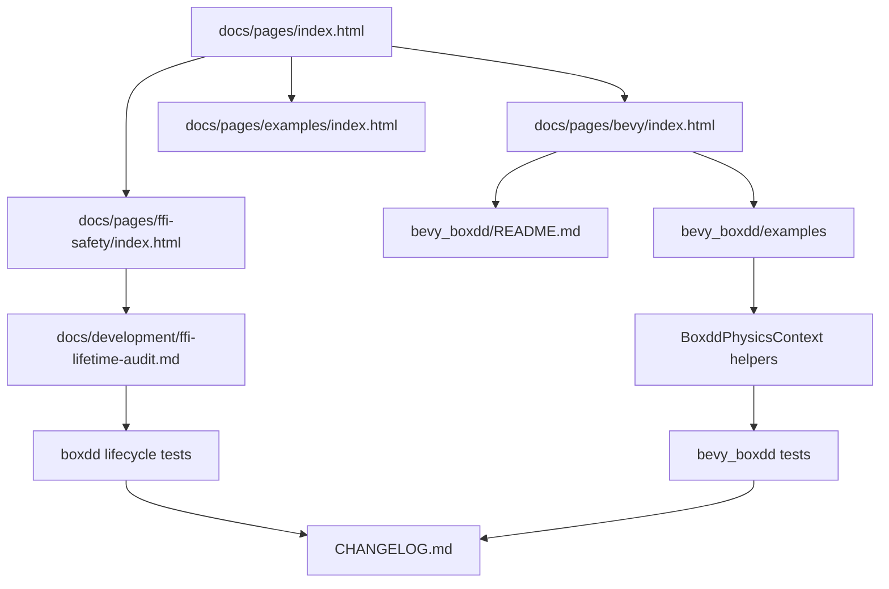

# Pages, FFI Safety, and Examples Productization - Plan

## Goal Capsule

| Field | Decision |
|---|---|
| Objective | Turn the current productization work into a user-facing release surface: GitHub Pages should guide users through core, Bevy, examples, and FFI safety; `boxdd` should have executable lifecycle evidence for common FFI hazards; `bevy_boxdd` should cover overlap queries, visual debug draw, child colliders, and collision filters with public APIs and examples. |
| Authority | User request for the next productization round, existing `boxdd` safe wrapper architecture, current `bevy_boxdd` ECS patterns, `xtask validate-pages`, prior 2026-07-06 plans, local tests/docs, and official Rust FFI guidance. |
| Execution profile | Fearless refactor is allowed, including breaking unreleased Bevy-facing APIs, deleting obsolete docs/examples, and reshaping tests when that improves safety or product clarity. |
| Stop conditions | Stop only if implementation reveals a real soundness issue that requires changing the public ownership model, or if Bevy 0.19 example APIs cannot compile without adding unwanted library dependencies. |
| Tail ownership | Execute directly in this session after goal creation; track progress in tasks and commits, not by editing this plan. |

---

## Product Contract

### Summary

This round closes the gap between “the bindings are broad” and “a new user can trust and use them.” The work prioritizes public trust surfaces over raw feature count: lifecycle guarantees must be explicit and tested, GitHub Pages must act as a real product hub, and Bevy users should see examples for the workflows they would naturally try next.

### Problem Frame

The repository already has strong core API coverage, sample parity, default-running lifecycle tests, a static Pages hub, and a Bevy crate with bodies, colliders, messages, ray helpers, joints, and debug-draw collection. The remaining product gap is mostly packaging and proof. Users still have to infer FFI lifecycle rules from scattered tests, the Pages hub does not yet have dedicated Bevy or FFI safety pages, and Bevy examples stop short of common gameplay/editor workflows such as overlap regions, collision filters, child colliders, and drawing debug geometry with Bevy tools.

### Requirements

**User-facing documentation and Pages**

- R1. The static Pages hub must link to dedicated Bevy and FFI safety pages, with local links validated by `xtask validate-pages`.
- R2. The examples page must list the new core and Bevy examples in topic groups that match how users choose workflows.
- R3. README and `bevy_boxdd/README.md` must describe the new overlap helper, child collider, filter, and debug draw workflows without duplicating long API docs.
- R4. `CHANGELOG.md` must explain the changes in user-facing language and include migration notes for any new or changed public API.

**FFI lifecycle and safety evidence**

- R5. `docs/development/ffi-lifetime-audit.md` must become a risk matrix that maps common FFI hazards to guards, tests, and remaining manual-only areas.
- R6. Tests must cover or explicitly document coverage for callback panic containment, callback reentry, stale ids, typed user data ownership/drop, raw user data pointer escape hatches, event/debug buffer lifetimes, world destroy/recycle, and public `!Send`/`!Sync` intent.
- R7. Any new safety documentation must distinguish internal thread-safe lifetime anchors from public `World`/owned-handle single-owner semantics.
- R8. Raw escape hatches must stay visibly named and documented so safe APIs do not accidentally imply ownership of caller-provided pointers.

**Bevy product workflows**

- R9. `BoxddPhysicsContext` must expose an entity-mapped AABB overlap helper with reusable-buffer and allocating forms, matching the existing ray helper style.
- R10. Bevy examples must demonstrate overlap queries, collision filtering, child colliders, and rendering `DebugDrawCmd` through Bevy Gizmos while keeping renderer dependencies outside the library.
- R11. Tests must prove overlap entity mapping, query filter behavior, disabled context behavior, buffer reuse/error semantics, and child collider lifecycle.
- R12. Existing Bevy query and joint scheduling behavior must remain intact after adding the new helpers and examples.

### Scope Boundaries

- This round does not add a live WASM demo. The Pages footer can continue to defer live demos until platform and callback boundaries are audited.
- This round does not expand `bevy_boxdd` to every Box2D joint type. Distance and revolute joints are already enough for the current ECS joint model; overlap/filter/debug/child-collider workflows have higher product value now.
- This round does not make `boxdd::World`, owned handles, or `BoxddPhysicsContext` `Send`/`Sync`.
- This round does not add Bevy render or gizmo dependencies to the `bevy_boxdd` library crate. Full Bevy remains a dev/example dependency only.
- Deferred follow-up work: dedicated visual browser QA for static Pages styling, live demo hosting, advanced joint families, a polished Bevy debug-draw plugin crate, and a formal compile-fail test suite for negative auto-trait assertions if ordinary tests prove insufficient.

### Acceptance Examples

- AE1. Given a user opens the Pages hub, they can reach a Bevy adapter page, FFI safety page, examples page, README, API coverage, sample parity, and CI gates without broken local links.
- AE2. Given a future maintainer adds a callback or raw pointer wrapper, the FFI lifecycle audit tells them which hazards to check and which tests must be extended before exposing a convenience API.
- AE3. Given a Bevy app with colliders in an AABB, `BoxddPhysicsContext` returns native shape ids plus mapped entities without callers manually using `shape_entity`.
- AE4. Given a Bevy app with category/mask filters, overlap queries can include or exclude matching shapes using `boxdd::QueryFilter`.
- AE5. Given a Bevy body with multiple child colliders, the plugin creates native shapes with local offsets and removes mappings when child colliders are removed.
- AE6. Given a Bevy app wants debug visualization, an example shows how to render collected `boxdd::DebugDrawCmd` values through `Gizmos` without changing the library crate dependency graph.

---

## Planning Contract

### Key Technical Decisions

- KTD1. Treat FFI safety as a product surface, not only an internal note. The audit should be a matrix of hazards, guards, tests, and owner files so users and maintainers can verify the model quickly.
- KTD2. Use official Rust guidance for FFI boundaries: do not let Rust panics cross plain `extern "C"` callbacks, keep unwind behavior explicit, and keep public `Send`/`Sync` semantics conservative for raw-pointer-backed resources.
- KTD3. Add Bevy AABB overlap helpers before adding more demos. The helper removes repetitive entity mapping from real gameplay/editor code and gives the new overlap/filter examples a clean API to teach.
- KTD4. Keep Bevy visual debug draw example-only. The public API remains render-agnostic `DebugDrawCmd` collection; `debug_draw_gizmos_2d.rs` is the place to show Bevy rendering.
- KTD5. Prefer focused regression tests over broad rewrites. The lifecycle surface already has default-running coverage; this round should fill gaps and organize evidence rather than duplicate every test.
- KTD6. Pages remain static HTML with repo-relative local links. `xtask validate-pages` is the source of truth for link correctness.
- KTD7. Changelog entries are user-facing and migration-oriented. They should explain what users can now do, which API to prefer, and how to update old manual patterns.

### High-Level Technical Design

### Assumptions

- The current `boxdd` lifecycle model is broadly sound: public world/handle types stay single-owner, callbacks catch panics and resume after Box2D returns, and event views defer destructive operations until borrowed buffers are released.
- Bevy 0.19 `Gizmos` APIs are available through the existing `bevy = "0.19.0"` dev-dependency and can compile in examples without changing library dependencies.
- `BoxddPhysicsContext` can add an internal `Vec<ShapeId>` scratch buffer for overlap helpers, mirroring the existing ray hit buffer.
- Public negative auto-trait intent can be enforced with a small dev-only assertion crate if the workspace does not already have a local assertion pattern.

### Sources and Research

- Local patterns: `docs/pages/index.html`, `docs/pages/examples/index.html`, `xtask/src/main.rs`, `docs/development/ffi-lifetime-audit.md`, `boxdd/tests/panic_across_ffi_is_caught.rs`, `boxdd/tests/user_data.rs`, `boxdd/tests/events_and_sensors.rs`, `boxdd/tests/world_destroy_and_recycle.rs`, `bevy_boxdd/src/resources.rs`, `bevy_boxdd/src/systems.rs`, `bevy_boxdd/tests/plugin.rs`, and `bevy_boxdd/examples/*`.
- Read-only Bevy research found the highest-value API gap is entity-mapped AABB overlap; collision filter, child collider, debug-draw Gizmos, and overlap examples can be added without core `boxdd` changes.
- Official Rust references shaping FFI risk decisions: Rust Nomicon FFI chapter (`https://doc.rust-lang.org/nomicon/ffi.html`), `std::panic::catch_unwind` docs (`https://doc.rust-lang.org/std/panic/fn.catch_unwind.html`), `std::marker::Send` docs (`https://doc.rust-lang.org/std/marker/trait.Send.html`), and `std::marker::Sync` docs (`https://doc.rust-lang.org/std/marker/trait.Sync.html`).

---

## System-Wide Impact

- `bevy_boxdd` public API adds an overlap hit wrapper and overlap helper methods on `BoxddPhysicsContext`; prelude and README must expose the intended import path.
- `bevy_boxdd` examples grow from smoke workflows to common product workflows: overlap regions, collision filters, child colliders, and visual debug drawing.
- `boxdd` safety docs and tests become a release trust gate; adding FFI wrappers later should update the matrix and tests, not only rustdoc.
- `docs/pages` shifts from a small hub to a product documentation entry point. Static link validation remains mandatory.
- `CHANGELOG.md` becomes the user migration contract for the round; it must mention manual query mapping replacement and the FFI audit/page additions.

---

## Implementation Units

### U1. Productize Static Pages Navigation

- **Goal:** Add dedicated Bevy and FFI safety pages, update the hub and examples page, and keep all local links valid.
- **Requirements:** R1, R2, R3; covers AE1.
- **Dependencies:** None.
- **Files:** `docs/pages/index.html`, `docs/pages/examples/index.html`, `docs/pages/bevy/index.html`, `docs/pages/ffi-safety/index.html`, `xtask/src/main.rs` only if existing validation cannot handle the new structure.
- **Approach:** Follow the existing static HTML style and restrained visual system. Link the Bevy tile to `docs/pages/bevy/index.html`, add an FFI safety tile, and group examples by core workflows and Bevy workflows. Keep pages static and repo-relative so `validate-pages` can verify them.
- **Patterns to follow:** Existing cards and tables in `docs/pages/index.html` and `docs/pages/examples/index.html`; `validate_pages` in `xtask/src/main.rs`.
- **Test scenarios:**
  - Happy path: `docs/pages/index.html` links to Bevy and FFI pages.
  - Happy path: `docs/pages/examples/index.html` links to every new Bevy example file.
  - Error path: no local `href` points at a missing repo file or page.
- **Verification:** `cargo run -p xtask -- validate-pages` reports every HTML file checked without errors.

### U2. Harden FFI Lifecycle Audit and Regression Coverage

- **Goal:** Convert the FFI audit into a maintainable risk matrix and add focused tests for the gaps that matter most to callback, pointer, event, and thread-boundary safety.
- **Requirements:** R5, R6, R7, R8; covers AE2.
- **Dependencies:** None.
- **Files:** `docs/development/ffi-lifetime-audit.md`, `docs/development/rustdoc-alignment.md`, `boxdd/Cargo.toml`, `Cargo.toml`, `boxdd/tests/panic_across_ffi_is_caught.rs`, `boxdd/tests/user_data.rs`, `boxdd/tests/events_and_sensors.rs`, `boxdd/tests/world_destroy_and_recycle.rs`, `boxdd/tests/handle_validity_panics.rs`, optional new `boxdd/tests/ffi_lifecycle.rs`.
- **Approach:** Build a matrix with columns for hazard, public boundary, guard, executable evidence, and follow-up rule. Strengthen tests only where coverage is missing or too implicit: public `!Send`/`!Sync` intent, callback panic followed by world reuse, typed user data drop on explicit destroy paths, raw pointer escape hatch clearing, stale id `try_*` consistency, and event/debug command owned-buffer lifetime. Use dev-only test dependencies only if they materially improve compile-time trait assertions.
- **Execution note:** Start with documentation and test discovery, then add the smallest failing or characterization tests before touching production code. If all behavior already exists, land the test/docs hardening without production changes.
- **Patterns to follow:** `boxdd/tests/panic_across_ffi_is_caught.rs`, `boxdd/tests/user_data.rs`, `boxdd/tests/events_and_sensors.rs`, `boxdd/tests/buffer_reuse.rs`, `boxdd/src/core/callback_state.rs`, `boxdd/src/core/world_core.rs`.
- **Test scenarios:**
  - Happy path: after a caught callback panic resumes through Rust, the world can still be dropped or reused as currently promised.
  - Happy path: typed user data attached to body/shape/joint is dropped on explicit destroy and replacement paths.
  - Edge case: raw `*_user_data_ptr_raw` setters are explicit, can be cleared, and do not imply Rust ownership of caller memory.
  - Edge case: owned event/debug command snapshots remain valid after later steps while borrowed views remain closure-scoped.
  - Error path: stale ids return `ApiError::Invalid*Id` on `try_*` paths and panic only on convenience paths already documented as panic-on-misuse.
  - Integration: public world/context handle types remain non-send/non-sync at the API boundary.
- **Verification:** Focused lifecycle tests pass under `cargo nextest run -p boxdd --test panic_across_ffi_is_caught --test user_data --test events_and_sensors --test world_destroy_and_recycle --test handle_validity_panics`; any new `ffi_lifecycle` test is included in the same command.

### U3. Add Bevy AABB Overlap Entity Helpers

- **Goal:** Add entity-mapped overlap queries to `BoxddPhysicsContext` with allocation and reusable-buffer forms.
- **Requirements:** R9, R11, R12; covers AE3 and AE4.
- **Dependencies:** None.
- **Files:** `bevy_boxdd/src/resources.rs`, `bevy_boxdd/src/prelude.rs`, `bevy_boxdd/tests/plugin.rs` or new `bevy_boxdd/tests/queries.rs`.
- **Approach:** Add `BoxddShapeHit { shape_id, entity }` and a private scratch `Vec<ShapeId>` in `BoxddPhysicsContext`. Implement `try_overlap_aabb_entities_into(aabb: boxdd::Aabb, filter: QueryFilter, out: &mut Vec<BoxddShapeHit>)` and `try_overlap_aabb_entities(...)`. Preserve the caller buffer on errors by letting core validation fail before clearing `out`, and clear stale hits on successful misses. Disabled contexts should clear output and return `Ok(())`, matching ray/debug helper behavior.
- **Execution note:** Implement proof-first with tests for buffer preservation and category/mask filtering before adding examples.
- **Patterns to follow:** Existing `BoxddRayHit`, `try_cast_ray_all_entities_into`, and core `World::try_overlap_aabb_into`.
- **Test scenarios:**
  - Happy path: overlap helper maps a plugin-created shape to its Bevy entity.
  - Happy path: allocating helper returns the same hit data as the `_into` helper.
  - Edge case: a successful miss clears stale caller output.
  - Error path: invalid AABB returns `ApiError::InvalidArgument` and preserves the caller buffer.
  - Integration: `QueryFilter` category/mask values include one collider and exclude another.
  - Integration: disabled context returns empty output without panicking.
- **Verification:** `cargo nextest run -p bevy_boxdd --test plugin` or the split query test passes.

### U4. Add Bevy Product Workflow Examples

- **Goal:** Add compile-checked examples for overlap queries, debug draw via Gizmos, child colliders, and collision filters.
- **Requirements:** R10, R11; covers AE4, AE5, AE6.
- **Dependencies:** U3 for overlap helper usage.
- **Files:** `bevy_boxdd/examples/overlap_query_2d.rs`, `bevy_boxdd/examples/debug_draw_gizmos_2d.rs`, `bevy_boxdd/examples/child_colliders_2d.rs`, `bevy_boxdd/examples/collision_filter_2d.rs`, `bevy_boxdd/Cargo.toml`, `bevy_boxdd/tests/plugin.rs` or focused test files.
- **Approach:** Keep examples small and directly runnable. `overlap_query_2d` should use the new helper and `Aabb`. `debug_draw_gizmos_2d` should collect commands and render simple line/circle/capsule approximations with Bevy `Gizmos`. `child_colliders_2d` should show one body entity with multiple child collider entities using local transforms. `collision_filter_2d` should use explicit category/mask constants through `PhysicsMaterial.filter` and `QueryFilter`.
- **Execution note:** Examples are product code; run `cargo check -p bevy_boxdd --examples` before considering the unit done.
- **Patterns to follow:** `bevy_boxdd/examples/ray_query_2d.rs`, `bevy_boxdd/examples/kinematic_platform_2d.rs`, `bevy_boxdd/examples/joint_bridge_2d.rs`, `bevy_boxdd/examples/debug_draw_collect_2d.rs`.
- **Test scenarios:**
  - Compile check: all new examples build against public APIs and the Bevy 0.19 dev dependency.
  - Integration: child collider test proves local offsets are reflected in native shape mapping or query hit position.
  - Integration: filter test proves category/mask behavior through a Bevy-facing query.
  - Documentation: example names and commands appear in `bevy_boxdd/README.md` and Pages examples table.
- **Verification:** `cargo check -p bevy_boxdd --examples` passes.

### U5. Align User Docs, Changelog, and Release Gates

- **Goal:** Update user-facing docs and changelog after code lands, then run focused release gates.
- **Requirements:** R3, R4, R12; covers AE1 through AE6.
- **Dependencies:** U1, U2, U3, U4.
- **Files:** `README.md`, `bevy_boxdd/README.md`, `CHANGELOG.md`, `docs/development/ci.md`, `docs/development/rustdoc-alignment.md`, `docs/pages/index.html`, `docs/pages/examples/index.html`, `docs/pages/bevy/index.html`, `docs/pages/ffi-safety/index.html`.
- **Approach:** Write changelog entries under Unreleased using Keep a Changelog shape: Added, Changed, Fixed if applicable, and Migration Notes. Keep wording concise and user-facing, with no manual hard wrapping. Mention that Bevy overlap helpers replace manual overlap-id-to-entity mapping and that debug visualization remains example-level unless users build their own renderer.
- **Patterns to follow:** Current `CHANGELOG.md` Unreleased section, `README.md` Engineering Status and Examples sections, `bevy_boxdd/README.md` examples table.
- **Test scenarios:**
  - Documentation: new public APIs and examples are discoverable from README, Bevy README, Pages hub, and examples page.
  - Migration: changelog explains how users should move from manual overlap mapping to `BoxddPhysicsContext` helpers.
  - Release gate: CI docs list any new commands required for this productization surface.
- **Verification:** `cargo fmt --all -- --check`, focused `nextest` commands from U2/U3, `cargo check -p bevy_boxdd --examples`, `cargo check -p bevy_boxdd --no-default-features`, `cargo clippy -p bevy_boxdd --all-targets --no-default-features -- -D warnings`, and `cargo run -p xtask -- validate-pages` pass or any non-applicable gate is documented with a concrete reason.

---

## Verification Contract

- Format: `cargo fmt --all -- --check`.
- FFI lifecycle: `cargo nextest run -p boxdd --test panic_across_ffi_is_caught --test user_data --test events_and_sensors --test world_destroy_and_recycle --test handle_validity_panics` plus any new lifecycle test target.
- Bevy product tests: `cargo nextest run -p bevy_boxdd --test plugin` or the equivalent split tests if test files are reorganized.
- Bevy examples: `cargo check -p bevy_boxdd --examples`.
- Bevy feature surface: `cargo check -p bevy_boxdd --no-default-features`.
- Bevy lint gate: `cargo clippy -p bevy_boxdd --all-targets --no-default-features -- -D warnings`.
- Static Pages: `cargo run -p xtask -- validate-pages`.
- Optional if touched: `cargo clippy -p boxdd --all-targets --all-features -- -D warnings` when production `boxdd` code changes, and `cargo doc -p boxdd -p bevy_boxdd --no-deps` when rustdoc-heavy public API docs change.

---

## Risks & Dependencies

- Bevy `Gizmos` API drift can break `debug_draw_gizmos_2d`; verify with `cargo check -p bevy_boxdd --examples` early and keep the example simple.
- Adding compile-time `!Send`/`!Sync` assertions may require a dev-dependency. If that increases dependency surface too much, document the public non-send model and use type-level structure plus existing NonSend Bevy resource tests instead.
- Static HTML duplication can drift. Keep Pages concise and link back to README/development docs for detail instead of copying long guidance.
- FFI tests can become flaky if they depend on physics timing. Prefer deterministic setups already used by lifecycle tests, not long simulation loops.
- Broad `cargo clippy -p boxdd --all-targets --all-features` may be expensive. It is required only when production `boxdd` code changes; documentation/test-only lifecycle hardening can use focused nextest plus fmt.

---

## Definition of Done

- Every implementation unit above is either implemented or explicitly deferred with a concrete reason outside the plan body.
- New Pages have no broken local links and are reachable from the hub.
- FFI safety audit reads as an actionable risk matrix and names executable evidence for each common FFI hazard.
- Bevy overlap helpers are public, tested, documented, and exported through the intended prelude path.
- New Bevy examples compile and are listed in README, Bevy README, Pages examples, and changelog.
- `CHANGELOG.md` has concise user-facing entries and migration notes without repeated wording.
- Required verification gates in the Verification Contract pass, or any unavailable/non-applicable gate is reported with exact command, failure reason, and residual risk.
- Dead-end experimental code, obsolete docs fragments, and unused examples introduced during implementation are removed before final handoff.
