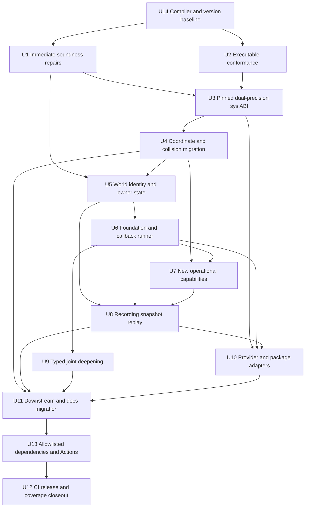
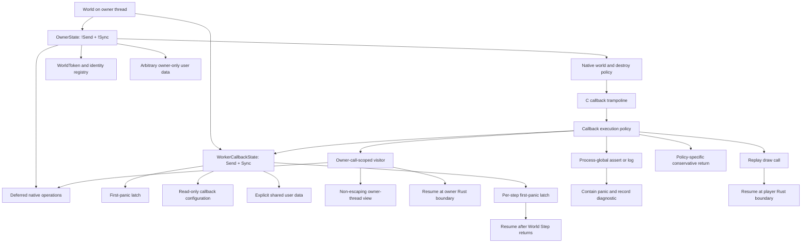
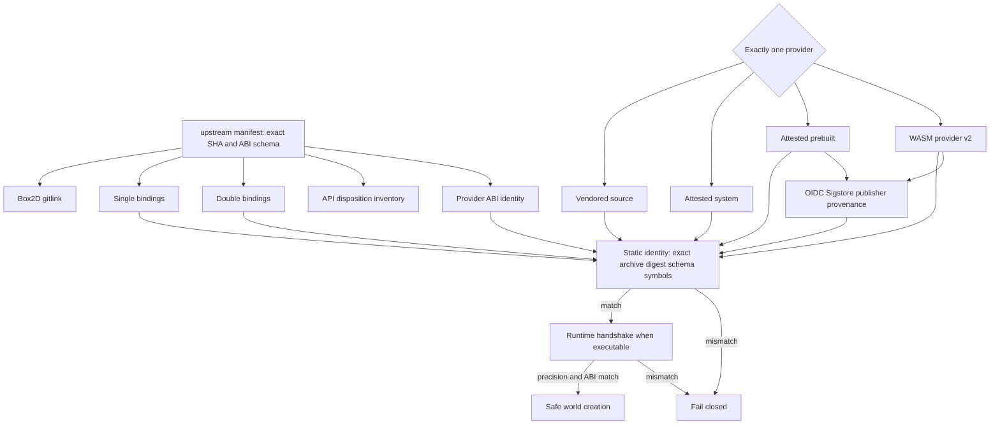
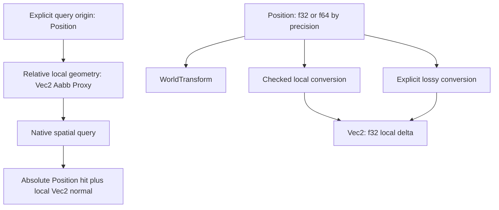
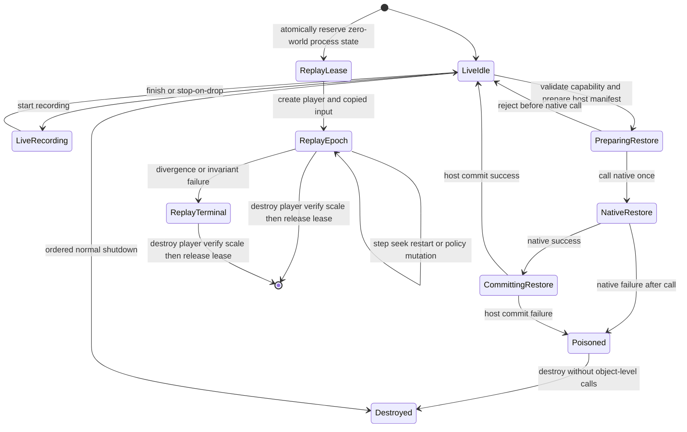

# Box2D 3.2 Soundness and Upstream Realignment - Plan

## Goal Capsule

| Field | Decision |
|---|---|
| Objective | Ship a breaking `0.6.0` line that removes the known Safe Rust soundness gaps, pins Box2D to official commit `56edae79f2949d86142b03450d5d60f63bcf5a6f`, exposes the usable 3.2 development-snapshot capabilities through audited Rust interfaces, and qualifies every supported build provider. |
| Authority | The confirmed user scope, the pinned upstream source and headers, Rust's `Send`/`Sync`, panic, `Vec`, and FFI contracts, this repository's safe-first ownership rules, and executable conformance tests in that order. |
| Execution profile | Proof-first, deep, and intentionally breaking. Obsolete shims, misleading APIs, duplicated validators, moving-target update behavior, and unqualified build paths may be deleted. |
| Stop conditions | Stop only for evidence that invalidates the pinned upstream target, makes a requested Safe Rust contract unprovable, or requires an unconfirmed product-scope change. Ordinary migration breakage and large diffs are not stop conditions. |
| Tail ownership | Execute with goal-driven `ce-work`, use subagents for bounded implementation and independent review, track progress outside this file, and create local Conventional Commits. Do not push or publish a release without a later explicit request. |

---

## Product Contract

### Summary

`boxdd` 0.6 will be a soundness and upstream-realignment release rather than a compatibility release.
It will repair the current Safe Rust violations, replace shallow symbol accounting with layered compiler and runtime evidence, migrate the complete workspace to a pinned Box2D 3.2 development snapshot, and qualify native source, attested system, prebuilt, and WASM-provider builds in both supported precision modes.
The Safe Rust layer will cover every upstream capability that can be given a defensible contract, while inherently unsafe hooks and internal-only functions remain narrow, explicit, and justified.

### Problem Frame

The current test suite is green, but several Safe Rust paths are not sound under valid caller behavior.
The shared FFI vector helper can permit native writes past actual capacity, globally valid IDs can be attached to the wrong world, `WorldCore` is manually `Send + Sync` while owning arbitrary non-`Send` user data, query and dynamic-tree callbacks omit the lifecycle guard used elsewhere, and a safe global length-scale setter can race in C.

The existing coverage gate counts 430 exported symbols but does not prove that a public Rust item or behavioral test exists. A repository script must not attempt to close that gap by reimplementing Rust name resolution, receiver inference, or call-graph analysis; those proofs belong to rustc and focused tests.
The build and release pipeline has similar false-green paths: pregenerated bindings are not regenerated and diffed, system libraries are accepted without an exact ABI identity, the strict WASM job always skips, and prebuilt artifacts are not consumed by a fresh test application.

The confirmed upstream commit changes far more than symbol count.
It grows the exported surface from 430 to 478 functions, changes roughly three dozen existing signatures, introduces large-world coordinates and a precision-dependent ABI, replaces collision and dynamic-tree semantics, adds an internal scheduler, and adds recording, snapshot, and replay lifecycles.
Treating this as a mechanical submodule bump would preserve existing unsoundness while introducing new lifetime and ABI hazards.

### Actors

- A1. A safe-wrapper user creates worlds, objects, callbacks, queries, snapshots, recordings, and replays without writing `unsafe` code.
- A2. A large-world user selects double precision and expects world coordinates to retain range without implicit narrowing to `f32`.
- A3. A low-level user intentionally uses `boxdd-sys` or a documented unsafe escape hatch and needs the boundary to be narrow and accurately classified.
- A4. A provider user explicitly selects vendored source, an attested system library, a prebuilt archive, or the Emscripten WASM provider and expects fail-closed ABI selection.
- A5. A maintainer updates upstream, bindings, Safe Rust mappings, packages, CI, and release artifacts as one reproducible transaction.
- A6. A downstream workspace user consumes `bevy_boxdd`, math interoperability features, examples, and migration documentation after the 0.6 break.

### Key Flows

- F1. Initialize and run a safe world
  - **Actors:** A1, A2
  - **Trigger:** The process configures Box2D foundation behavior or takes the default configuration, then creates a world.
  - **Steps:** Freeze process configuration, qualify the selected ABI, create owner-thread state, configure the internal scheduler, create objects, step, query, read events, and destroy on the owner thread.
  - **Outcome:** No safe path can race process-global C state, cross a world boundary, outlive a callback, or unwind through C.

- F2. Select and qualify a build provider
  - **Actors:** A2, A3, A4
  - **Trigger:** Cargo features and provider configuration select exactly one native or WASM source.
  - **Steps:** Validate the exact upstream SHA, precision, target, CRT, feature identity, layouts, and symbols before the Safe Rust crate creates a world.
  - **Outcome:** A missing or mismatched provider fails with a diagnostic and never silently falls back to another provider.

- F3. Execute Rust code from a native callback
  - **Actors:** A1
  - **Trigger:** A world callback, query visitor, dynamic-tree visitor, debug draw, material callback, foundation hook, or replay debug callback enters Rust.
  - **Steps:** Enter the callback policy, run user code outside internal locks, capture the first panic, return a conservative sentinel, leave the native stack, flush allowed deferred destruction, and resume the panic only from Rust-owned control flow.
  - **Outcome:** Callback behavior is consistent across every adapter and no callback can retain an owning world context.

- F4. Snapshot and restore a world
  - **Actors:** A1
  - **Trigger:** The caller captures an opaque in-process snapshot at a step boundary and later restores it into its origin world.
  - **Steps:** Validate metadata and origin, preflight the image, restore native state, reconcile Rust registries and IDs, or poison and destroy the world after any failure once the native restore call has begun, including host reconciliation commit failure.
  - **Outcome:** Snapshot-time IDs retain their documented meaning, post-snapshot IDs become stale, and host-side state never silently aliases restored native objects.

- F5. Record and replay a simulation
  - **Actors:** A1
  - **Trigger:** The caller starts an owned recording session or opens its resulting opaque `Recording` in a replay player.
  - **Steps:** Keep the recording allocation alive, prevent incompatible callbacks, finish or stop on drop, acquire the replay-exclusive foundation lease, and expose only epoch-bound read views of the player-owned world.
  - **Outcome:** Recording buffers, replay worlds, global length scale, restart, seek, divergence, and destruction have one unambiguous owner.

- F6. Update and release the binding
  - **Actors:** A5, A6
  - **Trigger:** A reviewed upstream SHA or the 0.6 release workflow is invoked.
  - **Steps:** Update the explicit manifest, gitlink, source set, dual bindings, C probes, API inventory, focused tests, providers, packages, version, changelog, and migration guide; then run all qualification gates.
  - **Outcome:** A release cannot combine the wrong Cargo version, tag, upstream revision, precision, target, or archive contents.

### Requirements

**Safe memory, ownership, and callbacks**

- R1. Every caller-owned native output buffer must prove actual capacity and initialized length before constructing a Rust slice or setting `Vec` length.
- R2. Safe object IDs must be opaque and bound to a Rust world identity so wrong-world, stale-generation, world-slot reuse, wrong-kind, and forged-raw cases fail before native mutation.
- R3. Native world ownership, arbitrary `T: 'static` user data, registries, and final destruction must remain owner-thread-only and must not rely on a broad manual `Send` or `Sync` implementation.
- R4. Worker callback state must contain only proven `Send + Sync` data, must not own the world, and must not expose a cloneable or escapable `CallbackWorld`.
- R5. Every C-to-Rust callback must use one execution policy for callback depth, panic containment, conservative fallback, deferred destruction, and post-FFI panic resumption.
- R6. Typed user-data access must run user closures outside global registry locks, permit non-conflicting nested access, report conflicting reentry, and remain usable after a closure panic.
- R7. Safe numeric setters and builders must validate all upstream preconditions, including finiteness, non-negativity, normalized values, ranges, capacities, worker counts, and joint-specific invariants before C assertions can fire.
- R28. Process-global foundation configuration must freeze before the first safe native use, make safe assert/log hooks panic-contained, and atomically coordinate ordinary-world counts plus transient worldless native-call leases with the exclusive replay lease.

**Pinned upstream and precision-aware public API**

- R8. The repository must pin official Box2D commit `56edae79f2949d86142b03450d5d60f63bcf5a6f` through an explicit manifest and gitlink, with no moving `--remote` update path.
- R9. `boxdd-sys` must support and independently qualify single- and double-precision builds with matching C defines, pregenerated bindings, provider identities, compile-time mixed-dependency rejection, runtime precision checks, and ABI probes.
- R10. Safe Rust must distinguish world-space `Position` and `WorldTransform` from local `Vec2` and `Transform` in both precision modes, with explicit checked or lossy narrowing.
- R11. The wrapper must adopt the target commit's query origins, local-manifold collision model, world-point reconstruction, world-space debug draw, shape ray cast, and dynamic-tree box-cast semantics, deleting interfaces whose upstream meaning no longer exists.
- R12. Safe APIs must cover the internal scheduler, world capacity and bounds, worker-count changes, contact recycling, orphan chain segments, and changed zero-time-step behavior with platform and step-boundary validation.

**Recording, snapshot, replay, and interface completeness**

- R13. Recording must be an RAII session that owns the native recording allocation for the complete active interval, rejects unsupported pre-solve/custom-filter wiring, and records whether deterministic friction/restitution mixers must be reinstalled by replay configuration.
- R14. Snapshot restore must validate origin and ABI metadata, reconcile IDs and Rust registries, preserve the live world only on rejection before the native call, and make every native or host-commit failure after that call a terminal poisoned state.
- R15. Replay must preflight the complete operation stream before native player creation, own its native player and world, hold a process-exclusive foundation lease, expose only lifetime- and epoch-bound read views, and distinguish malformed input, divergence, end-of-stream, restart, and seek outcomes.
- R16. Every usable public capability added or changed by the pinned commit must have a safe wrapper and behavioral evidence; unsafe implementor contracts and internal test hooks may remain raw or omitted only with a specific rationale.

**Executable conformance and provider qualification**

- R17. A lightweight reviewed inventory must classify every exported C function exactly once as `safe`, `raw`, or `omitted`, require rationale for every exception, and fail when headers, checked-in bindings, and the inventory disagree on the function-name set.
- R18. Signature and ABI drift must be detected by complete generated-binding digests and compiler-backed C ABI probes. Safe Rust behavior and reachability are proved by rustc, trybuild, focused runtime tests, Miri, and sanitizers; repository tooling must not implement a partial Rust or C compiler frontend.
- R19. In check mode, the upstream refresh tool must validate the exact revision, gitlink, source inventory, recording inputs, and persisted generated/provider identities. Write mode must derive bindings and provider identities from a fresh effective-source staging directory. Each generated file replacement is atomic, while ordinary Git review and recovery handle interruption across multiple files; write mode must not fetch, change submodules, create worktrees, edit the index, or silently select stale output. C ABI shape remains the responsibility of the compiler-backed probe.
- R20. Vendored source, attested system, prebuilt, WASM provider, and compile-only WASM must be explicit adapters with mutually exclusive selection and no silent fallback. Safe native system/prebuilt adapters are static-only in 0.6 and accept caller-supplied local inputs; network download, archive extraction, caching, and name-only dynamic linking are outside their contract.
- R21. Every runtime-capable adapter must prove exact upstream SHA, precision, target, and applicable CRT/SIMD/validation identity before Safe Rust use; `b2GetVersion()` alone is insufficient. Native attestation must bind the exact archive passed to the linker, and official prebuilt/WASM artifacts must additionally verify publisher provenance before load or execution.
- R22. WASM runtime support must use a versioned provider ABI with matching imports, exports, memory-growth handling, and runtime smoke tests; compile-only targets must not be described as runtime support.

**Release, maintenance, and migration**

- R23. Prebuilt archives and crate packages must contain the correct library, headers, generated bindings, source inventory, upstream and project licenses, canonical SHA-256 ABI manifest, checksums, and a fresh-consumer proof. Official runtime artifacts must carry repository/workflow/commit/tag-bound OIDC/Sigstore provenance; local system manifests are caller-trusted compatibility attestations, not project-authenticated provenance.
- R24. CI must enforce Rust 1.95 MSRV from the first implementation unit, a pinned Rust 1.97 development toolchain, a separately pinned date-qualified nightly for Miri and sanitizers, native source tests on three operating systems, dual precision, provider matrices, package tests, and mixed Rust/C ASan, UBSan, and targeted TSan execution.
- R25. Ordinary dependency and GitHub Actions maintenance must occur after ABI stabilization, preserve the declared MSRV, follow an explicit package/version allowlist, avoid incompatible duplicate graphics types, and pin workflow actions to immutable revisions. Architecture-required dependency changes stay with their owning implementation units; Emscripten and wasm-bindgen belong to U10's provider ABI and pin SDK sources immutably.
- R26. The workspace must release as `0.6.0`, migrate `boxdd`, `boxdd-sys`, `bevy_boxdd`, interop features, examples, docs, and package metadata together, and provide a concrete 0.5-to-0.6 migration map without compatibility shims.
- R27. Documentation must call the dependency a pinned Box2D 3.2.0 development snapshot, record the exact SHA and artifact compatibility limits, and remove claims contradicted by the implemented callback, WASM, scheduler, or lifetime behavior.

### Acceptance Examples

- AE1. Insufficient output capacity
  - **Covers:** R1
  - **Given:** The shared native-output helper receives a reusable `Vec` with capacity 8 and a count request for 10 elements, while every unique native getter has a non-empty real Box2D scenario.
  - **When:** The helper fills caller-owned memory, or an event pointer/count pair is mapped into reusable safe storage.
  - **Then:** Capacity and returned counts are validated before initialized elements become visible, every getter exercises the shared protocol, event mapping is verified independently, and sanitizers report no overflow or uninitialized read.

- AE2. Wrong-world and recycled-slot IDs
  - **Covers:** R2, R3
  - **Given:** Two worlds are live and a third world later reuses a destroyed native slot.
  - **When:** An ID from one world is borrowed, mutated, destroyed, assigned user data, or used during another world's borrowed event view.
  - **Then:** Safe Rust returns a stable wrong-world or stale-ID error before C is called and no registry or deferred-destroy queue is modified.

- AE3. Owner-thread user data
  - **Covers:** R3, R4, R6
  - **Given:** User data contains `Rc<Cell<_>>` and records its drop thread.
  - **When:** Worker callbacks run, borrowed capabilities are used locally, and the world is dropped.
  - **Then:** Worker state cannot obtain ownership of the data or world, and the payload and native world are destroyed only on the owner thread.

- AE4. Callback panic and deferred destruction
  - **Covers:** R4, R5, R6
  - **Given:** A query, dynamic-tree visitor, world callback, material callback, or debug draw closure panics after requesting deferred destruction or performing nested user-data access.
  - **When:** The native callback returns.
  - **Then:** The callback uses its documented fallback, C traversal exits, deferred operations flush at the allowed boundary, and the panic resumes only after Rust regains control. A process-global assert hook instead records the diagnostic and requests the upstream trap in a subprocess, never allowing C to continue after a failed invariant.

- AE5. Foundation initialization and replay exclusion
  - **Covers:** R5, R15, R28
  - **Given:** Multiple threads attempt default or conflicting foundation initialization while ordinary worlds, transient worldless native calls, or a replay player may be active.
  - **When:** Initialization, world creation, a worldless definition/geometry/collision helper, or replay creation is attempted.
  - **Then:** Identical initialization is idempotent, conflicting configuration fails, shared native activity and replay acquisition use one atomic protocol, failed player creation releases its lease, and replay excludes both shared categories without globally serializing independent worlds.

- AE6. Dual-precision ABI qualification
  - **Covers:** R8, R9, R20, R21
  - **Given:** Single and double builds exist for source, system, prebuilt, and WASM providers.
  - **When:** C defines, generated bindings, manifests, symbols, runtime precision, the exact static archive, or a dependency-graph edge enabling only `boxdd-sys/double-precision` disagrees with the Safe Rust mode.
  - **Then:** ABI qualification or compilation fails before any native call; every matching combination passes the static identity chain plus applicable C/Rust size, alignment, offset, symbol, and runtime precision checks.

- AE7. Large-world coordinate fidelity
  - **Covers:** R9, R10, R11
  - **Given:** Two bodies are near 10,000,000 meters with a millimeter-scale separation.
  - **When:** The double-precision wrapper creates, queries, steps, and reads their positions.
  - **Then:** The separation is retained, while any conversion to an `f32` local vector is explicit and reports or documents precision loss.

- AE8. Upstream spatial semantics
  - **Covers:** R10, R11
  - **Given:** A far-origin query, a local collision pair, and a dynamic tree with a swept box are configured.
  - **When:** The corresponding Safe Rust operations run.
  - **Then:** Query geometry is relative to an explicit `Position` origin, collision returns a frame-local manifold with correctly reconstructed runtime world points, and the deleted upstream shape-cast facade is absent.

- AE9. Built-in scheduler and platform limits
  - **Covers:** R4, R7, R12
  - **Given:** Equivalent native worlds use one and multiple workers and a non-threaded WASM runtime requests multiple workers.
  - **When:** They step the same deterministic scene.
  - **Then:** Native final state agrees, worker callbacks obey `Send + Sync` policy, runtime worker changes occur only at step boundaries, and unsupported WASM concurrency returns an error.

- AE10. Capacity, recycling, and orphan chain behavior
  - **Covers:** R7, R12
  - **Given:** Boundary capacities, recycle distances, per-body recycling flags, zero time step, and loose chain-segment inputs are exercised.
  - **When:** The Safe Rust API validates and applies them.
  - **Then:** Invalid values never reach C, documented valid boundaries work, zero-time-step collision behavior matches upstream, and chain-owned segments cannot be mutated through orphan-only operations.

- AE11. Recording ownership
  - **Covers:** R13
  - **Given:** A world starts recording, mutates, unwinds through user code, or drops the session without an explicit finish.
  - **When:** Recording ends.
  - **Then:** The native buffer remained alive, stop occurs exactly once, bytes remain owned by `Recording`, every capability path obeyed the central activity gate, pre-solve/custom-filter hooks were rejected in both installation orders, and any custom friction/restitution mixer requirement is carried into replay configuration.

- AE12. Snapshot reconciliation
  - **Covers:** R2, R14
  - **Given:** A snapshot is taken, then objects and user-data registrations are created and destroyed before restore.
  - **When:** The origin world restores it.
  - **Then:** A prepared per-entry manifest intersects snapshot membership, current native identity, and registration nonce; later or replaced entries are dropped once, surviving user data is reattached, destroyed arbitrary user data is not resurrected, and any failure after the native call leaves only shutdown/drop available without further object-level C access.

- AE13. Snapshot compatibility boundary
  - **Covers:** R14, R21, R27
  - **Given:** An internal snapshot payload is truncated or incompatible, or its capability comes from another world.
  - **When:** In-place restore is requested.
  - **Then:** Only an unforgeable in-process `Snapshot` capability from the origin world may restore; Safe Rust exposes no native snapshot bytes, external import, or fresh-world load surface.

- AE14. Replay ownership and epochs
  - **Covers:** R15
  - **Given:** A replay player receives an opaque `Recording` with custom mixer metadata, then steps, seeks, restarts, reaches the end, draws frame queries, or diverges; crate-private corruption fixtures can inject malformed framing or payloads for validation tests.
  - **When:** The caller observes its world and query/body data.
  - **Then:** A generated preflight parser rejects malformed bytes before native creation, required mixers are installed before the first step, views cannot outlive the player call or epoch, every player mutation invalidates old observations even on failure, replay-draw panic resumes only at the player boundary, malformed/diverged/end states remain distinct, and player drop destroys its internal world, verifies scale restoration, and only then releases the foundation lease.

- AE15. Executable coverage contract
  - **Covers:** R16, R17, R18, R19
  - **Given:** The pinned headers expose 478 functions plus tracked ABI capabilities.
  - **When:** A C function is added or removed, checked-in bindings drift, a binding signature changes, an ABI probe disagrees, an exception loses its rationale, or a Safe Rust behavior test fails.
  - **Then:** The responsible inventory, generated-artifact, compiler, or runtime gate fails without requiring xtask to parse Rust paths or infer call graphs.

- AE16. Provider fail-closed behavior
  - **Covers:** R20, R21, R22
  - **Given:** A user explicitly selects system, prebuilt, or WASM with missing, stale, or mismatched metadata or provenance, pairs valid-looking metadata with a different actual archive/module, or requests name-only dynamic linking.
  - **When:** The build or runtime initializes.
  - **Then:** Static artifact identity, publisher provenance, or the runtime handshake rejects the incompatible provider and never falls back to vendored source, accepts an unproved dynamic image, or treats compile-only WASM as a working runtime.

- AE17. Package and release identity
  - **Covers:** R23, R24, R25, R26
  - **Given:** A `v0.6.0` release candidate contains all precision/target artifacts.
  - **When:** Unprivileged build jobs produce artifacts and the isolated release qualification job runs.
  - **Then:** Each publishable `.crate` is packaged, content-checked, unpacked, wired into fixed fresh consumers through local patches, and built in dependency order; tag, workspace version, release commit, Box2D SHA, archive names, canonical manifests, checksums, OIDC/Sigstore provenance, licenses, and consumer executions all agree. Attestation alone receives `id-token: write`, publication alone receives `contents: write`, and missing or extra artifacts fail the aggregate gate.

- AE18. Downstream migration
  - **Covers:** R10, R11, R26, R27
  - **Given:** A 0.5 user migrates core, interop, Bevy, examples, callbacks, queries, and provider selection.
  - **When:** They follow the 0.6 migration guide.
  - **Then:** Each deleted or changed API has one documented replacement or an explicit unsupported boundary, and no compatibility shim silently preserves obsolete semantics.

### Success Criteria

- The target headers account for exactly 478 exported functions with one reviewed disposition each; binding digests, compiler probes, and focused Rust tests own ABI and behavioral evidence outside that inventory.
- No broad `unsafe impl Send` or `unsafe impl Sync` remains on world ownership or arbitrary type-erased user-data state.
- All callback adapters use the shared execution policy and no user closure runs while a global registry mutex is held.
- Single- and double-precision source builds pass the complete core suite, C ABI probes, provider checks, and downstream compile gates.
- All supported provider combinations fail closed on exact-SHA, precision, exact-link, or provenance mismatch and pass a real create-step-query-destroy smoke test when compatible.
- The 0.6 release contract verifies the early MSRV gate, pinned nightly sanitizers, packaged-source fresh consumers, migration docs, authenticated artifact identity, and release-job privilege separation without a permanently skipped CI job.

### Scope Boundaries

**In scope**

- All confirmed audit findings, the exact upstream migration, dual precision, complete Safe Rust classification, new upstream capabilities, typed-joint deepening, provider qualification, CI, dependency maintenance, downstream migration, and 0.6 release preparation.
- Breaking public types, method names, error variants, callback arguments, provider features, package layout, and examples where required by soundness or new upstream semantics.
- Deletion of obsolete wrappers, generated fixtures, moving-target scripts, unsupported runtime claims, duplicated validation, and compatibility shims.

**Deferred to follow-up work**

- A safe custom task-executor abstraction. The upstream internal scheduler is the safe path in 0.6; raw callback fields remain an explicitly unsafe extension until their exactly-once and shutdown protocol receives a separate design.
- A general safe custom allocator implementation contract. Audited process initialization may configure safe assert/log adapters, but arbitrary allocator function pointers remain unsafe.
- Threaded WASM scheduling. Non-threaded WASM providers reject `worker_count > 1` until pthread/shared-memory builds have their own runtime qualification.
- Re-pinning to a future official Box2D 3.2 tag. That requires a new reviewed conformance transaction rather than silently moving this plan's target.

**Outside the product contract**

- Any Safe Rust snapshot or recording byte import/export entry point, including same-version `from_bytes`/`to_bytes` APIs. Native artifacts remain internal and are compatible only with their recorded ABI identity.
- Direct edits inside the Box2D gitlink or undeclared build-time source rewriting. `boxdd-sys/third-party/box2d` remains official upstream history; narrowly reviewed C fixes live in checked-in declarative patches and participate in the effective-source identity.
- New Bevy gameplay features unrelated to adapting the breaking core and large-world coordinate model.
- A network downloader, general-purpose archive extractor, or provider cache. Safe system/prebuilt adapters consume caller-supplied local static inputs; controlled CI package extraction is only a verification fixture.
- Defense against an already-compromised local compiler, linker, or runner. Artifact authentication treats the build host as trusted while refusing untrusted external inputs before load.

---

## Planning Contract

### Key Technical Decisions

- KTD1. Execute the complete audit as one breaking 0.6 program. `(session-settled: user-directed - chosen over a narrowed or staged subset: the user requested every audited area in one plan and authorized deletion and compatibility breaks.)`
- KTD2. Pin official upstream commit `56edae79f2949d86142b03450d5d60f63bcf5a6f`. `(session-settled: user-approved - chosen over remaining on `c05c487`, following a moving branch, or waiting for a tag: an exact pin makes the development ABI reproducible and reviewable.)`
- KTD3. Repair current Safe-reachable soundness failures before broad interface churn, then establish executable conformance before changing the gitlink. This follows the repository's prior governance-first rule and ensures each upstream change has a destination and test.
- KTD4. Ship both single and double precision in 0.6. `(session-settled: user-approved - chosen over float-only qualification: the confirmed scope includes the upstream large-world mode as a real supported build.)`
- KTD5. Make `Position` and `WorldTransform` semantically distinct public types in both modes. Treating them as aliases in float mode would preserve ambiguous local/world APIs and force another break when users enable double precision.
- KTD6. Replace the world-wide `Arc<WorldCore>` trust boundary with owner-thread state plus a separate worker-safe callback state. Owner state keeps arbitrary `T: 'static` user data and final native destruction; callback-readable shared data uses a distinct `Send + Sync` registry, and worker state never strongly owns owner state.
- KTD7. Separate FFI `RawId` values from safe world-bound IDs rather than extending the `repr(C)` layout. Allocate `WorldToken` values monotonically with explicit exhaustion, brand every native result only in a known world context, keep native `world0` as a secondary check, and expose no Safe Rust constructor, binder, or serialization path for process-local IDs.
- KTD8. Use one callback execution module with four explicit panic-ownership policies. Owner-call-scoped visitors may defer owner mutations and resume at their Rust call boundary; worker panics converge into the active step latch and resume after `b2World_Step`; process-global log hooks contain panic and record diagnostics without promising a resume point; a safe assert hook records diagnostics and always requests the upstream trap so C cannot continue after a broken invariant; replay draw callbacks resume only at the player call boundary.
- KTD9. Replace the runtime global length setter with one-time foundation initialization and a shared/exclusive activity protocol. Ordinary worlds hold counted shared ownership, safe worldless calls that may read foundation state take transient shared leases, and replay takes the exclusive lease only when both shared counts are zero. Safe assert and log adapters may be installed permanently through `Send + Sync + 'static` closures; arbitrary allocator pointers and direct global mutation remain unsafe.
- KTD10. Use Box2D's internal scheduler for the safe `worker_count` surface and keep custom task callbacks raw. This removes an unsafe adapter from the common path while retaining an advanced escape hatch with honest obligations.
- KTD11. Treat restore as a host/native transaction, not a plain FFI call. Only an unforgeable in-process snapshot capability may restore its origin world; prepare a per-kind ID and registration-nonce manifest without mutation, call native restore once, commit the host reconciliation only on success, and enter a terminal state without further object-level C calls after any post-call failure.
- KTD12. Treat wrapper worlds, recording sessions, and replay players as distinct owners. Recording owns its buffer and borrows a wrapper-owned world while rejecting upstream-unsupported pre-solve/custom-filter hooks. Deterministic friction/restitution mixers remain available but the recording metadata requires the same mixer set in `ReplayConfig` before the first player step. Replay owns a player-owned native world and exposes only epoch-bound read views. Shutdown order is: block new calls, stop recording if active, destroy the wrapper world or player and join workers, release callback state, drop arbitrary user data on the owner thread, then release the foundation or replay lease.
- KTD13. Use layered evidence instead of a monolithic executable contract. The inventory owns only reviewed C-function disposition and name-set parity; generated binding digests and C probes own ABI shape; rustc and focused tests own Safe Rust behavior. Unsafe allocator, task, and internal test contracts remain explicitly raw or omitted.
- KTD14. Keep explicit public typed-joint methods and centralize only private kind, owner, numeric, and FFI operation semantics. Do not reintroduce opaque `macro_rules!` expansion or a wide public forwarding trait that previous refactors intentionally removed.
- KTD15. Make build providers explicit, mutually exclusive, and fail-closed through three evidence layers. Build-time identity binds the exact static archive/header/binding digests and layout schema to the adapter manifest; the runtime handshake verifies precision and crate-owned ABI identity where executable; official prebuilt/WASM artifacts additionally verify publisher provenance before load. Vendored source is the default, safe system/prebuilt modes are static-only and cannot rely on an unbound sidecar assertion, local system manifests remain caller-trusted, the WASM provider uses a versioned module identity, and no selected adapter silently falls back.
- KTD16. Execute through goal-driven `ce-work` with bounded subagents, independent review, and local Conventional Commits. `(session-settled: user-directed - chosen over a plan-only handoff: the user explicitly requested autonomous implementation, review agents, and commits.)`
- KTD17. Model lifecycle and activity as orthogonal state. `Live`/`Poisoned`/`Destroyed` governs native validity while `Idle`/`Recording`/`Restoring` gates every entry through `World` and its borrowed capabilities; no borrow shape alone is trusted to enforce recording or restore exclusion.
- KTD18. Establish the Rust 1.95 MSRV, pinned Rust 1.97 development channel, and date-qualified verification nightly before implementation begins. Keep ordinary dependency and Actions churn after ABI stabilization, keep architecture dependencies with their owning units, and run every unit under the real compiler floor from the start.

### High-Level Technical Design

The diagrams define boundaries and lifecycle order, not exact Rust type signatures.
Implementation may refine names and private file placement while preserving these contracts.

**Execution dependency graph**

The graph is a visual summary of blocking order and may omit direct edges already implied by another path; the implementation-unit table is the authority for complete dependency declarations.

**Owner and callback boundary**

**Upstream and provider qualification**

**World and local coordinate boundary**

**Snapshot, recording, and replay lifecycle**

### Sequencing Strategy

1. Pin the 0.6 workspace version, Rust 1.95 compiler floor, Rust 1.97 development toolchain, and `nightly-2026-05-27` verification channel before establishing failing evidence or adding new unsafe surface.
2. Build the layered inventory, generated-artifact, and compiler gates with the exact upstream manifest while the 430-symbol baseline still compiles, then use them to account for the 478-symbol target.
3. Land `boxdd-sys` and the Safe Rust coordinate/collision migration as one integration phase. U3 is required green only for the two `boxdd-sys` precision gates; U4 restores the core `boxdd + boxdd-sys` gates; U11 is the first checkpoint where the complete workspace must be green.
4. Serialize U4, U5, and U6 because they share public value, capability, and world-core files. Rebuild identity and callback execution on the final ABI before adding snapshot and replay.
5. Deepen typed joints only after owner-aware validation, callback/lifecycle state, and the target joint ABI are stable.
6. Qualify providers after the native ABI, foundation, and persistence contracts stop moving, while typed-joint Safe Rust work may proceed independently. Upgrade provider tool versions inside U10, then migrate downstream crates and isolate the allowlisted ordinary dependency and Actions maintenance in U13 while retaining U14's compiler gates.
7. Run simplification and independent review after U4, U6, U9, and before U12 closes the release contract.

### Alternatives Considered

- Wait for an official 3.2 tag. Rejected because the user confirmed the exact development commit and reproducibility comes from the pin, not from waiting indefinitely.
- Qualify only single precision. Rejected because it would leave the largest upstream type-system change unmodeled and require another breaking world-coordinate migration later.
- Require all user data to be `Send + Sync`. Rejected because the world is intentionally owner-thread-bound; splitting worker state preserves useful owner-only Rust values without making them cross threads.
- Put a global mutex around every Box2D call. Rejected because it would hide the foundation race by serializing independent worlds and defeat upstream multithreading.
- Expose a safe custom executor immediately. Rejected because the pinned commit's built-in scheduler covers the common use case while the custom exactly-once and shutdown protocol remains an unsafe implementor contract.
- Restore arbitrary Rust user data from native snapshot bytes. Rejected because native images do not contain Rust values; surviving entries can be reattached, but already-dropped arbitrary `T` values cannot be soundly resurrected.
- Deduplicate typed joints with public macros or a universal forwarding trait. Rejected because repository history shows this obscures auditability and expands the public abstraction surface.
- Accept any system Box2D reporting 3.2.0. Rejected because multiple development snapshots share that version while exposing different symbols and layouts.

### Sources and Research

**Repository constraints and precedents**

- `docs/development/ffi-lifetime-audit.md` defines the intended panic, lifetime, borrowed-buffer, and public thread-boundary contract; query and dynamic-tree claims must be corrected to match implementation.
- `docs/workstreams/query-buffer-reuse/design.md` defines the reusable-buffer semantics that `boxdd/src/core/ffi_vec.rs` currently violates.
- `docs/workstreams/boxdd-0.4-upstream-realignment/design.md` requires official upstream history and Rust-side semantic normalization. This refactor preserves the untouched gitlink and represents unavoidable C fixes as a content-addressed declarative overlay rather than mutable submodule edits.
- `docs/workstreams/boxdd-0.3-fearless-refactor/design.md` requires explicit public receiver methods, a single private FFI path, upstream assertion validation, and narrow raw seams.
- `boxdd/src/joints/creation/validation.rs` is the existing world-owner validation precedent; `boxdd/src/body/runtime.rs` and `boxdd/src/shapes/runtime.rs` are the private capability-operation precedents.
- `boxdd/src/debug_draw.rs` is the closest existing example of guard, panic containment, native return, deferred flush, and post-FFI resume in one path.

**Pinned upstream**

- [Target commit `56edae7`](https://github.com/erincatto/box2d/commit/56edae79f2949d86142b03450d5d60f63bcf5a6f)
- [Compare current `c05c487` to target](https://github.com/erincatto/box2d/compare/c05c48738fbe5c27625e36c5f0cfbdaddfc8359a...56edae79f2949d86142b03450d5d60f63bcf5a6f)
- [Pinned large-world documentation](https://github.com/erincatto/box2d/blob/56edae79f2949d86142b03450d5d60f63bcf5a6f/docs/large_worlds.md)
- [Pinned recording and snapshot documentation](https://github.com/erincatto/box2d/blob/56edae79f2949d86142b03450d5d60f63bcf5a6f/docs/recording.md)
- [Pinned `types.h` callback and scheduler contract](https://github.com/erincatto/box2d/blob/56edae79f2949d86142b03450d5d60f63bcf5a6f/include/box2d/types.h)
- [Pinned foundation globals](https://github.com/erincatto/box2d/blob/56edae79f2949d86142b03450d5d60f63bcf5a6f/include/box2d/base.h)

**Rust and build contracts**

- [Rustonomicon `Send` and `Sync`](https://doc.rust-lang.org/nomicon/send-and-sync.html)
- [`Arc` thread-safety bounds](https://doc.rust-lang.org/std/sync/struct.Arc.html)
- [`Vec::reserve`, `set_len`, and spare capacity](https://doc.rust-lang.org/std/vec/struct.Vec.html)
- [Rust panic behavior across FFI](https://doc.rust-lang.org/stable/reference/panic.html)
- [Rust sanitizer support](https://doc.rust-lang.org/beta/unstable-book/compiler-flags/sanitizer.html)
- [Cargo build-script metadata](https://doc.rust-lang.org/cargo/reference/build-scripts.html)
- [Cargo resolver and feature unification](https://doc.rust-lang.org/cargo/reference/resolver.html)
- [Cargo source replacement and local registries](https://doc.rust-lang.org/cargo/reference/source-replacement.html)
- [Cargo `rust-version`](https://doc.rust-lang.org/stable/cargo/reference/rust-version.html)
- [Cargo SemVer compatibility](https://doc.rust-lang.org/cargo/reference/semver.html)
- [GitHub Actions immutable pinning guidance](https://docs.github.com/en/actions/reference/security/secure-use)
- [GitHub artifact attestations](https://docs.github.com/en/actions/how-tos/secure-your-work/use-artifact-attestations/use-artifact-attestations)
- [Sigstore CI verification](https://docs.sigstore.dev/quickstart/quickstart-ci/)

---

## System-Wide Impact

### Public Interface

- Raw FFI IDs and safe branded IDs become different types; Safe Rust cannot construct, bind, or deserialize process-local IDs outside a known owner context.
- `Position` and `WorldTransform` replace `Vec2` and `Transform` at world-space boundaries across body definitions, runtime reads and writes, events, queries, debug draw, explosions, collision reconstruction, recording, replay, and Bevy integration.
- Spatial queries gain an explicit origin; dynamic-tree shape cast is deleted in favor of the upstream box-cast model; collision helpers return local manifolds.
- `CallbackWorld` as a cloneable world owner disappears. Callback signatures expose values, captured shared state, or a scoped non-escaping view according to the upstream threading contract.
- The global runtime setter becomes foundation initialization; new error variants distinguish wrong world, runtime conflicts, poisoned worlds, incompatible artifacts, and active recording.

### State and Failure Propagation

- Every `World` carries a non-reused Rust identity and separate lifecycle/activity state independent of native slot reuse; every borrowed capability entry checks both gates.
- Restore prepares a per-entry host reconciliation plan before C, commits it only after native success, and transitions directly to terminal shutdown after any native or host-commit failure once the call begins, without issuing object-level native calls.
- Recording owns its buffer while the central activity state blocks bypass through previously acquired capabilities; replay atomically excludes ordinary worlds and transient worldless native calls before owning the process lease and player-owned world.
- Player mutation advances the replay epoch before native work, so failure cannot revive an old read capability.
- Callback panic ownership depends on policy: owner calls and replay calls resume locally, worker panic resumes at the step boundary, and process-global hooks only record diagnostics.
- Wrapper-owned worlds and player-owned worlds have distinct destroy policies. Shutdown waits for the native scheduler/player, releases callback state, drops arbitrary user data on the owner thread, and releases the foundation lease last.
- Provider mismatch becomes a build or initialization error. Safe native external providers are static-only, compatibility attestation is bound to the exact linked archive rather than self-reported sidecar text, and official runtime artifacts additionally require authenticated publisher provenance.

### Downstream Crates and Artifacts

- `bevy_boxdd` needs a world-origin bridge so Bevy's local `f32` transforms can address a double-precision Box2D world without silent narrowing.
- `serde`, `mint`, `nalgebra`, `glam`, and `bytemuck` integrations must distinguish world positions from local vectors and expose only representations valid for the active scalar/layout.
- Examples, docs pages, READMEs, migration notes, API inventory docs, WASM provider assets, and prebuilt package names all change with the 0.6 ABI.
- Published prebuilt assets double across precision modes and carry exact revision metadata plus authenticated provenance; branch artifacts remain immutable, unprivileged inputs and stay separate from formal release assets.

### Maintainer Workflow

- Upstream updates begin from an explicit reviewed SHA and fail on dirty submodule state.
- The updater no longer discovers a moving remote or selects the first stale bindgen output by glob.
- Inventory, ABI, provider, package, and release metadata derive from shared structured inputs instead of duplicated inline shell or PowerShell logic.
- CI enumerates supported feature/provider combinations rather than relying on a misleading `--all-features` build where mutually exclusive options mask each other.
- Unprivileged jobs build and test immutable artifacts; after aggregate validation, a protected attestation job receives only `id-token: write` and a separate publication job receives only `contents: write`.

### Risks and Mitigations

| Risk | Impact | Mitigation |
|---|---|---|
| The pinned commit is an untagged development snapshot | Upstream may change after this plan | Pin the full SHA, vendor official history, document the development status, and require a new reviewed transaction for any later pin. |
| Dual precision changes many layouts and public types | Silent ABI mismatch or broad downstream breakage | Generate two bindings, use separate provider identities, run C probes, introduce semantic world types once, and fail closed before world creation. |
| World ownership redesign touches every capability family | Regression in drop, stale-ID, or callback behavior | Introduce `WorldToken` and lifecycle state centrally, migrate families through one validator, and retain real native-chain lifecycle tests. |
| Snapshot restore cannot recreate arbitrary dropped Rust values | Native objects may return without former host user data | Record snapshot membership and registration nonces, reattach only the surviving intersection, drop later/replaced entries once, do not promise resurrection, and keep native snapshot bytes outside Safe Rust. |
| Native restore or host reconciliation fails after releasing live state | Rust registries or borrowed capabilities could access a half-restored world | Prepare without mutation, call native once, commit host state only on success, and destroy/terminalize immediately after any post-call failure. |
| Replay mutates the process-global length scale | Concurrent ordinary worlds or worldless native helpers could observe the wrong scale | Track ordinary worlds and transient safe native-call leases in one shared/exclusive protocol, destroy the player and verify scale restoration before releasing the exclusive lease. |
| Callback panic policy is wrong for one callback class | Abort, mutation during traversal, or hidden divergence | Define a per-class sentinel table, test every adapter through a real native call chain, and review the shared runner independently. |
| Attested system mode is less convenient | Existing arbitrary or dynamic system libraries stop working through Safe Rust | Keep vendored source as the default, accept verified caller-supplied static archives, and retain an explicitly unsafe low-level link escape hatch only in `boxdd-sys`. |
| A valid-looking sidecar describes a different actual library | Exact-SHA and layout checks pass textually before ABI corruption | Bind manifests and linker input to the same exact static archive/header/binding digests and require a runtime precision/ABI handshake when executable; otherwise fail closed. |
| Matching checksums describe attacker-produced artifacts | A self-consistent but untrusted native/WASM artifact can execute in consumers | Require repository/workflow/commit/tag-bound OIDC/Sigstore provenance for official artifacts before load; label local system manifests as caller-trusted only. |
| Release matrix jobs hold write tokens while running dependencies and build scripts | A compromised build chain can modify release assets | Build with read-only permissions, pass commit-bound immutable artifacts to an aggregate gate, then grant only `id-token: write` to attestation and only `contents: write` to publication in separate protected jobs. |
| WASM provider callback ABI is incomplete | APIs compile but fail at runtime | Version the provider, run Node and browser smoke tests, and cfg-disable unsupported callback surfaces instead of claiming runtime support. |
| Mixed-language sanitizer setup is fragile | False confidence if only one language is instrumented | Make the build adapter propagate flags to C, execute focused FFI scenarios, and keep trait/compile-fail proofs alongside sanitizers. |
| Large refactor creates overlapping agent edits | Lost work or accidental overwrite | Assign bounded file ownership, serialize shared-core units, inspect the worktree before every patch/commit, and never reset or restore user changes. |

---

## Implementation Units

| U-ID | Title | Primary files | Depends on |
|---|---|---|---|
| U14 | Establish compiler and version baseline | workspace manifests, `rust-toolchain.toml`, direct CI compiler coordinates | None |
| U1 | Eliminate immediate Safe-reachable UB | `boxdd/src/core/ffi_vec.rs`, `boxdd/src/core/math.rs`, `boxdd/tests/buffer_reuse.rs` | U14 |
| U2 | Establish layered upstream and API contracts | `xtask/src`, `xtask/api-inventory.toml`, `boxdd-sys/upstream.toml`, `tools/abi-probe` | U14 |
| U3 | Pin and qualify the dual-precision sys ABI | `boxdd-sys/third-party/box2d`, `boxdd-sys/src`, `boxdd-sys/build.rs`, `boxdd-sys/tests` | U1, U2 |
| U4 | Migrate world coordinates, collision, queries, and trees | `boxdd/src/types.rs`, `boxdd/src/collision.rs`, `boxdd/src/query`, `boxdd/src/dynamic_tree.rs` | U3 |
| U5 | Deepen world identity and owner-thread state | `boxdd/src/core/world_core.rs`, `boxdd/src/core/user_data.rs`, `boxdd/src/world`, capability families | U1, U4 |
| U6 | Unify foundation and callback execution | `boxdd/src/core`, callback adapters, lifecycle tests | U5 |
| U7 | Cover 3.2 operational capabilities | world/body/shape definitions and runtime, chains, events | U4, U6 |
| U8 | Add recording, snapshot, and replay owners | new recording/snapshot/replay modules, `WorldCore`, focused tests | U5, U6, U7 |
| U9 | Deepen typed-joint runtime and invariants | `boxdd/src/joints`, joint tests | U4, U5, U6 |
| U10 | Qualify build providers, packages, and WASM | `boxdd-sys/build_support`, package helper, WASM provider, provider tests | U3, U6, U8 |
| U11 | Migrate downstream crates and documentation | interop modules, `bevy_boxdd`, examples, READMEs, migration docs | U4, U8, U9, U10 |
| U13 | Stabilize allowlisted dependencies and Actions | manifests, lockfile, workflows | U10, U11 |
| U12 | Enforce CI, release, and final coverage gates | workflows, release contract, coverage, changelog | U13 |

### U14. Establish Compiler and Version Baseline

- **Goal:** Make the 0.6 version and every compiler constraint executable before implementation can accidentally depend on a newer language or toolchain behavior.
- **Requirements:** R24, R26; covers the compiler/version portion of AE17.
- **Dependencies:** None.
- **Files:** root and crate `Cargo.toml` files, new `rust-toolchain.toml`, focused nightly constants used only by Miri/sanitizer orchestration, CI bootstrap steps.
- **Approach:** Set workspace/crate version `0.6.0` and internal requirements consistently; declare `rust-version = "1.95"`; pin the default development toolchain to `1.97.1`; record `nightly-2026-05-27` plus `miri` and `rust-src` as the verification channel. Keep compiler checks as direct Cargo invocations in CI instead of adding an `xtask` wrapper, and invoke the Rust 1.95 build check from every implementation checkpoint. Keep dependency and Actions updates in U13 so this unit changes constraints, not runtime dependencies.
- **Patterns to follow:** Workspace-shared package metadata, checked-in deterministic configuration, and direct Cargo/rustup coordinates where no environment orchestration is required.
- **Test scenarios:**
  - Every public crate declares the same 0.6 version and Rust 1.95 floor; internal dependency requirements resolve to that unpublished workspace version.
  - The active development compiler must match 1.97.1 for generation and formatting, while `cargo +1.95.0 check` covers every promised feature/provider combination from the first unit onward.
  - `nightly-2026-05-27` exposes `miri` and `rust-src`; sanitizer and Miri commands reject an unpinned or different nightly.
  - A crate omitting `rust-version`, drifting to 0.5, or introducing a dependency whose declared compiler floor exceeds 1.95 fails the baseline gate.
- **Verification:** The direct Rust 1.95 workspace check and pinned Rust 1.97 format/check bootstrap pass before U1 or U2 begins; focused nightly orchestration rejects the wrong channel and passes on sanitizer/Miri-capable hosts.

### U1. Eliminate Immediate Safe-Reachable UB

- **Goal:** Repair the shared output-buffer capacity violation and remove the unsynchronized safe global length setter before adding new FFI surface.
- **Requirements:** R1, R28; covers AE1 and part of AE5.
- **Dependencies:** U14.
- **Files:** `boxdd/src/core/ffi_vec.rs`, `boxdd/src/events/mod.rs`, `boxdd/src/core/math.rs`, `boxdd/src/error.rs`, `boxdd/tests/buffer_reuse.rs`, optional unit tests beside `ffi_vec`.
- **Approach:** Express native output memory through spare capacity and `MaybeUninit`, reserve against actual `len + additional` semantics, validate native counts before exposing initialized elements, and restrict the helper to raw `boxdd_sys::ffi` POD rather than future world-branded safe IDs. Apply the same correct growth calculation to safe event-buffer reuse, then bind returned raw IDs only at a known world boundary in U5. Delete the ordinary safe runtime setter and retain only an explicitly unsafe raw operation until U6 installs the process runtime.
- **Patterns to follow:** The centralized `ffi_vec` helper for native output pointers, the independent event pointer/count mapping helpers, and `Error` for checked failures.
- **Test scenarios:**
  - The generic output helper grows capacity 8 to a requested count of 10 and publishes all 10 initialized elements.
  - Zero capacity, exact capacity, excess capacity, zero elements, and repeated reuse without unnecessary reallocation.
  - Synthetic native responses below zero or above requested capacity are rejected without setting length.
  - A fill panic or early error does not expose uninitialized memory or corrupt the prior buffer contract.
  - Every unique native getter that consumes the helper returns a non-empty result in at least one real Box2D test; shared generic error cases are not repeated per getter.
  - Event pointer/count validation and reusable mapped/clone storage exercise their own capacity-growth contract without pretending to use `ffi_vec`.
  - No ordinary safe API can mutate length units after this unit.
- **Verification:** Focused buffer tests pass in default and validation builds; pure helper tests pass under Miri where available; ASan coverage is added in U12.

### U2. Establish Layered Upstream and API Contracts

- **Goal:** Replace substring-based symbol accounting and moving update behavior with small, independent gates whose responsibilities match their toolchains.
- **Requirements:** R17, R18, R19; covers AE15.
- **Dependencies:** U14.
- **Files:** split `xtask/src/lib.rs`, thin `xtask/src/main.rs`, focused command modules under `xtask/src`, `xtask/Cargo.toml`, `xtask/api-inventory.toml`, `boxdd/tests/api_coverage.rs` (delete), `boxdd/tests/fixtures/api_coverage_symbols.txt` (delete), generated recording-operation metadata, `boxdd-sys/upstream.toml` (new), `tools/update_submodule_and_bindings.py` (delete).
- **Approach:** Parse only the public C function-name set needed for disposition accounting and compare it with every checked-in binding. Keep `safe` as reviewed intent, and require explicit rationale for `raw` and `omitted`. Parse the pinned `recording_ops.inl` schema only for recording wire code generation consumed by U8. Let complete binding digests and the C compiler detect signatures and ABI drift, and let Rust compiler/runtime gates prove wrapper behavior. Give upstream synchronization one focused `xtask` command: check mode validates checked-in identities without regeneration, while write mode derives outputs in a fresh effective-source staging directory and replaces each file atomically. Do not add Python-to-Rust double orchestration or a cross-file rollback framework.
- **Patterns to follow:** Mature Rust workspace tooling: small commands that validate repository facts, delegate language semantics to rustc and the C compiler, and keep generated artifacts reviewable in Git.
- **Test scenarios:**
  - The current 430-symbol baseline parses and every existing classification migrates without silently changing status.
  - A missing rationale, duplicate disposition, unknown classification, or missing/extra header or binding function fails inventory validation.
  - Adding or deleting a header function without an inventory change fails; signature and layout changes fail through generated binding digests or C ABI probes.
  - Unknown/duplicate recording opcodes, unsupported argument tags, or generated payload-schema drift fail before replay code compiles.
  - A mismatched manifest, gitlink, checkout, or generated input fails check mode without modifying files.
  - Multiple stale bindgen output directories cannot influence the selected generation result.
- **Verification:** `xtask` unit and integration tests prove exact function-set accounting, check-mode identity validation, write-mode isolated generation, and failure modes; rustc, trybuild, runtime tests, Miri, sanitizers, and C ABI probes provide the language-level evidence.

### U3. Pin and Qualify the Dual-Precision Sys ABI

- **Goal:** Move `boxdd-sys` to the exact target source and establish reproducible single- and double-precision bindings with C-backed ABI proof.
- **Requirements:** R8, R9, R19, R21; covers AE6 and AE15.
- **Dependencies:** U1, U2.
- **Files:** root `Cargo.toml`, `boxdd-sys/third-party/box2d`, `boxdd-sys/upstream.toml`, `boxdd-sys/Cargo.toml`, `boxdd-sys/src/ffi.rs`, split pregenerated binding files under `boxdd-sys/src`, `boxdd-sys/build.rs`, new build-support modules as needed, `boxdd-sys` ABI tests, the publish-disabled ABI probe workspace fixture, mixed-feature dependency-graph fixtures, and `xtask/api-inventory.toml`.
- **Approach:** Pin the gitlink, inventory every required `.c`, `.h`, and `.inl` file, generate both precision binding sets from the same manifest, and pass the same precision define to C compilation and bindgen. Embed generation provenance and export a cfg-driven const/type precision identity that `boxdd` checks against its own expected mode at compile time. Replace Rust-only hardcoded layout assertions with a publish-disabled fixture whose `build.rs` compiles a C shim and forwards single/double precision to `boxdd-sys`; compare sizes, alignments, offsets, callback pointers, version, precision, and symbol linkage. Use bindgen's supported WASM import-module option instead of post-generation string rewriting.
- **Patterns to follow:** Existing pregenerated-binding default and optional bindgen refresh, but with deterministic outputs and the official upstream-only rule from the 0.4 realignment.
- **Test scenarios:**
  - Manifest SHA, gitlink, generated provenance, and source inventory agree exactly.
  - Single and double `b2Pos`, `b2WorldTransform`, definitions, events, debug draw, and function-pointer structs match the C probe.
  - Every target `B2_API` symbol required by the selected precision links; deleted or renamed 3.1 symbols are absent from the new contract.
  - Precision define applied only to C or only to Rust causes a deterministic failure.
  - A second dependency edge that enables only `boxdd-sys/double-precision` while `boxdd` expects single precision fails at compile time before any by-value FFI call.
  - Bindgen regeneration produces no diff from checked-in files in both modes.
  - Packaged-source inventory includes newly required inline and recording/snapshot sources.
- **Verification:** Both `boxdd-sys` precision modes build and pass layout, symbol, and provenance tests. U3 and U4 are an integration pair; the core `boxdd + boxdd-sys` gates are required green at U4, not at the intermediate raw-ABI checkpoint.

### U4. Migrate World Coordinates, Collision, Queries, and Trees

- **Goal:** Adopt the target commit's precision-aware public value model and changed spatial semantics across core `boxdd`.
- **Requirements:** R9, R10, R11; covers AE7 and AE8.
- **Dependencies:** U3.
- **Files:** `boxdd/Cargo.toml`, `boxdd/src/types.rs`, `boxdd/src/collision.rs`, `boxdd/src/distance.rs`, `boxdd/src/contact.rs`, body and shape definitions/runtime, `boxdd/src/query`, `boxdd/src/dynamic_tree.rs`, `boxdd/src/debug_draw.rs`, `boxdd/src/events`, `boxdd/src/world_extras.rs`, prelude exports, corresponding math/collision/query/tree/debug/event tests.
- **Approach:** Introduce always-distinct world-space types backed by the active precision scalar. Migrate every world-space argument and result, add explicit query origins with relative `f32` geometry, and require checked or visibly lossy narrowing. Rebuild collision around relative transforms and local manifolds, reconstruct runtime world contact points from anchors and body centers, replace dynamic-tree shape cast with box cast, and add the target debug bounds callback. Delete old names and zero-origin convenience that would hide the semantic break.
- **Patterns to follow:** Existing checked-versus-convenience API split and explicit public value types; no raw sys structs in safe signatures.
- **Test scenarios:**
  - Single-mode near-origin behavior remains numerically equivalent where upstream semantics did not change.
  - Double-mode 10,000,000-meter coordinates retain a millimeter delta through create, step, read, query, event, and debug draw paths.
  - Checked narrowing rejects out-of-range positions; explicit lossy narrowing is named and documented.
  - Far-origin AABB, ray, shape, mover, point, and shape-ray queries return absolute positions from relative inputs.
  - All collision families return the expected local manifold and runtime contacts reconstruct correct world points.
  - Dynamic-tree capacity validation and box-cast callbacks work; the obsolete shape-cast method is no longer publicly reachable.
  - `DrawBounds` and every changed debug callback survive panic containment once U6 is applied.
- **Verification:** Default and double-precision `boxdd + boxdd-sys` value, collision, distance, query, dynamic-tree, debug-draw, event, and docs tests pass. The complete workspace is intentionally not required green until U11 migrates Bevy, provider smoke, and examples.

### U5. Deepen World Identity and Owner-Thread State

- **Goal:** Make world ownership, capability identity, user-data destruction, and lifecycle state provable from types rather than a broad unsafe implementation.
- **Requirements:** R2, R3, R4, R6; covers AE2 and AE3.
- **Dependencies:** U1, U4.
- **Files:** `boxdd/src/core/world_core.rs`, `boxdd/src/core/user_data.rs`, `boxdd/src/core/identity_registry.rs`, `boxdd/src/world`, `boxdd/src/types.rs`, `boxdd/src/body/runtime/attachments.rs`, shape contact/sensor query modules, chain modules, body/shape/joint/chain capability modules, creation validators, `boxdd/src/error.rs`, `boxdd/tests/world_ownership.rs`, `boxdd/tests/ffi_lifecycle.rs`, `boxdd/tests/user_data.rs`, `boxdd/tests/world_destroy_and_recycle.rs`, compile-fail fixtures.
- **Approach:** Give every Rust world a monotonically allocated, exhaustion-checked `WorldToken`; separate safe branded IDs from raw FFI POD; brand native results only inside a known owner context; and expose no Safe Rust constructor, binder, or serde route for IDs. Replace the shared owner graph with owner-thread state that is structurally `!Send + !Sync`; split out the minimal worker-safe callback state without a strong owner reference. Centralize owner, lifecycle, activity, kind, and native-validity checks and delete joint-local duplicates. Replace the single lock-held user-data closure path with per-entry checked borrowing so unrelated nested reads work, conflicting reentry returns an error, and panic cannot poison final drop. Introduce orthogonal `Live`/`Poisoned`/`Destroyed` and `Idle`/`Recording`/`Restoring` states for U8.
- **Patterns to follow:** The existing joint world check for the raw `world0` secondary assertion, capability-scoped owner borrows, and static auto-trait assertions in `ffi_lifecycle`.
- **Test scenarios:**
  - Every body, shape, joint, chain, contact, borrowed capability, creation, user-data, and destroy path rejects a foreign token.
  - World-slot reuse and stale generation cannot make an old safe ID valid in a new world.
  - Raw conversion is unavailable as an unconditional safe constructor, and Safe Rust exposes no target-world binding operation.
  - Serde has no implementation for process-local IDs and cannot forge a live world token.
  - A foreign-world operation during an event borrow cannot bypass the origin world's borrow/deferred-destroy state.
  - Owner types and borrowed capabilities are `!Send + !Sync`; only the separate callback state is positively `Send + Sync`.
  - `Rc<Cell<_>>` user data, replacement, explicit destroy, world drop, and panic all destroy on the owner thread.
  - Nested access to another entry succeeds, same-entry conflicting access returns `ReentrantAccess`, and later access still works after panic.
- **Verification:** Compile-time trait tests, compile-fail callback escape tests, and real multi-world/runtime tests pass without any broad `unsafe impl Send/Sync` on owner state.

### U6. Unify Foundation and Callback Execution

- **Goal:** Centralize process-global Box2D initialization and make every C-to-Rust callback obey one auditable crossing contract.
- **Requirements:** R4, R5, R6, R28; covers AE4 and AE5.
- **Dependencies:** U5.
- **Files:** `boxdd/src/core/box2d_lock.rs` (replace or delete), new foundation runtime module, `boxdd/src/core/callback_state.rs` (deepen or replace), `boxdd/src/world/runtime/callbacks.rs`, `boxdd/src/core/material_mix_registry.rs`, `boxdd/src/query/raw.rs`, `boxdd/src/dynamic_tree.rs`, `boxdd/src/debug_draw.rs`, recording/replay callback adapters added later, public initialization/error exports, lifecycle, callback, user-data, query, tree, material, and debug tests.
- **Approach:** Require explicit `Foundation::initialize` before any safe native use, freeze that process configuration on the first successful initialization, install permanent panic-contained assert/log trampolines when configured, atomically track ordinary-world ownership, transient worldless native-call leases, and the replay-exclusive lease, and keep allocator/global raw mutation unsafe. Define separate policies for owner-call-scoped visitors, worker callbacks, process-global hooks, and replay calls. Owner calls may flush owner deferred operations and resume locally; worker panics converge into one per-step latch and resume only after step; the log hook contains and diagnoses panic because no unique Rust resume boundary exists; the assert hook records diagnostics and always returns nonzero to trigger the upstream trap; replay calls resume at the player boundary. Remove rich worker-world context and use explicit shared callback data.
- **Patterns to follow:** The complete lifecycle currently implemented by debug draw, generalized into one module; `OnceLock` for immutable global configuration.
- **Test scenarios:**
  - Default initialization is explicit and idempotent; identical repeated initialization succeeds; conflicting length scale or hooks fail before C mutation.
  - Assert/log closures are permanent, `Send + Sync + 'static`, recursion-protected, lock-free while invoked, and cannot unwind into C; log contains and records, while an assert subprocess proves the safe trampoline requests a trap and never continues native execution.
  - Worldless defaults, geometry constructors, and collision helpers acquire a transient shared foundation lease; replay creation races with each category under TSan and cannot begin until they drain.
  - Internal native query collectors and dynamic-tree visitors enter the appropriate callback boundary. Query user visitors run only after native traversal, under a Rust panic boundary without callback depth, so ordinary Safe Rust access remains available and outer-unwind cleanup cannot trigger a second unwind.
  - World filter/pre-solve, material, debug draw, query, tree, and foundation panic paths use their specified stop/default/no-op sentinel.
  - Concurrent worker panics preserve only the first payload without dropping another panicking payload on a foreign stack, join at the active step, and resume on its owner call boundary.
  - Callback closures cannot clone, send, or store an owner context in `'static` state.
  - `panic=abort` behavior is documented and verified in a subprocess rather than promised recoverable.
- **Verification:** Every callback family implemented through U6 passes real native-chain panic, reentry, deferred-drop, and post-panic teardown tests; replay-specific draw callbacks close in U8. An independent soundness review signs off on every remaining callback `unsafe` block.

### U7. Cover Box2D 3.2 Operational Capabilities

- **Goal:** Add safe, validated wrappers for the target commit's non-recording operational features and changed runtime behavior.
- **Requirements:** R7, R12, R16; covers AE9 and AE10.
- **Dependencies:** U4, U6.
- **Files:** world/body/shape definitions and runtime modules, `boxdd/src/tuning.rs`, chain geometry and creation, events and metrics, `boxdd/src/world_extras.rs`, error and prelude exports, API inventory, and focused world/body/shape/chain/event tests.
- **Approach:** Model worker count and capacities as validated values, use the upstream internal scheduler when callbacks are absent, enforce step-boundary changes, and reject unsupported WASM worker counts. Add world bounds, maximum capacity, contact recycle distance, per-body recycling, loose chain-segment ownership, 64-bit byte count, changed center names, and zero-time-step behavior. Classify dump/rebuild/speculative and other internal or side-effectful APIs explicitly rather than wrapping them for a numeric coverage target.
- **Patterns to follow:** Existing checked setters and builders, chain capability versus orphan-segment distinctions, and feature/platform error handling.
- **Test scenarios:**
  - Worker counts at 1, supported maximum, zero, excess, runtime boundary, and non-threaded WASM boundaries.
  - One-worker and multi-worker worlds reach deterministic equivalent state and shut scheduler threads down before callback state drop.
  - Initial capacities and reported maximum capacity agree; invalid counts and overflow never reach C.
  - Global and per-body contact recycling modes exercise threshold, disabled, and zero behavior, including callback frequency changes.
  - Zero-time-step still performs the upstream-documented collision/event work.
  - Orphan chain segments validate geometry, report no parent chain, and reject chain-owned-only mutations in both directions.
  - Every newly safe capability has a focused behavioral test and every remaining raw/omitted capability has a specific contract rationale.
- **Verification:** Focused operational tests pass in both precisions and validation mode; the API inventory accounts for the target function-name set without unclassified entries.

### U8. Add Recording, Snapshot, and Replay Owners

- **Goal:** Expose the new persistence and replay capabilities without leaking native pointers, corrupting Rust registries, or aliasing player-owned worlds.
- **Requirements:** R13, R14, R15, R16; covers AE11 through AE14.
- **Dependencies:** U5, U6, U7.
- **Files:** `boxdd/Cargo.toml`, new `boxdd/src/recording.rs`, `boxdd/src/snapshot.rs`, `boxdd/src/replay.rs`, generated recording-operation metadata from `recording_ops.inl`, `boxdd/src/world` integration, `boxdd/src/core/world_core.rs`, foundation leases, user-data/identity registries, debug draw integration, public errors and prelude, recording/snapshot/replay tests, API inventory, and docs.
- **Approach:** Make active recording a session that owns `Recording` while mutably borrowing the world, sets the central activity gate seen by every capability, and stops exactly once on finish, drop, or unwind. Reject pre-solve and custom-filter hooks in both configuration orders. Allow deterministic worker-safe friction/restitution mixers, store a mixer-required marker in wrapper metadata, and require the matching `ReplayConfig` mixer set before the first step. Keep native snapshot and recording bytes private because upstream formats contain process-local native representations; durable persistence belongs to an application-owned schema that rebuilds a world. Delete the external snapshot byte envelope and its direct `blake3` dependency. The unforgeable in-process `Snapshot` stores exact ABI identity plus a per-kind member/registration-nonce manifest. Restore prevalidates and preallocates a reconciliation plan without mutation, calls native once, commits the host plan only after success, and immediately destroys/terminalizes without object-level C access after native or host-commit failure. Generate a bounded Rust preflight parser from the pinned `recording_ops.inl` schema and validate the complete header, snapshot, opcode, payload-shape, framing, and trailing-byte stream before creating a native player from an opaque `Recording`. Acquire replay exclusivity only after ordinary-world and transient-call counts reach zero, copy the private input bytes, install required mixers, brand closure-scoped read views with an epoch advanced before every player mutation, and destroy the player/verify scale before releasing the lease.
- **Patterns to follow:** RAII recording/replay owners, closure-scoped borrowed native views, and `WorldCore` lifecycle state from U5.
- **Test scenarios:**
  - Recording capacity boundaries, explicit finish, session drop, panic unwind, repeated start, world drop, and input-byte ownership.
  - Recording rejects pre-solve/custom-filter hooks in both installation orders, including attempts through previously acquired capabilities; custom friction/restitution mixers record a replay requirement and reproduce only when `ReplayConfig` supplies the matching set.
  - Snapshot size query/fill handles insufficient capacity using U1's initialized-output rules.
  - Same-world restore intersects snapshot membership, current raw identity, and registration nonce; it preserves valid snapshot-time IDs, invalidates later IDs, drops replaced/post-snapshot registrations once, and reattaches only surviving user data.
  - Slot reuse, user-data take/replace, and combined body/shape/joint/chain serialization changes cannot attach a newer payload to a restored older object.
  - Foreign capabilities and internally corrupted or incompatible payloads reject before live mutation; Safe Rust exposes no external byte path that could acquire restore authority.
  - Failpoint tests cover prepare, native call, and host commit. A wrapper rejection before C preserves `Live`; any native or host-commit failure after the call begins destroys/terminalizes the world and every old capability returns a terminal-state error.
  - Durable application state rebuilds a fresh world through ordinary Safe Rust creation APIs rather than importing native snapshot bytes.
  - Generated preflight validation rejects unknown opcodes, wrong payload shapes, overflow, truncated records, malformed snapshot bounds, and trailing partial frames before C; validated end, divergence, forward/backward seek, restart, keyframe policy, query/body inspection, raw-ID reuse, compile-fail view escape, epoch invalidation on every mutation including failure, and exactly-once player/world destruction remain distinct.
  - Replay debug draw panics through a real native call chain, returns conservatively, preserves epoch/lifecycle state, and resumes only at the player Rust boundary.
  - Races among ordinary world creation, transient worldless native calls, and replay/validate-replay acquisition are serialized by one protocol; null player creation, panic, and drop release correctly, and length scale is verified restored before lease release.
- **Verification:** Recording, snapshot, and replay integration suites pass in both precision modes; sanitizer runs cover session unwind, restore poison, seek/restart, and final drop.

### U9. Deepen Typed-Joint Runtime and Invariants

- **Goal:** Remove duplicated unsafe/native semantics across six typed-joint families while preserving explicit, discoverable public receiver methods.
- **Requirements:** R2, R7, R16; covers AE2 and the joint portion of AE18.
- **Dependencies:** U4, U5, U6.
- **Files:** `boxdd/src/joints/runtime.rs`, `boxdd/src/joints/typed.rs`, joint definitions and creation validation, private capability modules, `boxdd/src/error.rs`, joint runtime/invariant tests, compile-fail fixtures, and API inventory.
- **Approach:** Centralize owner, lifecycle, kind, and numeric validation, then route each native joint operation through one private implementation. Keep public joint-family capability methods explicit and thin. Delete duplicated world checks, direct FFI calls, and inconsistent invariant handling. Reject NaN, infinity, negative hertz/damping/force/torque, invalid limits, wrong kind, stale ID, and foreign world before C. Use no public code-generation trait and no opaque macro for semantics.
- **Patterns to follow:** Private body/shape capability engines, the existing joint kind gate, and the repository's explicit-interface decision from the 0.3 refactor.
- **Test scenarios:**
  - Distance, motor, prismatic, revolute, weld, and wheel capability operations share the same private semantic path.
  - Every setter/getter reaches one native implementation and returns identical errors for wrong kind, stale ID, foreign world, callback state, and poisoned world.
  - NaN, infinity, negative and out-of-order values fail in checked Rust; valid boundary values reach C without upstream assertions.
  - Destruction remains explicit at the owner capability and cannot leak into the shared non-owning engine.
  - Public rustdoc and compile tests prove methods remain discoverable without a wide public trait import.
- **Verification:** Joint focused suites and validation builds pass in both precisions; source audit finds no duplicated unsafe FFI operation across public receiver variants.

### U10. Qualify Build Providers, Packages, and WASM

- **Goal:** Turn `build.rs`, system linking, prebuilt archives, and the WASM provider into explicit adapters that prove compatibility and can be tested independently.
- **Requirements:** R20, R21, R22, R23; covers AE6, AE16, and the package part of AE17.
- **Dependencies:** U3, U6, U8.
- **Files:** `boxdd-sys/build.rs`, new `boxdd-sys/build_support` modules, `boxdd-sys/Cargo.toml`, `boxdd-sys/src/lib.rs`, `xtask` native-package/package-consumer modules, build-mode/package/consumer tests and fixtures, `examples-wasm/provider-smoke`, WASM provider source/assets, `xtask` WASM commands, `boxdd-sys/README.md`, `docs/platforms/wasm.md`.
- **Approach:** Parse provider configuration once, require exactly one adapter, sort and validate source inventory, and reject invalid link kind or missing input. Keep vendored source as the safe default. Make safe system/prebuilt selection static-only: accept a caller-supplied local archive/header/manifest directory, verify its canonical SHA-256 identity, pass the resolved archive itself to the linker, and reject dynamic/name-only modes; do not add download, extraction, or caching to the crate. Treat a locally generated system manifest as caller-trusted compatibility evidence, while official prebuilt and WASM artifacts additionally require repository/workflow/commit/tag-bound OIDC/Sigstore provenance before load. Run applicable precision and ABI handshakes. Package from the exact current build output through `xtask native-package`, fix header nesting, include all licenses and manifest fields, then package, inspect, unpack, and consume each publishable crate through fixed local-patch fixtures. Use provider identity `box2d-sys-v2`, Emscripten 6.0.4 from its immutable SDK revision, and synchronized wasm-bindgen crate/CLI versions. Generate imports through bindgen support, qualify single/double runtimes, refresh typed memory views after growth, and cfg-disable any callback table not proven by runtime smoke. Remove the permanently skipped strict-WASM branch and false WASI runtime claims.
- **Patterns to follow:** Existing source build as default, `xtask native-package` as the native artifact naming owner, and current provider smoke as the runtime starting point.
- **Test scenarios:**
  - Selecting zero or multiple native adapters, a dynamic/name-only link kind, missing manifest, or missing source fails without fallback; the unsafe low-level `boxdd-sys` link escape hatch remains visibly separate from Safe Rust.
  - A system library reporting 3.2.0 but lacking a digest-bound target attestation or matching precision is rejected before Safe Rust use; a correct sidecar paired with another archive also fails.
  - Prebuilt target, CRT, precision, SHA, SIMD, validation, checksum, publisher provenance, or exact static-link mismatch is rejected before load.
  - Archive layout contains one `include/box2d` tree, project dual licenses, upstream MIT license, exact manifest, and the intended current library.
  - A fresh unpacked consumer creates, steps, queries, and destroys a world for every published host-native artifact; the adapter performs no network fetch or archive extraction.
  - WASM old module identity, wrong precision, wrong function type, stale memory view, or unsupported callback fails before physics logic.
  - Node and browser smoke cover create, step, position ABI, query, memory growth, and every advertised callback surface in both precisions.
  - Compile-only `wasm32-unknown-unknown` and `wasm32-wasip1` checks remain explicitly separate from runtime qualification.
- **Verification:** Build-mode, package, fresh-consumer, Node, and browser gates pass for supported adapters; no conditional CI job silently skips the claimed runtime contract.

### U11. Migrate Downstream Crates and Documentation

- **Goal:** Carry the breaking core model through interop features, Bevy, examples, rustdoc, Pages, and a practical 0.5-to-0.6 guide.
- **Requirements:** R10, R11, R26, R27; covers AE7, AE8, and AE18.
- **Dependencies:** U4, U8, U9, U10.
- **Files:** `boxdd` feature-specific conversions and tests, `bevy_boxdd/src`, `bevy_boxdd/tests`, core and Bevy examples, `README.md`, crate READMEs, `docs/development/ffi-lifetime-audit.md`, `docs/development/rustdoc-alignment.md`, `docs/platforms/wasm.md`, Pages content, new 0.6 migration documentation, `CHANGELOG.md` draft.
- **Approach:** Add scalar-correct interop for `Position` and keep local vectors on `f32`; make all narrowing explicit. Add a Bevy world-origin resource/bridge that maps local Bevy transforms to absolute Box2D positions and supports origin rebasing without silent precision loss. Update examples for query origins, local manifolds, callbacks, scheduler, snapshot, recording, replay, and provider selection. Rewrite lifecycle documentation from real call-chain evidence and provide a direct old-to-new API map. Delete obsolete compatibility examples and claims.
- **Patterns to follow:** Existing feature-isolated interop tests, Bevy resource/system boundaries, static Pages validation, and Keep a Changelog migration sections.
- **Test scenarios:**
  - `serde`, `mint`, `nalgebra`, `glam`, and `bytemuck` compile and round-trip only representations valid for single and double modes.
  - Bevy single-precision behavior remains equivalent near origin; double mode maps large absolute positions through an explicit local origin and survives origin rebasing.
  - All core and Bevy examples compile against public 0.6 APIs without raw sys access.
  - Migration docs map raw-shaped IDs, coordinate types, query origins, collision results, length initialization, callback context, scheduler, persistence, and provider selection.
  - FFI lifecycle docs no longer claim query/tree guards, worker world access, or WASM runtime support that tests do not prove.
  - Pages and README links remain valid and generated coverage/release information is current.
- **Verification:** All supported feature combinations, examples, Bevy tests, rustdoc, Pages validation, and documentation drift checks pass in their declared precision modes. This is the first post-U3 checkpoint where the complete Cargo workspace must be green.

### U13. Stabilize Allowlisted Dependencies and Actions

- **Goal:** Perform a closed, reviewable set of ordinary dependency and workflow maintenance after all runtime ABIs are stable.
- **Requirements:** R24, R25, R26; covers the dependency and workflow portions of AE17 and AE18.
- **Dependencies:** U10, U11.
- **Files:** workspace and crate `Cargo.toml` files, `Cargo.lock`, `.github/workflows/ci.yml`, `.github/workflows/pages.yml`, `.github/workflows/prebuilt-binaries.yml` or its replacement, dependency documentation.
- **Approach:** Treat `bevy_egui` 0.41.1 and `env_logger` 0.11.11 as the allowlisted ordinary-maintenance baseline because both versions are already present at the starting commit; do not manufacture manifest or lockfile churn for them. Keep architecture-required dependency additions, removals, or version changes with their owning implementation units: source overlays and ABI probes in U2/U3, provider inspection in U10, and release/version parsing in U12. Review each such change against Rust 1.95 and remove superseded parser dependencies rather than retaining them for compatibility. Retain `glow 0.17` while `dear-imgui-glow` requires it; do not add Dependabot or opportunistically upgrade unrelated direct dependencies. Update existing third-party Actions to compatible majors pinned by full immutable SHA. Keep Emscripten and wasm-bindgen changes in U10 because they define the provider runtime ABI, and preserve U14's compiler/toolchain pins unchanged.
- **Patterns to follow:** Workspace-shared versions, existing feature-isolated tests, and immutable Actions guidance.
- **Test scenarios:**
  - Rust 1.95 and pinned Rust 1.97 gates remain green with the allowlisted ordinary-maintenance baseline and every architecture-required dependency delta.
  - Dependency changes preserve single/double, interop, Bevy, package, and docs behavior and introduce no duplicate incompatible graphics-context type; every direct dependency delta has an owning implementation unit, and any unrelated update or Dependabot diff fails review.
  - Every third-party Action reference is a full commit SHA for the intended compatible major.
  - Workspace version, internal dependency requirements, MSRV, `rust-toolchain.toml`, and focused nightly constants from U14 remain mutually consistent.
- **Verification:** MSRV and current-toolchain matrices pass with the final dependency cohort; manifest, lockfile, and workflow diffs contain only owning-unit requirements and no unrelated package or ABI migration.

### U12. Enforce CI, Release, and Final Coverage Gates

- **Goal:** Make the complete 0.6 contract executable in CI and prepare a coherent local release state without publishing it.
- **Requirements:** R16 through R27 and R28; covers AE15 through AE18.
- **Dependencies:** U13.
- **Files:** `.github/workflows/ci.yml`, `.github/workflows/prebuilt-binaries.yml` or replacement release workflow, `.github/workflows/pages.yml`, `xtask` release/verification modules and tests, `docs/development/ci.md`, `README.md`, `CHANGELOG.md`, package and API inventory manifests.
- **Approach:** Keep format, lint, feature/provider compile coordinates, ABI probes, compile-fail suites, and ordinary tests as explicit Cargo/rustc/nextest commands. Use focused `xtask` orchestration only where a gate owns environment or artifact assembly: pure Miri selection, mixed-language sanitizers, WASM runtime quadrants, packaged-source consumers, and release validation. Instrument both Rust and vendored C for ASan and UBSan and add targeted TSan through U14's pinned nightly. Package each publishable crate, inspect and unpack the `.crate`, wire fixed fresh consumers through local patches in dependency order, and build them without repository-only files. Split release automation into unprivileged build/test/package jobs with `contents: read`, an attestation job with only `id-token: write`, and a publication job with only `contents: write` after aggregate validation. Bind immutable workflow artifacts to run ID and commit SHA; reject arbitrary branch/tag checkout input. Make the release aggregator re-check the protected tag/commit, Box2D SHA, artifact set, canonical SHA-256 manifests, checksums, and OIDC/Sigstore provenance before a draft release could publish. Close the lightweight inventory only after all 478 target functions have one reviewed disposition; keep ABI and Safe Rust proofs in their compiler and runtime gates.
- **Patterns to follow:** Direct compiler/test coordinates for language semantics and small `xtask` commands only for repository facts, external toolchains, or multi-artifact transactions.
- **Test scenarios:**
  - ASan/UBSan execute buffer, callback, query, userdata, restore, replay, and teardown FFI paths with C and Rust both instrumented; TSan executes foundation, multiple worlds, and worker callbacks.
  - Package helper unit tests run in CI; each unpacked unpublished 0.6 crate is consumed through fixed local patches in dependency order and builds without repository-only files.
  - Pull-request, branch, and ordinary manual runs cannot create or mutate releases; build jobs never receive write tokens, attestation has no content-write token, publication has no OIDC token, and neither privileged job can run until every immutable artifact and provenance check succeeds.
  - A missing/extra artifact, wrong precision/CRT/target, `v0.6.1` against manifest 0.6.0, wrong submodule SHA, untrusted provenance, arbitrary checkout ref, or stale changelog fails release validation.
  - SemVer tooling recognizes the 0.5-to-0.6 break as intentional and rejects the same public break under a 0.5 patch version.
  - Final API inventory reports the exact 478 target functions with one reviewed disposition per name; binding, ABI, compile-fail, runtime, Miri, and sanitizer gates independently cover their owned contracts.
- **Verification:** The complete Verification Contract below passes locally where platform-capable and in CI for the full matrix. The repository ends on local reviewable commits with no release push or publication.

---

## Verification Contract

The implementation may add focused commands, but it must preserve these observable gates and keep local and CI entry points aligned.

| Gate | Command or execution surface | Proves | Units |
|---|---|---|---|
| Compiler baseline | Direct `cargo +1.95.0 check --locked --workspace --all-targets` and pinned 1.97.1 checks | Workspace 0.6 version, MSRV, and development compiler are pinned and usable | U14, U1-U13 |
| Format | `cargo fmt --all -- --check` | Rust formatting across the workspace | U14, U1-U13 |
| Lint | Supported provider/precision combinations of `cargo clippy --workspace --all-targets -- -D warnings` | No warning regressions without relying on invalid all-feature combinations | U14, U3-U13 |
| `xtask` model | `cargo nextest run -p xtask` | Focused inventory, isolated upstream generation, recording metadata, provider, package, and release command logic | U14, U2, U8, U10, U12 |
| Sys ABI probes | Publish-disabled C fixture in single and double modes | Actual C/Rust sizes, offsets, callbacks, symbols, precision, and provenance | U3, U10, U12 |
| Core default | `cargo nextest run -p boxdd -p boxdd-sys` | Safe wrapper and sys baseline; baseline at U1-U2 and restored after U4 | U1-U2, U4-U13 |
| Core double | `cargo nextest run -p boxdd -p boxdd-sys --features boxdd/double-precision` or the final equivalent feature selection | Large-world Safe Rust and sys behavior after the core migration | U4-U13 |
| Workspace integration | `cargo nextest run --workspace` plus workspace target/example checks | First complete post-migration integration checkpoint and later regressions | U11-U13 |
| Feature matrix | Explicit Cargo check/test coordinates in CI for interop, SIMD, validation, providers, and precision | Supported combinations stay visible without another orchestration abstraction | U10-U13 |
| Upstream contract | `cargo run -p xtask -- upstream-sync --check` | Exact SHA, gitlink, source/recording inputs, checked-in artifact digests, and provider identity; the separate C fixture proves ABI | U2, U3, U10 |
| API inventory | `cargo run -p xtask -- api-inventory --check` | All 478 exported C functions have one reviewed disposition and every checked-in binding has the same function-name set | U2-U13 |
| Compile-fail boundaries | Direct nextest execution of the `trybuild` fixtures | Safe IDs, callback/replay views, and owner state cannot forge, escape, or become `Send` | U5, U6, U8, U12 |
| Bevy and examples | `cargo nextest run -p bevy_boxdd` plus workspace example checks | Downstream coordinate, origin, lifecycle, and public interface migration | U11 |
| Crate package | `xtask verify-packages` packages, checks, unpacks, and consumes `boxdd-sys`, `boxdd`, and `bevy_boxdd` through fixed local patches | Published source completeness and fresh-consumer compatibility in dependency order | U10, U12 |
| WASM runtime | `xtask` provider qualification for Node/browser times single/double | Versioned imports/exports, memory, positions, queries, and supported callbacks | U10, U12 |
| WASM compile-only | Cargo checks for `wasm32-unknown-unknown` and `wasm32-wasip1` | Type/build compatibility without claiming a runtime | U10, U12 |
| MSRV | Rust 1.95 feature/provider matrix from every unit checkpoint | Declared minimum Rust version remains real throughout implementation | U14, U1-U13 |
| Sanitizers | `nightly-2026-05-27` mixed-language ASan and UBSan suites plus targeted TSan suites | Native memory, ABI, callback, global-state, and teardown behavior | U14, U1, U5-U8, U12 |
| Pure unsafe helpers | `nightly-2026-05-27` targeted Miri tests that do not enter real C FFI | `MaybeUninit`, callback-state, and state-machine Rust invariants | U14, U1, U6, U8 |
| Documentation | Workspace rustdoc with warnings denied, Pages validation, generated-doc drift checks | Public docs and product surface match implementation | U2, U11-U13 |
| Release contract | `cargo run --locked -p xtask -- release-contract --check --artifacts <qualified-release-input-directory>` | Version/tag/commit/SHA/artifact/checksum/provenance consistency | U12 |
| Independent review | `ce-code-review` after major soundness phases and before final commit | Spec, standards, unsafe proofs, tests, and regression review | U4, U6, U9, U12 |

### Required Review Checkpoints

- After U4: review upstream ABI, dual precision, world/local type boundaries, collision semantics, and deleted APIs.
- After U6: review every remaining `unsafe impl`, callback trampoline, panic path, lock boundary, ID validator, and drop thread.
- After U9: run simplification across capability/joint semantics and verify explicit public interfaces were not replaced by hidden generation.
- After U12: run full code review, apply actionable findings, rerun affected gates, inspect the complete diff against the plan, and verify every local commit contains only intended files.

---

## Definition of Done

### Global Completion

- All R1-R28 requirements and AE1-AE18 scenarios are implemented or represented by an explicit raw/omitted rationale permitted by the Product Contract.
- U1-U14 have passed their focused tests and every applicable gate in the Verification Contract.
- The submodule is exactly `56edae79f2949d86142b03450d5d60f63bcf5a6f`, generated artifacts and manifests agree, and no update command follows a moving remote.
- The Safe Rust ownership model contains no unproved broad `Send`/`Sync`, no forgeable world-unbound safe ID, no lock-held user closure, and no callback panic path across C.
- Single and double precision are both qualified for every provider advertised as runtime-capable, and unsupported combinations fail with an explicit error.
- The inventory accounts for exactly 478 pinned exported functions; binding digests, C probes, rustc, and focused tests independently detect ABI and Safe Rust regressions.
- `boxdd`, `boxdd-sys`, and `bevy_boxdd` report version `0.6.0`; MSRV, packages, changelog, migration guide, and release workflow agree.
- Independent reviews have no unresolved P0/P1 soundness, ABI, lifecycle, data-integrity, or release findings.
- All experiments, obsolete compatibility code, unused fixtures, dead update branches, duplicated validators, and abandoned implementation attempts are removed from the final diff.
- Local Conventional Commits are reviewable and precise; user-authored unrelated changes are neither staged nor modified; nothing is pushed or published without new authorization.

### Per-Unit Completion

| Unit | Done signal |
|---|---|
| U14 | Workspace 0.6 metadata, Rust 1.95 MSRV, Rust 1.97 development channel, and `nightly-2026-05-27` verification components are pinned and enforced before other units. |
| U1 | Insufficient-capacity and invalid-count regressions pass, all affected families use the corrected helper, and no ordinary safe global length setter remains. |
| U2 | The disposition inventory, generated identities, compiler probes, and Rust tests replace substring checks and deleted pseudo-compiler parsers. |
| U3 | Exact target source, two bindings, source inventory, every symbol, and C/Rust ABI probes agree in both precisions. |
| U4 | World/local types and all changed spatial/collision interfaces compile and pass precision-specific behavior tests. |
| U5 | Raw and branded IDs, non-reused world tokens, owner-thread drop, per-entry user-data borrowing, and lifecycle/activity state pass compile-time and runtime proofs. |
| U6 | Every callback and foundation hook uses the shared policy, no user closure runs under a global lock, and panic/deferred-drop tests pass. |
| U7 | Scheduler, capacity, bounds, recycling, chain, time-step, and remaining target capabilities are safely covered or explicitly justified. |
| U8 | Recording activity gates, opaque process-local recordings and snapshots, transactional same-world restore, replay epochs, atomic leases, registry manifests, terminal failure, and drop tests pass in both precisions. |
| U9 | Six joint families share one private semantic path, preserve explicit public methods, and reject all invalid numeric/identity states before C. |
| U10 | Every advertised provider and package is static where required, fail-closed, digest/provenance-attested, freshly consumed, and runtime-tested where claimed. |
| U11 | Interop, Bevy origin bridging, examples, rustdoc, Pages, lifecycle docs, and migration documentation match 0.6 behavior. |
| U13 | The existing allowlisted ordinary-dependency baseline, owning-unit dependency deltas, and immutable Actions pass the Rust 1.95/1.97 full supported matrix without unrelated dependency automation or churn. |
| U12 | Pinned-nightly sanitizers, packaged-source fresh consumers, direct compiler/test coordinates, focused orchestration commands, final 478-function inventory, SemVer, split minimal release permissions, and authenticated artifact identity gates all pass. |
