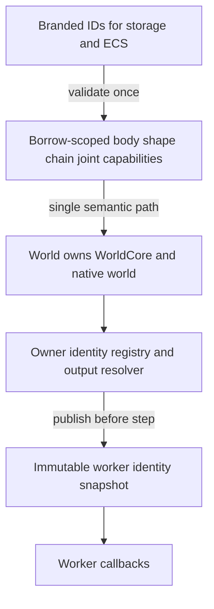
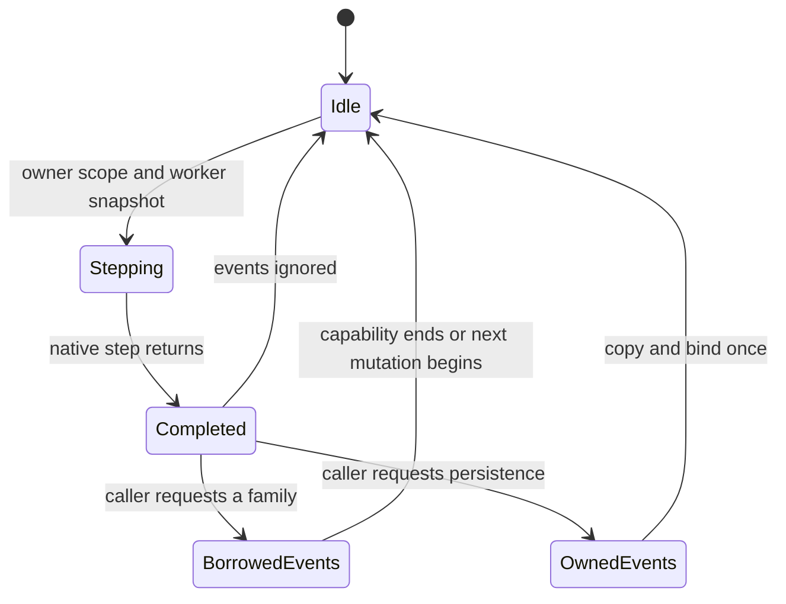
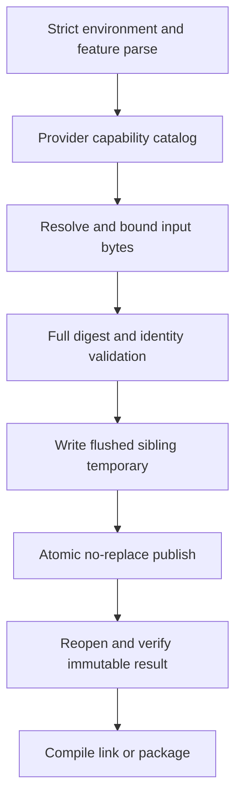
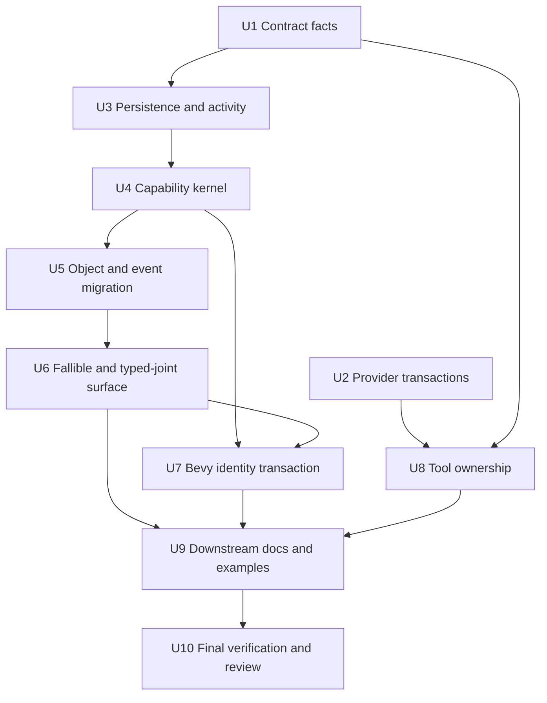

# Boxdd Capability and Contract Consolidation - Plan

## Execution Amendments (2026-08-04 and 2026-08-05)

Later user decisions narrowed the tooling design after this plan was approved. The product and
soundness outcomes remain authoritative, but the following mechanism-level clauses are
superseded:

- Do not restore `rust_index`, a Rust name resolver, a closure call graph, receiver inference, or
  source-text witness policies in `xtask`. Rust API reachability and ownership are proved by
  `rustc`, compile-fail tests, focused runtime/ABI probes, and small exact registries at the native
  boundary. R23, KTD11, the engine/policy portion of U8, and their policy-registration mutation
  tests are retired.
- `api-inventory` is a reviewed C function disposition inventory, not a formal proof of Safe Rust
  routes. It must remain small and must not grow into a partial compiler frontend.
- The provider catalog is the single source for provider vocabulary and qualification classes.
  Concrete artifact matrices remain owned and exactly checked by their build or release command;
  they are not copied into one universal catalog. This narrower rule replaces the literal R24
  wording.
- R17 wins the internal conflict with R18: Safe Rust has no bare native recording stream escape.
  Mixer identity is checked before native replay creation, and the contradictory lossy escape
  requirement is removed.
- AE16 is satisfied by exact provider vocabulary, C API disposition, recording wire, package
  surface, and compiler-enforced capability tests. It does not require resurrecting deleted policy
  or route registries.
- Recording producer reachability is not inferred from C source text. The canonical
  `recording_ops.inl` namespace and wire semantics remain exact-set contracts, while selected
  producer behavior such as `b2World_RebuildStaticTree` is proved by executing the compiled native
  function and inspecting its framed opcode. R21, KTD10, AE10, and U1's source-analysis clauses are
  narrowed accordingly; no C preprocessor or reachability analyzer belongs in `xtask`.
- In AE1, the capability boundary may perform its one native `IsValid` authentication after
  process-local brand and registry checks. A wrong typed-joint conversion must still return
  `WrongJointType` before any family-specific native operation; adding parallel family-specific
  acquisition methods solely to avoid that one authentication call is explicitly out of scope.
- GitHub Actions owns job timeouts, permissions, dependency order, and protected-ref sequencing;
  `actionlint` and review validate that workflow surface. `release-contract` owns artifact and
  provenance semantics, but it must not parse or mirror workflow YAML. This replaces the workflow
  parser and timeout-mutation portions of R29 and U2.
- Subprocess isolation is seam-specific: Git removes Git configuration, hooks, replacement objects,
  and process-injection variables; Node and Cargo remove their relevant injection variables; CI job
  timeouts bound release execution. Do not add a generic environment allowlist or cross-platform
  process-tree supervisor to `xtask`. This narrower trust boundary replaces the literal R31 shared
  filtering/timeout mechanism while retaining fail-closed command-status checks.

These amendments implement the later explicit direction to keep repository tooling comparable to
mature Rust open-source projects and to delete abstractions whose only purpose is proving the
source code through another incomplete source-code analyzer.

## Goal Capsule

| Field | Contract |
|---|---|
| Objective | Replace the post-Box2D-3.2 wrapper's duplicated panic, ownership, receiver, identity, and provider paths with a smaller capability-oriented Safe Rust architecture while fixing every confirmed P1/P2 audit defect. |
| Authority | This plan implements the user's approved breaking-refactor direction. The pinned upstream/API contracts remain authoritative for native behavior, and soundness takes precedence over compatibility or convenience. |
| Execution profile | Work in dependency order, characterize fragile behavior before changing it, keep generated artifacts deterministic, and use focused commits plus review checkpoints for the ownership, snapshot/replay, and tooling phases. |
| Stop conditions | Stop only if evidence requires changing the pinned upstream commit, weakening the 478-function coverage contract, adding a new trust boundary, or preserving a compatibility surface that contradicts the approved break. |
| Tail ownership | Finish with simplification, independent unsafe/API/contract review, the complete verification matrix, dead-code removal, precise local commits, and no push or release without separate authorization. |

---

## Product Contract

### Summary

This refactor makes one fallible Safe Rust path own each Box2D operation, makes `World` the sole native owner, uses process-local IDs for storage and borrow-scoped capabilities for operations, and removes `WorldHandle`, `Owned*`, panic twins, and the `unchecked` duplicate surface.
It also repairs the audited Bevy identity corruption, recording metadata loss, constant and recording-wire contract gaps, provider snapshot transactions, callback cleanup, Pages download bounds, and policy/tool ownership problems.

### Problem Frame

The completed Box2D 3.2 realignment is substantially safer than `main`, but the resulting wrapper exposes 3,347 public function endpoints, including 1,346 `try_*` endpoints whose panic twins usually repeat the same semantics.
Owned, scoped, ID, `World`, and `WorldHandle` receivers multiply object and typed-joint operations; scoped handles contain `Rc<WorldCore>` plus a phantom lifetime rather than a borrow that proves liveness.
This matrix forces repeated identity locks and native validity calls, makes RAII drop require a deferred-destroy state machine, and makes every step copy and bind all event arrays even when the caller never reads events.

The audit also found concrete correctness failures rather than only maintainability debt.
Safe Bevy marker copying can destroy another entity's native object, `Recording::into_bytes` can silently discard replay requirements, public C constants already differ across six binding routes, one real recording producer is exempted by a false contract statement, prebuilt snapshots can be permanently poisoned by interruption, and `World::step` does not establish the owner cleanup scope used by other callback-capable boundaries.

The objective is therefore not a cosmetic module split.
The refactor must reduce the number of authoritative states and semantic paths while preserving the soundness properties established by the preceding plan.

### Actors

- A1. A Rust user stores branded IDs in game or ECS state and acquires short-lived object capabilities to inspect or mutate a live world.
- A2. A Bevy user expects ECS entities, native objects, and restore operations to remain one consistent identity graph even when components are malformed or moved.
- A3. A replay user records with custom material mixers and expects one opaque process-local value to retain the exact replay requirements without exposing native bytes.
- A4. A low-level user intentionally uses `boxdd-sys` for raw or unchecked access instead of relying on a second unsafe surface in the safe crate.
- A5. A maintainer adds upstream functions, constants, providers, joint families, recording operations, or release routes without editing scattered parallel truth tables.

### Key Flows

- F1. Acquire and use an object capability
  - **Trigger:** A caller has a process-local object ID and a live `World`.
  - **Actors:** A1
  - **Steps:** Validate world identity, registration nonce, object kind, native generation, lifecycle, and access state once; borrow the world for the capability lifetime; execute typed operations through one implementation path.
  - **Outcome:** The object cannot be destroyed, restored, or aliased through another safe mutable owner while the capability is active.

- F2. Step and inspect events
  - **Trigger:** A caller advances a world.
  - **Actors:** A1
  - **Steps:** Establish an owner callback scope, publish an immutable worker identity snapshot, execute the native step, return a completed-step capability, and resolve or copy only event families the caller requests.
  - **Outcome:** A step with unused events performs no event copying or global identity lookup, while borrowed and explicitly owned event data remain safe.

- F3. Reconcile Bevy identity
  - **Trigger:** Systems create, remove, mutate, or restore physics entities.
  - **Actors:** A2
  - **Steps:** Treat the context mapping as the sole authority, verify each entity-to-ID and ID-to-entity edge before native mutation, repair or reject projected marker drift, and commit native plus ECS restore state as one transaction.
  - **Outcome:** A copied, moved, stale, or forged marker cannot destroy another entity's native object or corrupt the reverse maps.

- F4. Record and replay process-local state
  - **Trigger:** A recording uses default or custom friction/restitution mixers in the current process.
  - **Actors:** A3
  - **Steps:** Capture stable caller-supplied mixer identities, retain the native stream only inside an opaque process-local value, and match replay configuration before native player creation.
  - **Outcome:** No safe conversion loses replay requirements, a different callback implementation cannot satisfy the contract merely by occupying the same callback slots, and no Safe Rust byte format is promised.

- F5. Select and materialize a native provider
  - **Trigger:** Cargo selects vendored, system, prebuilt, or WASM inputs.
  - **Actors:** A4, A5
  - **Steps:** Parse configuration strictly, derive one provider capability record, snapshot external bytes through atomic content-addressed persistence, materialize vendored sources without host-specific publication assumptions, and qualify exact identity before use.
  - **Outcome:** Invalid configuration, interrupted writes, concurrent builds, unsupported hosts, or provenance drift fail closed without leaving poisoned cache entries.

- F6. Extend the upstream contract
  - **Trigger:** Upstream adds a function, constant, field, joint family, recording producer, or provider route.
  - **Actors:** A5
  - **Steps:** Parse the C surface once, resolve Rust capability routes through explicit policy modules, update the owning catalog, regenerate deterministic outputs, and run exact-set mutation tests.
  - **Outcome:** A new capability has one discoverable maintenance path and cannot disappear behind a boolean witness or a false exemption.

### Requirements

**Safe API and ownership**

- R1. `World` must be the only long-lived Safe Rust owner of a native world; no cloneable world shell or object owner may keep native state alive after the world value is gone.
- R2. Branded IDs must remain copyable process-local storage keys, while body, shape, chain, and joint operations must run through capabilities whose real borrow prevents safe concurrent destruction or restore.
- R3. Every lifecycle-, identity-, callback-, validation-, allocation-, or FFI-fallible Safe Rust operation must use its simple canonical name and return the crate's common `Result`; panic twins and duplicated assert/check validators must be deleted.
- R4. Pure value constructors and conversions may remain infallible only when all inputs are represented by valid types and no native call, allocation, global activity, or runtime identity check can fail.
- R5. The `unchecked` feature and its duplicate extension traits must be removed; intentionally unchecked native access belongs in `boxdd-sys`, while remaining raw hooks in `boxdd` require narrow per-item safety contracts.
- R6. Raw object identifiers, snapshots, and recordings must remain opaque process-local capabilities. Durable persistence must use an application-owned schema that rebuilds live process authority.
- R7. Every callback-capable native boundary, including `World::step`, must appear in an exact-set callback-boundary catalog and establish one owner cleanup scope that drains all affected worlds before resuming a captured panic; deliberate process-global exceptions must name their retention or termination policy.
- R8. Recording and restore activity transitions must be created by core-owned leases whose constructors encode legal transitions and whose destructors cannot perform an arbitrary state change.

**Performance and event behavior**

- R9. The default step path must not call native event getters, copy event arrays, or resolve event IDs unless the completed-step capability is inspected or converted to owned data.
- R10. Known-world native outputs must resolve through the world's registry directly and in batches; no per-element process-global registry lookup is permitted.
- R11. Reusable query and output APIs must reuse both raw and mapped scratch storage, preserve transactional failure semantics, and perform zero steady-state allocation after sufficient capacity is reserved.
- R12. Multi-worker filter and pre-solve callbacks must resolve IDs from immutable callback contexts pinned for one step, registered only after owner mutation ends, and retained until `b2World_Step` returns after all external tasks join; callback replacement and panic paths must release the snapshot without serializing workers on the mutable owner registry.
- R13. Typed-joint capabilities must validate kind once during conversion, then expose unprefixed family operations without repeating kind lookup or native validity checks.

**Bevy and snapshot/replay integrity**

- R14. `BoxddPhysicsContext` must be the sole authority for entity/object identity; runtime marker components are opaque projections and may never authorize a native destroy by themselves.
- R15. Every Bevy lifecycle mutation must verify the exact bidirectional mapping before FFI, and malformed, copied, moved, or stale markers must be repaired or reported without touching an unrelated native object.
- R16. Unrestricted mutable access to the Bevy context's `World` must be removed; context-owned operations must cover supported mutations and provide transactional snapshot restore with atomic map/component reconciliation.
- R17. `Snapshot` and `Recording` must keep Box2D v3 native payloads private. Safe Rust must expose no byte import, byte export, fresh-world snapshot load, or bare-stream replay path; `Recording` retains stable mixer identities for process-local replay.
- R18. Replay must reject missing, malformed, or mismatched mixer identity before creating a native player. Safe Rust exposes no native-stream escape that could detach bytes from their process-local replay requirements.

**Executable contracts and tooling**

- R19. Stable public C constants must be first-class contract entries with exact name, type, value, target, precision, and feature routing across all six checked-in bindings.
- R20. `B2_DEFAULT_MASK_BITS` must be a canonical `u64::MAX` value on every route, and validation identity must derive from the active feature rather than a stale bindgen-time constant.
- R21. Recording-wire validation must exactly match the canonical native operation namespace and semantic fields independently of Safe/Raw/Omitted exposure. Producer reachability is owned by compiled native/runtime regressions for reviewed exceptional operations, not source-text inference.
- R22. The API contract must support multiple capability routes for one C symbol and prove that logged operations are reachable through `RecordingSession` rather than only through ordinary world receivers. Ordinary and recording acquisition must use one sealed access-proof abstraction so both modes return the same capability types and differ only in the activity authority validated at acquisition.
- R23. Repository tooling must not reimplement Rust AST/cfg/name resolution or source witness policies. Rust capability reachability and ownership are proved by rustc, trybuild, focused runtime/ABI probes, and small exact registries only where the native seam itself has a closed vocabulary.
- R24. Provider vocabulary and qualification classes must have one typed catalog, while build, artifact, WASM qualification, and release commands own and exactly validate their concrete seam-specific matrices.
- R25. Native package and attestation tooling must move out of the published `boxdd-sys` crate into publish-disabled repository tooling and consume explicit build identity instead of mirroring crate feature compilation.

**Build, release, and resource safety**

- R26. Content-addressed prebuilt snapshots must use the full digest and an atomic same-directory publish protocol that recovers from interruption and concurrent writers without accepting partial bytes.
- R27. Vendored source materialization must return an immutable generation directly and work on any host supported by Rust and the C toolchain without Linux/macOS/Windows-only directory publication FFI.
- R28. Boolean build environment variables must reject invalid or non-Unicode values instead of silently selecting `false`.
- R29. CI and release jobs must declare bounded GitHub Actions timeouts, validated by actionlint and review, and protected-tag identity must be re-resolved by executable release logic after upload before publication can complete.
- R30. Pages and WASM asset loading must enforce manifest and asset byte limits during streaming, cancel over-limit reads, and continue to verify exact length and digest before use.
- R31. External subprocess execution must apply seam-specific injection filtering and fail-closed status checks: Git isolates repository/config/hook variables, Cargo and Node remove their relevant injection variables, and CI job timeouts bound long-running release work. No universal process supervisor or environment allowlist is required.
- R32. The pinned Box2D commit must remain unchanged, and no direct dependency may be added or upgraded unless implementation evidence proves it necessary. R25 may remove or rehome packaging-only dependencies; the known incompatible graphics duplication is not a reason to bump `glow` alone.

### Acceptance Examples

- AE1. Given a stale, foreign, wrong-kind, or recycled ID, acquiring an object capability returns a typed error before any native call.
- AE2. Given a live body capability, repeated getters and setters do not reacquire the identity registry lock or call `b2Body_IsValid` for each operation.
- AE3. Given an unused completed-step result, a step performs zero event-array copies and zero event-ID resolutions.
- AE4. Given 100,000 contact events, a borrowed event iteration resolves identities in one batch transaction; converting to owned data copies exactly once.
- AE5. Given a callback that drops another world, recording session, or activity owner through thread-local state and then panics, owner cleanup runs every deferred action and destroys every affected world exactly once before the panic resumes in Rust.
- AE6. Given two malformed Bevy entities containing the same projected shape marker, cleanup does not destroy the authoritative entity's shape and reports or repairs the projection mismatch.
- AE7. Given a Bevy snapshot restore, native state, components, forward maps, reverse maps, descriptors, and stale-ID invalidation either all commit or all remain unchanged/terminal according to the core restore contract.
- AE8. Given a recording with custom friction and restitution IDs, the opaque process-local value preserves both IDs and replay rejects any missing or different ID before player creation.
- AE9. Given the six checked binding routes, the default mask constant compiles as `u64` and has the same value; validation identity matches the selected feature.
- AE10. Given a compiled native call to `b2World_RebuildStaticTree` while recording, the framed stream contains opcode `0x0C`, and the canonical wire contract maps `0x0C` to `WorldRebuildStaticTree` even though Safe Rust exposure remains omitted.
- AE11. Given an interrupted prebuilt snapshot write, the next build publishes or reuses the complete full-digest file and never accepts the partial file.
- AE12. Given two concurrent writers of identical prebuilt bytes, one immutable snapshot wins and both callers verify the same complete content.
- AE13. Given `BOXDD_SYS_FORCE_BINDGEN=tru` or non-Unicode input, the build fails with the variable name and accepted values.
- AE14. Given a streaming Pages response larger than its declared length, the reader cancels as soon as the byte limit is crossed without constructing the complete oversized buffer.
- AE15. Given a new typed joint family, maintainers add one family capability and one operation policy rather than four public receiver copies and parallel validation/apply tables.
- AE16. Given a deleted C disposition, stable constant route, recording wire row, provider vocabulary entry, or package surface item, an exact-set mutation test fails before packaging or release; Rust capability regressions fail through compilation or focused runtime evidence.

### Success Metrics

- Public `boxdd` function endpoints fall from approximately 3,347 to below 2,000, with no public `try_*` twins, `WorldHandle`, `OwnedBody`, `OwnedShape`, `OwnedJoint`, `OwnedChain`, or `unchecked` feature.
- Typed-joint public endpoints fall from 812 duplicated receiver methods to one typed capability surface plus explicit conversions.
- An empty step with ignored events performs no event FFI getter or event mapping work; known-world batch output performs no process-global registry lookup.
- Warm reusable output buffers perform zero allocation for capacities they already hold, including successful and empty-result paths.
- The executable contract accounts for all 478 C function dispositions, stable constants, the complete recording operation/wire namespace, compiled exceptional producer regressions, and compiler-checked Rust capability surfaces in single, double, native, and WASM configurations.
- Independent review finds no unresolved P0/P1 soundness, identity, persistence, FFI, provider, or release defect.

### Scope Boundaries

**In scope**

- Every P1/P2 finding from the architecture, contract, FFI, provider, release, and performance audits, plus directly adjacent P3 work whose old abstraction is deleted by the chosen design.
- Breaking changes to public names, return types, ownership types, events, Bevy components, recording capabilities, raw-ID serialization, feature flags, package tooling, and generated contracts.
- Deletion of compatibility shims, duplicated tests/fixtures, false platform claims, stale rustdoc suppressions, unused build helpers, and abandoned paths.

**Deferred to follow-up work**

- New physics or Bevy gameplay features unrelated to the audited architecture.
- A stable cross-version snapshot or recording format independent of exact ABI identity.
- Threaded WASM scheduling and a general safe custom task-executor or allocator contract.
- Re-pinning to a future Box2D tag; that remains a separate upstream transaction.

**Outside this product's identity**

- A network downloader or general provider cache inside `boxdd-sys`.
- Local patches to upstream Box2D source.
- Making `World` or object capabilities `Send`/`Sync`.
- Publishing crates, artifacts, tags, or a remote branch without separate authorization.

---

## Planning Contract

### Key Technical Decisions

- KTD1. Execute the complete confirmed audit as one compatibility-breaking program. `(session-settled: user-directed - chosen over compatibility layers or another narrowed follow-up: the user explicitly authorized fearless breaking changes and deletion while this release window is open.)`
- KTD2. Use borrow-scoped object capabilities over both a pure `World + ID` facade and runtime-checked cloneable handles. A pure ID facade keeps a wide receiver and repeated checks; cloneable handles retain aliasing, inert shells, deferred destruction, and event-copy pressure. IDs remain the storage format, and capability acquisition is the validation boundary.
- KTD3. Establish borrow-scoped capabilities while the legacy receivers still share the existing stable core, migrate and delete every `WorldHandle`/`Owned*` receiver, and only then atomically move owner state into a stable-address `Pin<Box<WorldCore>>` under `World`. Callback-time world destruction transfers that owned core into the active owner frame. Frames associate deferred actions and owned cores by world token, run actions before native destruction, merge nested frames into the outermost frame exactly once, and never retain an `Rc` shell in the final surface.
- KTD4. Use one canonical fallible Safe Rust API with a root `Error`/`Result` vocabulary. Delete panic twins instead of renaming them to another convenience suffix; pure value operations are the only infallible exception under R4.
- KTD5. Represent joint families as typed capabilities reached by one checked conversion. Keep an untyped ID for heterogeneous storage, but make family methods unprefixed and unavailable until conversion proves kind.
- KTD6. Make a successful ordinary or recording step return a non-`DerefMut` completed-step capability tied to the exclusive world borrow. Each native event family is fetched and bound at most once on demand, owned conversion is explicit, callback panic returns no capability, foreign-world owner cleanup may run before return, and primary-world event state remains valid until the capability ends or the next mutable boundary retires it without relying on `Drop`.
- KTD7. Split owner identity from worker identity. For ID-resolving callbacks, owner operations use a non-global registry and batch output resolver; immediately before each step, owner state builds immutable dense identity data and step-local callback contexts whose stable addresses remain registered through native return and task join. This removes the per-callback identity mutex without an atomic-pointer publication scheme or a new dependency. Box2D's context-free material-mix function-pointer ABI instead uses the bounded generation-aware slot described by U3, with one immutable publication pinned for the complete native call.
- KTD8. Make Bevy context mappings authoritative and marker components opaque projections. No public mutable world escape may bypass the context transaction, and restore is a context operation rather than a borrowed native-world operation.
- KTD9. Keep recording bytes and mixer IDs inside one opaque process-local value. Caller-supplied stable mixer IDs identify application semantics; callback presence alone is not provenance, and durable state is rebuilt through an application-owned schema.
- KTD10. Model constants, C disposition, and recording wire semantics as small first-class contract dimensions. Rust capability routes are proved by rustc, compile-fail tests, and focused runtime probes; exposure classification does not control recording wire classification.
- KTD11. Preserve deep modules and delete shallow source-policy seams. Replay preflight and source capture remain cohesive; Rust capability evidence stays with rustc/trybuild/runtime tests, and provider vocabulary uses one catalog with seam-specific adapters.
- KTD12. Move package/attestation commands to `xtask` and pass explicit build identity. The published sys crate contains runtime bindings and build support, not repository release executables or feature-mirrored packaging dependencies.
- KTD13. Publish immutable files and source generations transactionally. Full content digests identify bytes; temporary siblings are flushed and atomically published without replacement; source materialization returns a unique validated generation instead of requiring platform-specific directory compare-and-swap.
- KTD14. Keep upstream `56edae79f2949d86142b03450d5d60f63bcf5a6f` and the current direct dependency allowlist. Upstream `main` is unchanged and the only outdated direct crate is the intentionally held `glow` edge, whose isolated bump would create an incompatible graphics type split.

### Assumptions

- The public surface may break without deprecation aliases, migration shims, or a staged compatibility release.
- ECS users prefer stable IDs plus short capability borrows over RAII object ownership; explicit destroy through `World`/capabilities matches Box2D's world-owned object model.
- Native event buffers remain valid while the completed-step capability exclusively borrows the world and no subsequent mutable world boundary occurs; the wrapper continues to validate every pointer/count pair before viewing it.
- CI can qualify concurrency and failure injection on supported Linux, macOS, and Windows runners even though source generation no longer hard-codes those hosts.

### High-Level Technical Design

The target ownership topology has one long-lived native owner and separates storage identity, owner-only mutation, and worker-only read snapshots.

The step/event lifecycle avoids unconditional work while preserving transient native-buffer safety.

Provider inputs and published files use one fail-closed transaction shape.

The implementation dependency graph keeps contract corrections available before broad API migration and delays generated-document finalization until paths settle.

### Alternative Approaches Considered

**ID-only operations on `World`.** This removes handle types but leaves a very wide `World` API, repeats identity/native validation on every call, and makes typed-joint naming remain family-prefixed. It is simpler to migrate but does not deepen the interface enough.

**Runtime-checked non-owning handles plus `Owned*` wrappers.** This preserves RAII ergonomics and can use `Deref`, but aliases require every operation to revalidate. It also preserves callback-time deferred destruction, residual world shells, owned-handle counters, and the reason safe events are copied every step.

**Borrow-scoped capabilities with IDs.** This is the selected design. It imposes the largest migration but gives the borrow a truthful meaning, amortizes validation, makes explicit world ownership match Box2D, and removes the most state and code.

**Code generation for every receiver.** Generating the existing matrix would reduce source size but keep the same public complexity and make safety review depend on generation templates. Generation remains appropriate only for upstream-derived facts, not for multiplying public semantic receivers.

### Sequencing Strategy

1. Correct executable facts and transactional build defects first so later generated outputs cannot preserve a false baseline.
2. Repair persistence/activity contracts before replacing ownership because recording, restore, and callback cleanup constrain the capability kernel.
3. Introduce the capability and sealed access-proof kernel beside the old receivers without changing core ownership, migrate one object family at a time, then delete the old receivers and atomically cut owner state over to direct stable-address ownership as one reviewed phase.
4. Collapse canonical errors and typed joints after receiver count falls, avoiding mechanical work on APIs that will be deleted.
5. Migrate Bevy, tooling, examples, and documents against the settled core surface, then regenerate and run the complete qualification matrix.

---

## System-Wide Impact

### Public Interface

This is a deliberate source-breaking release within the already approved 0.6 window.
Callers replace `try_*` with simple fallible names, replace owned or cloneable handles with IDs and borrowed capabilities, use typed joint conversion, handle a completed-step result for events, keep snapshots/recordings process-local, persist application-owned state, and route Bevy world mutations through context operations.

### State and Failure Propagation

Removing cloneable owner shells makes most lifecycle failures local to an active `World` borrow.
Owner-scope cleanup remains mandatory because safe callbacks can reach thread-local values from other worlds, and persistence failures retain the existing terminalization rules once native restore begins.
Structured errors must preserve operation and argument context rather than collapsing all invalid values into an unexplained `InvalidArgument`.

### Performance

The refactor removes process-global identity lookup from known-world output, removes identity mutex contention from worker callbacks, removes unconditional event copying, and gives reusable output APIs both raw and mapped scratch buffers.
Benchmarks and instrumentation must distinguish wrapper overhead from native step cost and verify lock/allocation counts in addition to wall-clock observations.

### Build and Release

Moving package tooling changes workflow commands and the published `boxdd-sys` file list, but not the provider trust model.
Provider selection remains explicit and static-only where required; no downloader or fallback is introduced.

### Risks and Mitigations

| Risk | Mitigation |
|---|---|
| Broad API migration hides a soundness regression | Characterize callbacks, restore, IDs, events, and Bevy cleanup before deletion; review each ownership phase independently. |
| Borrowed event views outlive native validity | Tie them to an exclusive world borrow, validate pointer/count pairs on access, and invalidate step state at every subsequent mutable boundary without relying on `Drop`. |
| Worker snapshots become stale | Publish only after owner mutation ends, keep world mutation locked out for the complete step, and discard snapshots before owner mutation resumes. |
| Removing ID serde and native byte export breaks persistence assumptions | Provide migration guidance toward application-owned schemas and compile-fail tests proving live capabilities and opaque native payloads are unavailable for serialization. |
| Atomic publish differs across filesystems | Use same-directory temporary files, no-replace publication, reopen verification, concurrency tests, and explicit errors when the filesystem cannot uphold the contract. |
| Massive generated/contract churn obscures review | Separate factual contract fixes, API migration, and final regeneration into reviewable commits; reject generated output that changes without an owning source change. |
| Bevy repair changes advanced escape-hatch workflows | Replace unrestricted mutation with context-level operations and a narrowly documented unsafe escape only if an audited use case cannot be represented safely. |

---

## Implementation Units

### U1. Correct Constant, Recording, and Capability Contracts

- **Goal:** Make the executable baseline represent stable C constants, the canonical recording wire namespace, selected compiled producer behavior, and compiler-checked Rust capability routes before public API migration.
- **Requirements:** R19-R22; covers AE9, AE10, and AE16.
- **Dependencies:** None.
- **Files:** `boxdd-sys/src/ffi.rs`, six `boxdd-sys/src/bindings*.rs` files, `boxdd-sys/build.rs`, `xtask/api-inventory.toml`, `xtask/src/commands/api_inventory.rs`, `xtask/src/recording_ops.rs`, `xtask/src/recording_wire.rs`, `xtask/src/commands/recording_codegen.rs`, constant/ABI/recording tests and fixtures.
- **Approach:** Treat stable constants as parsed contract items, blocklist feature-sensitive generated macros where a canonical Rust definition is required, and compare exact type/value sets. Keep C function disposition and recording wire semantics as separate small registries. Let rustc, compile-fail tests, focused ABI probes, and runtime tests prove Rust capability paths and callback ownership instead of reconstructing them from source text.
- **Execution note:** Add mutation tests that fail against the current baseline before correcting generated bindings and exemptions.
- **Patterns to follow:** Existing exact-set function/field contract validation, six-route binding fixtures, and recording opcode generation from `recording_ops.inl`.
- **Test scenarios:**
  - All six routes expose the default mask as `u64::MAX`; deleting, narrowing, or changing one route fails exact comparison.
  - Validation disabled/enabled builds report the matching Rust constant and adapter identity.
  - A public constant addition, deletion, type change, value change, or route omission fails the contract.
  - A compiled `b2World_RebuildStaticTree` call records opcode `0x0C`; deleting or changing the canonical `WorldRebuildStaticTree` wire row fails exact-set validation.
  - Adding, deleting, reordering, or changing an operation in `recording_ops.inl` without updating the canonical wire fixture and generated parser fails.
  - Logged queries require an applicable `RecordingSession` route; a World-only path is insufficient.
  - Callback-capable boundaries have focused owner-scope runtime/ABI regressions, including outer-unwind subprocess cases.
- **Verification:** Targeted xtask/native/runtime tests and generated-drift checks pass, and the 478-function disposition total remains unchanged while constants and recording operations retain independent exact-set totals.

### U2. Make Provider and Download Transactions Recoverable

- **Goal:** Remove interrupted-file poisoning, host-specific source publication, permissive environment parsing, unbounded downloads, and unbounded workflow execution.
- **Requirements:** R26-R31; covers AE11-AE14.
- **Dependencies:** None.
- **Files:** `boxdd-sys/build.rs`, `boxdd-sys/src/source_overlay.rs`, provider/build tests, `xtask/src/commands/pages.rs`, `docs/pages/bevy-testbed/loader.js`, Pages browser tests, `xtask/src/commands/release_contract.rs`, native/release subprocess support, `.github/workflows/ci.yml`, `.github/workflows/prebuilt-binaries.yml`, release workflow fixtures and docs.
- **Approach:** Persist full-digest snapshots through flushed sibling temporaries and atomic no-replace publication, then reopen and verify. Return a unique immutable source generation instead of publishing one shared hash directory through OS-specific FFI. Parse optional booleans strictly. Apply byte ceilings while streaming Pages inputs. Add job timeout policy, a final protected-tag re-resolution, and shared subprocess environment/timeout filtering.
- **Execution note:** Use failure injection and concurrent-writer characterization before replacing existing publication code.
- **Patterns to follow:** Existing canonical path/symlink checks, full artifact digest verification, process injection filters used by WASM tooling, and release-contract mutation tests.
- **Test scenarios:**
  - Failure after partial temporary write leaves no accepted destination; retry succeeds.
  - Concurrent identical writers converge on one complete full-digest file; differing bytes cannot share a path.
  - Source materialization succeeds through the platform-neutral generation path and validates every captured file before use.
  - Invalid, empty, mixed-case unsupported, and non-Unicode boolean values fail with the variable name; documented true/false spellings succeed.
  - Missing, zero, or over-policy workflow timeouts fail release-contract mutation tests.
  - A protected tag moved after uploads is detected before publication completes.
  - Oversized or length-mismatched manifest/assets cancel during streaming and never reach WebAssembly instantiation.
  - Disallowed inherited environment variables and timed-out Cosign/native/release subprocesses fail consistently.
- **Verification:** Focused sys, xtask, Pages browser, and release-contract tests pass on supported hosts without platform-specific source publish branches.

### U3. Make Process-Local Recording and Activity Transitions Truthful

- **Goal:** Prevent recording metadata loss, prove mixer identity, keep native payloads opaque, and move recording/restore transitions into core-owned leases.
- **Requirements:** R8, R17, R18; covers AE8.
- **Dependencies:** U1.
- **Files:** `boxdd/src/recording.rs`, `boxdd/src/replay.rs`, `boxdd/src/snapshot.rs`, `boxdd/src/core/world_core.rs`, `boxdd/src/core/material_mix_registry.rs`, world callback registration, recording/replay/snapshot tests, API contract and migration fixtures.
- **Approach:** Replace presence-only mixer requirements with bounded stable IDs captured at callback registration. Retain IDs and the native stream only inside an opaque process-local `Recording`; delete Safe Rust byte import/export, fresh-world snapshot load, and bare-stream replay paths. Introduce recording and restore leases with legal constructors and explicit commit/terminalization behavior. Replace parallel material callback pointer/state ownership with one generation-aware owned slot whose immutable publication is pinned for the complete World or Replay native step; replacement, clearing, release, and generation reuse fail closed until the active call guard ends after worker join.
- **Execution note:** Characterize recording and restore failure states before removing byte escape hatches; application persistence must rebuild live authority through its own schema rather than serializing a Safe capability.
- **Patterns to follow:** private snapshot validation, recording preflight before publishing the opaque value, and foundation shared/exclusive lease ownership.
- **Test scenarios:**
  - Default-mixer recordings replay with an empty mixer identity set.
  - Custom friction/restitution IDs remain associated with the opaque recording exactly; missing, swapped, malformed, or different IDs reject before native player creation.
  - No Safe Rust API extracts or imports native snapshot/recording bytes, loads a snapshot into a fresh world, or opens a bare native stream.
  - Application persistence guidance explicitly rebuilds live process authority instead of serializing a capability.
  - Idle-to-recording and idle-to-restoring transitions succeed; every other transition is unrepresentable or returns `WorldBusy`.
  - Lease drop after panic restores idle exactly once; post-native restore failure remains terminal.
  - Replacing and clearing material callbacks cannot race invocation or reuse a stale generation.
- **Verification:** Recording, replay, snapshot, callback panic, and activity-state suites pass in both precision modes with opaque-capability and contract drift checks updated.

### U4. Establish the Capability and Owner-Scope Kernel

- **Goal:** Establish truthful borrowed capabilities, shared ordinary/recording authorization, callback cleanup, and non-global identity resolution alongside the legacy receivers without prematurely changing the core ownership representation they depend on.
- **Requirements:** R1, R2, R6-R8, R10, R12; covers AE1, AE2, and AE5.
- **Dependencies:** U3.
- **Files:** `boxdd/src/world.rs`, `boxdd/src/core/world_core.rs`, `boxdd/src/core/identity_registry.rs`, `boxdd/src/id.rs`, `boxdd/src/core/callback_state.rs`, `boxdd/src/query`, world ownership/callback/ID/serde compile-fail tests.
- **Approach:** Make raw IDs opaque and non-serializable. Resolve known-world output through a registry reference, not `IdBrand` plus a global weak map. Introduce a sealed access proof issued only by ordinary `World` access or `RecordingSession`; both proofs acquire the same capability types after validating the permitted activity once. Extend owner frames to associate stable-address cores and deferred actions by world token, execute actions before native destruction, and merge nested ownership exactly once. Build step-local pinned callback contexts from an immutable dense identity snapshot and keep them registered through native return and external task join.
- **Execution note:** Preserve the existing shared core only as a migration scaffold for the old receivers. Do not switch to direct `World` ownership or add raw-pointer adapters while any public `WorldHandle`/`Owned*` receiver remains.
- **Patterns to follow:** Replay's closure-scoped views, foundation lease transfer, branded registration nonces, and existing owner-call cleanup semantics used by checked queries.
- **Test scenarios:**
  - Foreign, stale, recycled, forged, and wrong-kind IDs fail capability acquisition before native calls.
  - A capability keeps the world exclusively borrowed in compile-fail tests and cannot escape its world.
  - Raw IDs cannot be constructed from fields or deserialized; authentic in-process unbind/rebind still requires the origin world and live registration.
  - Known-world output resolution never touches a global registry and retains transactional failure behavior.
  - Worker callbacks resolve both shapes from one immutable snapshot without owner-registry locks.
  - Ordinary and recording access proofs acquire the same body, shape, joint, typed-joint, and completed-step capability types; an ordinary proof cannot bypass recording activity and a recording proof cannot authorize an idle-only operation.
  - Step/query/debug/replay/dynamic-tree/event-view callback boundaries match the exact-set catalog; process-global exceptions have tested retention or termination behavior.
  - Dropping a recording session, then its world, then panicking in one callback runs stop-recording before native destruction, preserves the primary panic, and destroys the world exactly once through nested owner scopes.
  - Callback replacement, step panic, and external task scheduling retain each pinned worker context through join and release it before owner mutation resumes; TSan reports no race.
  - `World`, capabilities, and owner state remain `!Send + !Sync`; worker snapshots remain `Send + Sync`.
- **Verification:** Compile-time ownership tests, callback lifecycle integration tests, and lock instrumentation prove the new kernel before legacy receiver deletion begins.

### U5. Migrate Objects, Queries, and Events to Capabilities

- **Goal:** Move body, shape, chain, joint-base, query, and event operations onto one borrowed capability surface and delete cloneable/owning receiver state.
- **Requirements:** R1-R3, R5, R7, R9-R12; covers AE1-AE5.
- **Dependencies:** U4.
- **Files:** `boxdd/src/body`, `boxdd/src/shapes`, `boxdd/src/joints/base*`, `boxdd/src/world/borrow.rs`, `boxdd/src/world/handle*` (delete), `boxdd/src/events`, `boxdd/src/query`, `boxdd/src/core/ffi_vec.rs`, `boxdd/src/world/metrics.rs`, object/event/query tests and examples.
- **Approach:** Make object creation return IDs, make capability acquisition through U4's sealed access proof the only object operation receiver, and route ordinary and recording calls through one semantic implementation. Delete `WorldHandle`, all `Owned*` types, owned counters, inert-shell behavior, deferred object destroy queues, and fake-lifetime `Rc` fields. After the final legacy receiver is gone, atomically replace the shared core with direct stable-address owner storage and delete `self_weak` plus the obsolete ownership state. Replace unconditional `EventCache` capture with the lazy completed-step contract from KTD6 and explicit owned conversion. Replace two-temporary `_into` mapping with reusable raw/mapped output storage and one batch resolver.
- **Execution note:** Migrate and verify one object family at a time, but delete the shared legacy ownership machinery only after all families have moved.
- **Patterns to follow:** The U4 capability kernel, existing checked pointer/count validation, and caller-owned reusable buffers.
- **Test scenarios:**
  - Body, shape, chain, and joint-base operations have one capability receiver and identical error precedence.
  - Creation returns IDs; explicit destroy invalidates IDs and cannot occur while the matching capability borrow is live.
  - Body and chain destroy preflight failure leaves native and registry state unchanged; success invalidates the exact cascaded body, shape, chain-segment, joint, and user-data set atomically while retaining only identities required by the active completed step.
  - User-data destruction panic cannot leave a half-committed native/registry cascade.
  - No ignored creation value can trigger immediate drop-based native destruction.
  - Empty step with ignored events calls no event getters; each requested family is fetched at most once.
  - Borrowed events cannot coexist with mutable world access; owned conversion remains readable after later mutation.
  - Forgotten completed-step capabilities do not prevent safe next mutation or retain unbounded retired identity state.
  - Reused query/output buffers allocate zero after sufficient capacity, and mapping failure leaves visible output empty.
  - Zero-hit checked queries allocate no owner-frame vector and still preserve nested callback cleanup/panic semantics.
- **Verification:** Object, query, event freshness, callback destruction, allocation, and lock-count tests pass with no production references to removed ownership types or deferred object queues.

### U6. Collapse the Fallible and Typed-Joint API Matrix

- **Goal:** Delete panic/`try_*` duplication, unify errors, and replace family-prefixed joint methods across four receivers with typed capabilities.
- **Requirements:** R3-R5, R13; covers AE2 and AE15.
- **Dependencies:** U5.
- **Files:** `boxdd/src/error.rs`, `boxdd/src/world/definition.rs`, public runtime/definition modules, `boxdd/src/joints/runtime.rs`, all `boxdd/src/joints/runtime_typed_*.rs`, joint creation/builders, `boxdd/src/unchecked.rs` (delete), `boxdd/Cargo.toml`, prelude/lib exports, try/compat/unchecked/joint tests and fixtures.
- **Approach:** Promote fallible implementations to simple names, delete panic wrappers and assert-only validators, and merge world creation into the common error model. Preserve structured operation/argument detail. Convert untyped joints once to a family capability and route validation plus FFI apply through one typed operation descriptor. Delete the `unchecked` feature and use `boxdd-sys` as the intentional low-level boundary.
- **Execution note:** Use rustdoc/semver surface inspection, repository searches, and compiler failures to enumerate legacy pairs before deletion; require endpoint-count and no-`try_` assertions after migration without maintaining a Rust source index.
- **Patterns to follow:** Existing private runtime implementation functions, typed definition builders, and non-exhaustive structured error enums.
- **Test scenarios:**
  - Every former `try_*` behavior is available under the simple name with the same or more specific error; no panic partner remains.
  - Invalid definitions, numeric values, callback state, stale IDs, wrong worlds, allocation failures, and provider output errors retain distinct structured diagnostics.
  - Distance, motor, prismatic, revolute, weld, wheel, and filter conversion accepts only the matching kind once.
  - Typed family methods no longer expose family prefixes or perform kind lookup per call.
  - Compile-fail tests reject operations from another joint family without relying on runtime dispatch.
  - Feature and public API checks prove `unchecked` and all removed exports are absent.
- **Verification:** Default/double API tests, rustdoc, compile-fail fixtures, endpoint metrics, and the 478-function contract pass with fewer than 2,000 public endpoints.

### U7. Make Bevy Identity One Transaction

- **Goal:** Eliminate cross-entity destruction and ensure ECS/native identity changes have one authority and atomic restore behavior.
- **Requirements:** R14-R16; covers AE6 and AE7.
- **Dependencies:** U4, U6.
- **Files:** `bevy_boxdd/src/components.rs`, `bevy_boxdd/src/resources.rs`, `bevy_boxdd/src/systems.rs`, Bevy errors/events, `bevy_boxdd/tests`, examples and migration docs.
- **Approach:** Make runtime markers opaque and non-copyable, expose read-only IDs, and authorize lifecycle operations from context mappings only after exact forward/reverse validation. Remove unrestricted `world_mut`; add context-owned operations needed by systems and users. Build restore reconciliation before native mutation, then atomically update maps, descriptors, components, and invalidated IDs or follow the core terminal failure contract.
- **Execution note:** Start with reproductions for copied shape/joint markers and world-mutation mapping bypass before changing component visibility.
- **Patterns to follow:** Core snapshot prepare/commit separation, Bevy `NonSend` owner resource, and ECS deferred commands.
- **Test scenarios:**
  - Copying or moving body, shape, or joint marker state cannot destroy the authoritative entity's object.
  - A stale component with a valid ID from another entity is repaired/rejected and never used as destroy authority.
  - Forward and reverse maps remain a bijection through create, recreate, remove, body cascade, joint cleanup, and error recovery.
  - Context restore remaps every surviving component and descriptor, removes stale projections, and invalidates post-snapshot IDs atomically.
  - Core mutation is unavailable through a safe unrestricted mutable world reference.
  - Property tests over randomized create/remove/reparent/recreate sequences preserve the identity graph.
- **Verification:** Bevy unit/integration/property tests and examples pass against the new core API with no direct tuple-component construction or safe `world_mut` escape.

### U8. Deepen Tool and Provider Ownership Boundaries

- **Goal:** Remove source-analysis policy machinery, keep small seam-owned contracts, centralize provider vocabulary, and remove release executables from the published sys crate.
- **Requirements:** R23-R25; covers AE15 and AE16.
- **Dependencies:** U1, U2.
- **Files:** `xtask/api-inventory.toml`, `xtask/src/commands/api_inventory.rs`, provider catalog modules, `xtask/src/commands/native_provider.rs`, `xtask/src/commands/upstream_sync.rs`, `xtask/src/commands/release_contract.rs`, package command modules under `xtask`, `boxdd-sys/bin/package/main.rs` (delete), `boxdd-sys/Cargo.toml`, workflows, tests and fixtures.
- **Approach:** Delete AST/cfg/resolution/reachability and source-witness machinery. Keep the C disposition inventory factual and small. Define stable provider vocabulary and qualification classes consumed by seam-specific adapters, while concrete artifact matrices remain owned and exactly checked by their build/release commands. Move packaging and local attestation into `xtask`, consume build identity files explicitly, and remove `package-bin`, optional packaging dependencies, and `bin/**` from the published sys package.
- **Execution note:** Replace source proofs with rustc/trybuild/runtime evidence before deleting old facades; do not introduce a universal provider/build/release registry merely to remove repeated small matrices.
- **Patterns to follow:** Replay preflight's shallow entry/deep internal validators, shared command support modules, and deterministic generated contract reports.
- **Test scenarios:**
  - Deleting a C disposition row, provider vocabulary entry, recording wire row, or package file fails a named exact-set test.
  - Rust capability and callback ownership regressions fail through compilation or focused runtime/ABI tests, not source-text inference.
  - Adding a provider requires one catalog entry and exhaustive adapter decisions; missing build/artifact/qualification/release support fails compilation or exact-set tests.
  - `cargo package` content for `boxdd-sys` contains no package binary or optional packaging dependency.
  - The xtask package contains the exact materialized effective public header used by the native
    build, and its manifest/checksums cover those bytes. This intentionally replaces the deleted
    helper's inconsistent raw-submodule header packaging, so legacy and schema-v3 archive digests
    are expected to differ.
  - CI attestation consumes the exact built archive/header/bindings/identity without compiling a feature-mirrored sys helper binary.
- **Verification:** Full xtask tests, package/fresh-consumer qualification, published file-list checks, and release-contract drift checks pass with the source-analysis monolith and package feature absent.

### U9. Migrate Documentation, Examples, and Generated Evidence

- **Goal:** Align all downstream code and documentation with the capability, persistence, provider, and Bevy contracts and remove stale claims/suppressions.
- **Requirements:** R1-R32.
- **Dependencies:** U2, U3, U6, U7, U8.
- **Files:** core and Bevy examples, `README.md`, crate READMEs, `bevy_boxdd/MIGRATION.md`, `docs/development/ffi-lifetime-audit.md`, `docs/development/ci.md`, `docs/platforms/wasm.md`, Pages content, API/ABI/coverage reports, rustdoc links and lint configuration.
- **Approach:** Rewrite examples around IDs, borrowed capabilities, fallible simple names, completed-step events, opaque process-local recordings, and context-owned Bevy operations. Correct the event-storage and platform-support claims. Remove `rustdoc::broken_intra_doc_links` allowances by repairing links. Regenerate contract evidence only from owning sources and delete compatibility-focused fixtures.
- **Execution note:** Compile examples as migration tests; do not preserve obsolete examples solely to demonstrate the old API.
- **Patterns to follow:** Existing 0.5-to-0.6 migration tables, generated coverage documentation, and docs-as-code validation.
- **Test scenarios:**
  - Every documented core and Bevy snippet compiles against public APIs without hidden imports or raw sys access.
  - Migration docs map panic/`try_*`, owned/scoped/world handles, joint prefixes, event snapshots, raw-ID serde, recording bytes, Bevy mutation, and package commands to their replacements.
  - FFI lifecycle docs accurately distinguish lazy borrowed native event views from explicitly owned copies.
  - Rustdoc builds with broken-link warnings denied and no local suppression.
  - Platform docs claim only behavior proved by build and CI contracts.
- **Verification:** Workspace examples, rustdoc, Pages validation, link checks, and generated-document drift checks pass in single and double precision where applicable.

### U10. Simplify, Review, and Qualify the Complete Break

- **Goal:** Remove transitional/dead code, independently review all unsafe and contract changes, and satisfy the complete 0.6 qualification matrix.
- **Requirements:** R1-R32; covers AE1-AE16.
- **Dependencies:** U1-U9.
- **Files:** All changed files, verification fixtures, changelog/release notes, and only review-driven fixes.
- **Approach:** Run a dedicated simplification pass over new capability, state-machine, registry, and tool seams. Audit every remaining unsafe block and raw hook, reconcile generated output, run independent architecture/correctness/performance/testing/contract reviews, apply actionable findings, and execute the full verification contract serially.
- **Patterns to follow:** Existing verification orchestration, precise Conventional Commits, and final source-versus-generated drift review.
- **Test scenarios:**
  - Endpoint, lock, allocation, event-copy, provider-vocabulary, and package-content metrics meet the stated success thresholds.
  - Default/double, validation/SIMD, native/WASM, MSRV/development/nightly, package/fresh-consumer, and sanitizer gates agree on the same API and ABI identity.
  - Mutation tests fail for each protected constant, disposition, provider vocabulary, timeout, package file, artifact field, and generated evidence edge.
  - Independent reviewers find no unresolved P0/P1; every accepted lower-severity fix has a regression test or explicit rationale.
  - Git diff contains no temporary adapters, abandoned alternatives, obsolete fixtures, unrelated user changes, or generated churn without an owning source change.
- **Verification:** Every applicable gate below has an observed result, residual risks are documented, and the final delivery set is audited without committing, pushing, or publishing unless separately authorized.

---

## Verification Contract

| Gate | Command or execution surface | Proves | Units |
|---|---|---|---|
| Format | `cargo fmt --all -- --check` | Workspace Rust formatting | U1-U10 |
| Toolchains | Direct `cargo +1.95 check` MSRV coordinates, development-toolchain checks, and `cargo run -p xtask -- verify-miri` on the pinned nightly | Declared MSRV, development, and nightly-only safety suites without a parallel toolchain registry | U1-U10 |
| Core default | `cargo nextest run -p boxdd -p boxdd-sys` | Safe wrapper, sys, ownership, persistence, events, and default precision | U1-U6, U9-U10 |
| Core double | `cargo nextest run -p boxdd -p boxdd-sys --features boxdd/double-precision` | Large-world API and ABI parity | U1-U6, U9-U10 |
| Bevy | `cargo nextest run -p bevy_boxdd` | Identity bijection, systems, restore, and downstream migration | U7, U9-U10 |
| Xtask | `cargo nextest run -p xtask` | Contract, provider, package, Pages, release, and policy logic | U1-U2, U8-U10 |
| Workspace | `cargo nextest run --workspace` | Cross-crate integration after migration | U9-U10 |
| Lint matrix | Supported provider/precision combinations of `cargo clippy --workspace --all-targets -- -D warnings` | Warning-free supported surfaces without invalid all-feature combinations | U1-U10 |
| API disposition | `cargo run --locked -p xtask -- api-inventory --check` plus rustc/trybuild/runtime probes | Exactly 478 C functions have one reviewed Safe-intent/raw/omitted disposition; Rust routes are compiler/runtime evidence, not inferred source proofs | U1, U4-U6, U8-U10 |
| Recording contract | `cargo run --locked -p xtask -- recording-wire-codegen --check` plus compiled native recording regressions | Canonical operation/wire exact set and semantics; reviewed exceptional native calls emit their required framed opcode | U1, U3, U8-U10 |
| Upstream contract | `cargo run -p xtask -- upstream-sync --check` | Exact SHA, gitlink, bindings, source identity, ABI, and generated routes | U1-U2, U8-U10 |
| Feature matrix | `cargo run --locked -p xtask -- verify-precision-contract`, direct independent-feature/AVX2 checks, and `verify-wasm --compile-only` | Interop, precision, SIMD, validation, provider, and WASM combinations without mirroring Cargo's feature solver | U2, U6, U8-U10 |
| Compile-fail | Shared `trybuild` verification | Capabilities cannot escape, alias mutable world access, cross joint kinds, serialize live authority, or become `Send` | U4-U7, U10 |
| Allocation/lock instrumentation | Focused event/query/callback/object tests | Empty step and warmed buffers avoid copies/allocations/global locks as required | U4-U6, U10 |
| Package tooling | Xtask package tests plus isolated-registry and fresh-consumer fixtures | Published sys crate is slim and xtask builds/attests exact artifacts | U2, U8-U10 |
| WASM runtime | Node and browser provider qualification in single/double precision | Provider ABI, memory growth, assets, queries, callbacks, and streaming limits | U2, U8-U10 |
| WASM compile-only | Checks for `wasm32-unknown-unknown` and `wasm32-wasip1` | Compile compatibility without false runtime claims | U1-U2, U9-U10 |
| Rustdoc and Pages | Workspace rustdoc with warnings denied, Pages static/browser tests, and generated-doc drift | Public documentation, links, examples, and bounded loaders match behavior | U2, U9-U10 |
| Release contract | Artifact-backed `cargo run -p xtask -- release-contract --check`; `actionlint` and review for workflow structure | Provider/package topology, protected identity, and provenance are executable; workflow permissions/timeouts/dependency order remain owned by GitHub Actions | U1-U2, U8-U10 |
| Sanitizers and Miri | Existing pinned-nightly ASan/UBSan/TSan gates plus targeted pure-Rust Miri suites | FFI memory, callbacks, registry snapshots, artifact parsing, and final destruction | U2-U7, U10 |
| Independent review | `ce-code-review` after U3, U6, U8, and before final completion | Persistence, ownership/API, tooling, unsafe, testing, and contract scrutiny | U3, U6, U8, U10 |

### Required Review Checkpoints

- After U3, review opaque recording capability boundaries, mixer identity, material callback ownership, and activity lease terminal states.
- After U6, review every ownership path, callback-time drop, capability borrow, identity resolver, event pointer/count view, typed-joint operation, remaining unsafe API, and removed panic path.
- After U8, review tooling scope, provider vocabulary completeness, package identity inputs, published crate contents, and workflow contract drift.
- After U10, run full independent review, apply eligible fixes, rerun affected gates, inspect the complete diff against this plan, and verify the intended delivery set contains every required tracked and untracked file.

---

## Definition of Done

### Global Completion

- R1-R32 and AE1-AE16 are implemented with observed verification evidence.
- The Safe Rust crate has one canonical fallible operation path, direct world ownership, truthful borrowed object capabilities, typed joint views, lazy completed-step events, no live-ID serde authority, and no `unchecked`, `WorldHandle`, or `Owned*` surface.
- Bevy identity has one authority and cannot destroy across entities; opaque process-local recordings cannot lose or fake mixer requirements.
- All 478 C dispositions, stable constants, recording operations, selected compiled producer regressions, compiler-checked capability surfaces, ABI fields, providers, packages, and generated documents are accounted for by the appropriate evidence layer.
- Empty steps, known-world output, warmed reusable buffers, and worker callback identity meet the copy/allocation/lock success metrics.
- Provider snapshots and source generations are interruption-safe, boolean configuration is strict, Pages streams are byte-bounded and abort when progress stalls, seam-specific subprocess isolation is enforced, workflows have explicit timeouts, and protected release identity is checked after uploads.
- The Box2D gitlink remains exactly `56edae79f2949d86142b03450d5d60f63bcf5a6f`; no unrequired dependency update or moving upstream route is introduced.
- Independent review has no unresolved P0/P1 soundness, API, identity, persistence, FFI, performance, provider, or release finding.
- Dead compatibility code, transitional adapters, duplicate validators, unused fixtures, stale documentation, false claims, and abandoned implementation attempts are removed.
- All applicable verification gates pass or have a specific environment-backed not-applicable record; the intended delivery file set is audited, and no commit, push, or publication occurs without separate authorization.

### Per-Unit Completion

| Unit | Done signal |
|---|---|
| U1 | Constants, C dispositions, and recording wire semantics are exact-set contract items; selected compiled producer behavior and Rust capability routes have direct runtime/compiler evidence. |
| U2 | Provider/download/workflow/subprocess transactions recover from interruption, reject invalid inputs, and enforce resource bounds without host-specific source publication. |
| U3 | Opaque process-local recordings retain stable mixer identity and core-owned leases enforce legal recording/restore/material-callback states. |
| U4 | Direct owner state, opaque process-local IDs, batch local resolution, worker snapshots, and all-owner callback cleanup pass compile-time and runtime proof. |
| U5 | All object/query/event behavior uses capabilities and reusable batches; cloneable/RAII receiver state, deferred object queues, and unconditional event copies are gone. |
| U6 | Simple fallible names and typed joints replace panic/`try_*` and receiver matrices; endpoint target passes and `unchecked` is absent. |
| U7 | Bevy components are projections of one bijective context identity graph and restore is atomic across native and ECS state. |
| U8 | Source-analysis policy machinery is deleted, provider vocabulary has one catalog with seam-owned concrete matrices, packaging lives in xtask, and published sys contents are minimal. |
| U9 | Examples, migration guidance, rustdoc, Pages, platform claims, and generated evidence match the final interface with no warning suppression. |
| U10 | Simplification, independent reviews, full matrices, sanitizers, package consumers, and final diff/delivery audits are complete with no unresolved high-severity finding. |
